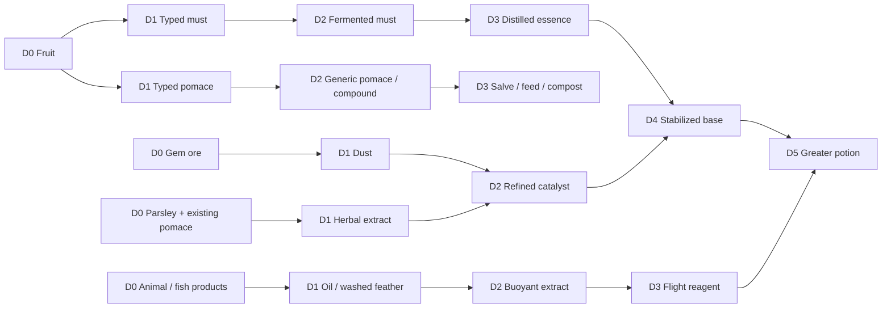

# 63 — Food, cooking, animal products and fruit alchemy

**Status: OWNER APPROVED on 2026-09-23.** Author: BeigeCoast. Audit: 2026-09-23,
`origin/main` **52b671b9**. Branch: `docs/food-alchemy-plan`. This is a documentation
PR: no gameplay definitions, runtime code, imported art or deployed state change.
The numbers below are approved implementation budgets, not measured gameplay outcomes.

[Open the visual companion](food-alchemy/index.html) ·
[Machine-readable master catalogue](food-alchemy/catalogue.json) ·
[All 6,982 icon dispositions](food-alchemy/icon-audit.csv) ·
[Review and verification instructions](food-alchemy/README.md).

## 1. Scope and approval contract

Make fruit processing the common foundation of cooking, medicine and alchemy.
Every useful by-product gets a route: typed pomace becomes medicine, generic compost
or feed; typed must becomes a potion base, fermented ingredient or distilled essence.
Food provides variety and preparation choices without outclassing all existing meals.
Potions grant bounded temporary effects; they never grant permanent skill ranks.

The master table includes existing items as compatibility anchors and proposed additions.
It specifies one gameplay item per named dish/flavour, not one item per recoloured sprite.
The icon audit gives **every vendor number** a selected, alternate, reference, deferred
or excluded disposition. Suitable distinct food silhouettes are represented in the
catalogue. Modern cans and unexplained blue/neon variants are explicitly deferred or
excluded rather than silently inventing crops and flavours. A5 records the approved interpretation and confectionery set.

The owner approved the full plan and the choices in §11 on 2026-09-23.
All six mana potions are included by subsequent explicit direction; no mana drain is required.
The owner requested support for hunting previously protected animals on 2026-09-23;
that direction is recorded as A2. Numeric/content budgets are approved. Continue with `/home/toby/projects/briefs/food-alchemy-implementation-prompt.md`.
No merge, deployment, world publication or destructive migration is authorized by this PR.

### Testable outcomes

- All selected icons resolve to verified local art or a prominently marked art request.
- Every proposed item has a source or an acyclic transformation path; top-tier potion
  chains reach depth **5**, with gathered/shop ingredients at depth 0.
- All 18 creatures have authored interaction policies: twelve hunting defaults and
  six small-creature capture defaults (§7); owned/ridden animals remain protected.
- Every potion has exact inputs, duration, magnitude, tier, cooldown and conflict policy.
- Old inventories, generic must/pomace, estate bottles, placed stations, slots and running
  jobs keep their IDs and behavior. No compensation migration or inventory rewriting.
- Cooking and alchemy can be authored through content kinds and shared-kit frames after
  the explicitly listed runtime capabilities are available.

## 2. What exists today

Audited authored content, not the live database: **340 items, 142 recipes, 37 processes,
60 objects, 10 frames, 23 crop definitions (22 ordinary plus tutorial strawberry),
27 resources, 18 creatures, 35 loot tables and 4 effects**.

| Area | Verified baseline | Gap addressed by this proposal |
|---|---|---|
| Eating | `food.restoreCenti` describes food; `onUse` actually consumes/restores/applies effects. Hunger caps at 100 and is exertion-driven. Raw crops restore 2–13, cooked meat/fish 24–40, preserves 12–23, Pantry Lunch 36, Cellar Supper 48. Raw meat/fish have no restore operation. | New dishes and explicit raw mini-buffs; no raw meat consumption added. `item.vigour` is tool cost, **not** a restore field. |
| Vitals | Health, Mana and Vigour already exist, normally 100 each; 100 centi-units = 1 displayed unit. Regeneration at baseline: 0.2 / 1 / 12 per second. Authority is **20 Hz**. | Generic instant vital restoration, exact periodic restores and consumable admission. All six mana potions are approved without a new sink or stat (§11 A1). |
| Effects | Fruitful Energy +50% Vigour regen for 300s; Orchard Tea +2 CON for 300s; Well Rested +25% Vigour regen for 7,200s; Winded −50% for 90s. | No periodic-restore/ability/flight payloads or effect-level exclusivity today. |
| Fruit | Apple, pear, peach and cherry from renewable trees (2 fruit per 900s); grapes, strawberries and watermelon from crops. Normal strawberry yields 3 per 1,500s; tutorial strawberry yields 3 per 30s. | No nightberry/citrus crop. Map pear to mana, peach to speed, strawberry/cherry to healing; no fictitious existing source. |
| Press | Five fruit recipes: 1 apple/cherry/grape/peach/pear → 1 generic `must` + 1 generic `pomace`, 300s, 4 Farming XP. | Fruit identity is lost. Separate varietal press produces typed rows, leaving old press untouched. |
| Cellar | 3 `must` → 1 `bottles`, 1,800s base, 25 Farming XP. Estate Bottles sell for 5,000 bronze before Vintage premium. | Fermented alchemy ingredients are **not estate bottles**; dedicated cask and upgrade policy required. |
| Pomace | 4 pomace + 1 fiber → compost; one application advances crop growth 25%, no XP. | Typed pomace can decant to generic pomace one-way, or enter salves/bandages/feed. |
| Cooking | Campfire cooks fish 40s, chicken/mutton/pork 45s, beef 50s. Existing provisions and 22 barrel preserves remain. | Multi-ingredient soup/baking/brewing needs a batch adapter. |
| Animals | Seven huntable species; cow alone supplies leather. The other eleven are protected. **No feather, wool, milk, egg, honey or mushroom item at this main revision.** | Explicit additions and peaceful merchant sourcing; owner-requested broader hunting support. Brief's “feathers now exist” was not true on audited main. Reconcile any later branch before importing. |
| Skills | Combat, Explorer and Farming tracks; mining/fishing/woodcutting are specializations. | No separate Defence, Crafting or Alchemy XP track. Potion names describe temporary activities, not new tracks. |
| Stations | `objects.json` already authors slot roles, timings, catch-up cap and auto-start; process rows can override timing. | Doc 62 §4's earlier hard-code audit is partially superseded. Adapter semantics, upgrade policy and residual sim constants still need code. |

Existing fruit consumption can refresh Fruitful Energy at full hunger; ordinary food
rejects full hunger. Preserve this baseline behavior. New restorative items preflight
all effects: consume only if at least one restore or allowed effect refresh can apply.
Ordinary food is forbidden inside isolated Delve runs; proposed food **and potions**
inherit that restriction until the owner explicitly approves a separate Delve balance pass.

Evidence: [`items.json`](../packages/assets/content/items.json),
[`processes.json`](../packages/assets/content/processes.json),
[`effects.json`](../packages/assets/content/effects.json),
[`food.ts`](../packages/sim/src/food.ts), [`modifiers.ts`](../packages/sim/src/modifiers.ts),
[`processor-authority.ts`](../packages/sim/src/content/processor-authority.ts),
[`processors.ts`](../packages/world/src/behaviour/processors.ts),
[doc 06 §§11–17 and amendments](06-progression-economy.md), [doc 28](28-crafting.md).
The baseline rows in §12 expand their current inputs, effects, stack sizes and prices.

## 3. Art inventory and import contract

P0 source correction (23 September 2026): milk uses Farming #168 and egg uses Farming #169. The original #167/#168 selection was one cell early (orange liquid / milk flask). Native review confirmed the corrected silhouettes; item identity, prices and effects are unchanged.


The premium intake in commits `278f1205` / `a0e36d98` retained nine native sheets:
Armor 1,850; Farming 205; Food 194; Monster Drops 210; Potions 676; Resources 950;
Tools 553; Treasure & Keys 704; Weapons 1,640 = **6,982 numbered icons**.
All nine current PNG hashes match the committed coordinate index. Reviewed all icons
on numbered, nearest-neighbour contact sheets, including equipment categories that
contain no food. The audit CSV has exactly one row per `(category, vendor number)`.
It is a visual taxonomy and disposition ledger, not a claim of vendor semantic names.

Canonical source prefix is `references/art/kenmi/cute-fantasy/icons/`. The companion
and catalogue store full paths, SHA-256, vendor number and exact crop. Vendor numbers
are **not necessarily row-major cells**: use `iconCells[number - 1][0]` in
[the coordinate index](reference-assets/kenmi-premium-icons-index.json), then
`x = cell % columns * 16`, `y = floor(cell / columns) * 16`. Duplicate matching cells
remain valid; blank cells do not create new numbered icons.

| Visual family | Disposition |
|---|---|
| Food | Breads, soups, eggs, pastries, preserves, plates, rice bites, sweets and drinks are selected or dish-family alternatives. Five pull-tab cans are excluded. Strong artificial colours need A5 review. |
| Farming | Keep current crop/fruit icons; seeds remain seeds. Meat/dairy silhouettes supply new food references. Unrepresented plants are discovery references, not automatically new crops. Burnt meats are alternatives for future failure art, never edible upgrades. |
| Monster Drops | Feather, bone, shell/chitin and slime references; unnatural eyes/organs remain alchemy references, not new animal species. |
| Potions | Empty, stoppered, half/full and colour/shape families. Keep hue stable by effect and small/medium/large silhouette by tier; names/tooltips remain required for accessibility. |
| Resources; Treasure & Keys | Mineral powders, crystals, fibres and materials selected where the shape fits. Colour alone does not establish ore identity. Keys, coins and jewellery excluded. |
| Tools | Pans, sieves, vessels and handles are references. A 16px pan icon is not station state artwork. |
| Armor; Weapons | All reviewed; equipment silhouettes excluded from this feature. |

The remaining mushroom/herb gap uses owner-purchased Clockwork Raven
`icon-packs/alchemy-herbs/sheet-16-without-outline.png`; selected cells and alternatives are
explicit in the catalogue. P0 correction (2026-09-23): use the available plain variant
for these same cells, as required by the existing plain-icon source tests; reviewed
native colours/crop positions remain unchanged. Fishing & Sea was also inspected; keep the current
reviewed fish icons rather than assigning new species to old catch quality rolls.
The full-library search found `halloween/Witch/Witch_Cauldron_Anim.png` (six 32×32
frames) as a cauldron **reference**, not an approved three-state machine. No complete
alembic/still/alchemy-table state set was found in the indexed local library.

Import **only after approval** through `assets:import`, preserving native licensed
ramps, semantic names and `sourcePath`/`sourceRegions`, then render and review before
marking approved. Example for Food #14 after resolving its indexed cell:

```sh
npm run assets:import -- references/art/kenmi/cute-fantasy/icons/Cute_Fantasy_Icons_Food/16x16/Food_all_16x16.png --size 16x16 --crop 48,16 --name icon_food_bread --category ui
npm run assets:render icon_food_bread
npm run assets:build
npm run assets:validate
```

Verify the crop against the index again at implementation time. The importer detects
Kenmi's licensed path for exact `sourcePalette`; Clockwork Raven does not receive
that same automatic handling in `import-image.ts` and must use the existing reviewed
native extraction path or a reviewed generic native-import extension. Never palette-snap
Raven art accidentally. Stable new keys: `icon_food_<id>`, `icon_alchemy_<id>`,
`icon_animal_<id>`; retain every old asset key. Do not commit source PNGs or atlases.
The HTML loads licensed images from local `references/`; no encoded source pixels
or copied sheets are included in this PR. Existing committed pixel grids are rendered
for current-icon comparison only.

## 4. Fruit identity, dependencies and recipes

### Proposed design record: typed branches, retained estate loop

**Status: Proposed (A7).** Add `object:varietal_press` with a different process tag;
keep all old presses, processes, must, pomace and casks unchanged. This avoids
rewriting inventories and partially complete production. Alternatives considered:
change old press outputs in place (breaks mixed stacks and player expectations),
attach provenance to generic stacks (changes inventory/schema semantics), or use a
recipe-selection mode in every old press (more migration surface). The separate
station costs an extra placed object and frame, but has a narrow, testable boundary.

For each of the seven actual fruit IDs: **1 fruit → 1 typed must + 1 typed pomace in
300s**; **3 typed must → 1 fermented typed must in 1,800s**; **2 fermented typed must
+ 1 wood → 1 distilled essence in 300s**; **1 essence + 1 refined catalyst → 1 stabilized
base in 60s**. Final greater brewing takes 120s. Exact rows are in §12 and the catalogue.
No new estate premium or bottle-produced statistic applies to any of these ingredients.

Typed must → generic must and typed pomace → generic pomace are one-way, 1:1,
shapeless hand recipes. There is **no** reverse route: generic stock must not become
whichever expensive variety is useful today. No fermented or distilled item can
be converted into Estate Bottles except by the unchanged generic estate recipe.

| Actual fruit | Proposed base trait, delivered once on successful potion use |
|---|---|
| Apple | +2 Vigour instant |
| Cherry / strawberry | +1 Health instant |
| Pear | +2 Mana instant; substitutes for the brief's hypothetical nightberry |
| Peach | +1 Vigour instant; primary base for Speed, substitutes for hypothetical citrus |
| Grape | Timed primary effect duration ×1.10, floored to authority ticks; no extra trait on instant primaries |
| Watermelon | +1 Hunger instant |

This intentionally small secondary trait cannot make healing food mandatory.
Raw fruit additions are separately marked in §12: strawberry Health +2/10s, pear
Mana +3, peach speed +2%/15s; parsley farming effort −2%/30s and garlic incoming
combat damage −2%/30s. Existing Fruitful Energy remains unchanged. No bread potion.

### Dependency graphs (D = count of transformations, not skill tier)

The HTML companion renders these same twelve chain summaries; the JSON stores every
recipe edge, and §12 gives the computed minimum depth for each item. Existing stock
is a source node for this expansion, not a claim that smelting historically costs no steps.



| Chain | Explicit progression and output role |
|---|---|
| Fruit | Fruit D0 → typed must/pomace D1 → fermented must D2 → essence D3 → stabilized base D4 → greater potion D5; pomace → generic compost/feed or bandage compound. |
| Grain/bakery | Wheat D0 → flour D1 → dough D2 → baked roll/pie D3. Early bread stays **3 wheat → 1 bread**, hand grid. Cookie: 2 wheat + cocoa + sugar → 8; cake: 3 milk + 3 wheat + 2 sugar + egg → 1; pumpkin pie: pumpkin + sugar + egg → 1. Deliberate Minecraft-style adaptations, not an exact recipe transcription. |
| Dairy | Milk D0 → cream/curd D1 → butter/cheese D2 → rich food D3. Milk/eggs/honey initially have explicit merchant sources, so husbandry is not an invisible prerequisite. |
| Collections | Small creature + net/jar → unique held specimen → release/journal or explicitly selected ingredient. Custody transitions are not ordinary crafting depth. |
| Apiary | Three bee specimens → colony; frame + flowering habitat + 600s → honeycomb D2 → honey/wax D3 → meals/salve. Honey merchant fallback is D0. |
| Meat | Existing raw meat D0 → existing cooked meat D1 → pie/stew D2 or deeper dough side chain. New game meat has a 40s campfire recipe; none is a mandatory potion prerequisite. |
| Fish | Existing raw fish D0 → oil/cooked fish D1 → concentrate D2 or rice dishes. Rice bites explicitly use **cooked fish**, even where artwork resembles sushi. |
| Mushroom | Purchased cultivated brown mushroom D0 → stew D1 / healing potion D2; shroom spore is bought on dry ground before toxin protection. |
| Herb | Parsley D0 + generic pomace D0 → extract D1; extract + oil D1 → concentrate D2. Typed pomace D1 + fibre D0 → compound D2 → salve/bandage D3. |
| Feather | Feather D0 → washed feather D1 → buoyant extract D2 → flight reagent D3 → optional greater flight D5. A peaceful shop route prevents mandatory hunting. |
| Mineral | Raw gem ore D0 → dust D1 → catalyst D2 → stabilized base D4. Existing mining/bar smelting station dependencies remain; catalogue depths describe ingredient transforms. |
| Overall | Parallel farming, cooking and mining meet at D4; a D5 output needs the still and Farming 15, not a new XP track. Optional flight also needs Explorer 15. |

### Recipe execution details

Every new zero-second transformation is a shapeless `recipe` unless stated otherwise:
bread is a shaped row of three wheat; cake is rows `milk milk milk / sugar egg sugar /
wheat wheat wheat`; all others use counted shapeless inputs. These nine cake units fit
3×3. New timed meals use `process` rows. Campfire additions needing multiple inputs
(toast) use the new kitchen cauldron instead; do not pretend the single-input campfire
can accept butter. Single-input fried egg/roast potato can reuse `campfire_cooking`.
All new oven/cauldron heated batches consume **one wood** (included in the catalogue),
regardless of output count; cold assembly does not. Optional cooled cream is a distinct
unheated process mode, pending A5. No cooling magic is inferred from a soup adapter.

Soup/salad recipes consume one wooden bowl. Eating returns one bowl atomically;
if there is no return capacity the use is rejected before consumption. Other packaging
is part of the portion; no milk bottle, wrapper or spoon item is invented. Potions
consume their vial permanently; that modest sink prevents refill/currency loops.
Crafted intermediates without an eating effect cannot be consumed.

## 5. Progression and numeric budgets

All proposed prices are **bronze per item**. `—` means no NPC purchase offer;
positive buy prices must be paired with the explicitly named shop, not merely a
number on the item. All source-shop additions use existing named merchants; no
unplaced NPC or unreachable biome is assumed. Shops are a deliberate first route
for new reagents, with the listed husbandry routes optional additions.

| Tier | Exact proposed gate for new recipes/process starts | Budget |
|---|---|---|
| T0 | No new level gate; retain existing station/recipe permissions | Starter bread, cooked eggs, hand assemblies; food 5–40 Hunger depending on portion |
| T1 | Farming level 3 and food/alchemy recipe set discovered by reading existing Jane's Gardening Book | Varietal press, kitchen cauldron, oven, alchemy table; minor brewing 30s |
| T2 | Farming level 8 and same learned recipe set | Alchemy cask, catalyst, standard brewing 60s |
| T3 | Farming level 15 and same learned recipe set | Still, distilled/stabilized bases, greater brewing 120s; flight additionally Explorer 15 |

Book reading adds discoveries only, never XP; previously owned/read books get an
idempotent discovery update on next read, without removing any knowledge. New
`trackLevelAtLeast` gates need authoritative recipe/process schema support; current
`skillRequirement` is a **node rank**, not track level. Show these locks in Studio
and game UI using the same resolver. Drinking is not level gated; trading prepared
potions is allowed, while crafting knowledge cannot be bypassed. No paid room,
Vintage, retired Knowledge/Terroir or unavailable “Alchemy level” gate.

| Potion budget | Minor | Standard | Greater |
|---|---:|---:|---:|
| Instant Health / Mana | 15 | 30 | 50 |
| Instant Vigour | 25 | 50 | 75 |
| Instant Hunger | 15 | 25 | 35 |
| Added Health over time | 12/30s | 24/45s | 40/60s |
| Added Mana over time | 15/30s | 30/45s | 50/60s |
| Added Vigour over time | 30/30s | 60/45s | 90/60s |
| Skill effect magnitude/duration | 5%/120s | 10%/180s | 15%/240s |
| Proposed sale value | 24 | 48 | 96 |
| Stack | 16 | 16 | 16 |

All recipes use base + active + modifier + one empty vial. Greater recipes use two
active ingredients except Flight, whose prepared reagent count is one. These are
explicit rows, **not** a combinatorial system accepting arbitrary ingredients.
There are no NPC potion buy offers in this proposal. Shop-only source ingredients
have buy prices in §12; rare/profession ingredients still have real production costs.
New process XP is **0** (omit `experience`, whose current parser requires positive
amounts); existing press/cask/cooking XP stays unchanged. Success statistics record
alchemy output and consumption without creating craft-uncraft XP loops.

These budgets use doc 06's **live** §§11–17 and amendments; §§1–10 describe the retired
solo game. Estate bottle values stay 5,000/10,000/20,000/40,000; room prices remain
60,000 and 180,000. Potion sales peak at 96 and do not gain `estate_vintage` premiums.
The exceptionally fast tutorial strawberry must be included in the recipe-price audit.
Vigour potions help active exertion: natural 12/s regeneration already makes them
unnecessary for standing still. Food variety stays below the existing 48-Hunger supper.

`sim:pace` is required as a **legacy regression**, not evidence for multiplayer
acquisition time. Implement a live-loop scenario measuring gather/buy → first meal →
first minor/standard/greater potion, including seed regrowth, tool effort, queues,
fuel, book acquisition and blocked outputs. Proposed first-session targets: one new
T0 meal in ≤15 minutes from a starter inventory; no claim yet for time to Farming 15.
Measure those tier times before setting an owner-approved target. Compare the same
seed and starting inventory before/after; report shop spending and bottle income
separately. Do not tune the retired simulator until it “proves” this feature.

## 6. Effects, stacking and traversal contract (new engine work)

### Proposed design record: generic payloads, effect-level families

**Status: Proposed (A4).** Extend effects with `periodicRestores`, `abilities`,
`activityModifiers`, `exclusiveGroup` and `tierRank`; add generic `restoreVital`
behavior for Health/Mana/Vigour, reusing Hunger where supported. Existing modifier
layers remain flat → additive percentage → stable multiplicative percentage → override
→ bounds. 10,000 basis points = 100%. Existing modifier `family` chooses per target
and cannot enforce “one skill potion” across different targets. Do not implement a
64-entry item-ID switch. Alternative: encode every potion as a callback; rejected
because normal content editing would then require new builds and duplicate logic.

- **Groups:** one active `potion.skill`, one `potion.regeneration`, and one
  `potion.utility` per player. Utility includes speed, vision, fortitude, luck and
  traversal; using one replaces the other under the rank rules. Instant potions
  share `potion.restore` cooldown without an active slot. Raw mini-buffs share
  `raw.food`; an equivalent potion suppresses its overlapping target, without
  suppressing existing Fruitful Energy or unrelated permanent effects. Instant raw restores (pear Mana +3) are exempt: they have no active slot and no potion cooldown; normal food admission still applies.
- **Rank:** stronger replaces weaker; equal refreshes expiry from now without
  stacking magnitude or accumulating duration; weaker rejects without consumption.
  Different families within one group use the same rank comparison. All potion
  uses share **20s (400 tick)** cooldown, including utility replacement. Failed
  use changes no items, stats, cooldown or effect rows.
- **Medicines:** salve and bandage both have rank 0 in `potion.regeneration`; minor/standard/greater potions have ranks 1/2/3. Salve and bandage replace each other at equal rank, refresh from now without accumulating duration, and reject while a regeneration potion is active. Both share the same global 20s potion cooldown; rejected uses consume nothing.
- **Periodic restore:** once-per-second settlement uses cumulative integer arithmetic:
  `due = floor(totalCenti * min(elapsedTicks,durationTicks) / durationTicks) - appliedCenti`.
  Persist applied progress and settle to the exact expiry boundary; repeated calls
  cannot replay healing. Partial missing-vital capacity is clamped and excess is
  discarded, not banked. Logouts expire potions on authority time; no offline potion
  restoration is awarded (existing natural offline regen is separate). Raw mini-buffs
  with explicit pulse schedules use those schedules, and their last partial pulse is
  not rounded upward. Existing natural regen remains additive.
- **Instant admission:** do not resurrect at zero HP. At least one proposed restore,
  useful refresh or new ability must apply; clamp restores to resolved maxima.
  An at-cap primary can still use its applicable secondary trait. Consumption,
  statistics, cooldown and effects commit in one transaction.
- **Skill effects:** combat damage +5/10/15%; defence incoming combat damage −5/10/15%;
  farming/mining/woodcutting activity tool effort −5/10/15%; fishing cast duration
  −5/10/15%; crafting **new batch adapter** duration −5/10/15%. No resource yield,
  XP, skill rank, rare tier, legacy estate timing or gear requirement is changed.
  Snapshot crafting benefit at job start; it expires normally on the player and
  never retroactively changes a stored job. Document this deliberate job policy.
- **Fortitude:** raises maximum HP by 5/10/15 without healing current HP; expiry
  clamps current HP. Do not increase STR to simulate this and accidentally raise damage.
- **Luck:** add 1/2/3 percentage points to the rare fishing bonus-group roll only,
  clamp chance to 100%; normal fish yield and weighted nested choices stay unchanged.
  No effect on estate sales, guaranteed quest rewards or Delve drops.
- **Night vision:** raise the local lighting floor by 5/10/15 percentage points,
  clamp to full daylight. It never reveals hidden objects, fogged areas or ore.
- **Knockout:** remove only new potion/raw-food effects and cooldowns during recovery,
  retain existing non-potion effects. Baseline does not automatically clear all rows.
  Removing max-HP or traversal effects uses the same safe expiry path.

D6 comes from [doc 61 §2.5.3 on its docs branch](https://github.com/Dastari/orchard-cellar/blob/docs/world-editor-model/docs/61-world-editor-and-authoring-model.md).
`water_walk`, `lava_immune`, `toxin_immune` must be explicit capabilities consumed by
the **same pure traversal resolver** in server collision, client prediction and
pathfinding. Lava/toxin immunity covers that medium's contact hazard, not all fire,
poison or combat damage. Solid walls/cliffs/objects remain blocking. No potion can
bypass a portal, ownership boundary, mount permission or locked region.

**Safe expiry is required before these potions ship:** record last dry, legal tile;
at expiry/replacement/knockout/content revocation, validate it again. Land there if
necessary; if occupied, deterministic bounded search within 8 tiles; if none exists,
use the space's authorized safe spawn. Never teleport between arbitrary spaces or
leave a player on an untraversable cell. Alert at 10s and 3s remaining. Client UX cannot
promise an ability that the active authority/content engine version rejects.

Flight remains A3: one greater potion, **15s**, maximum **6 tile** distance from
takeoff, low altitude only; no wall/cliff/void/locked-space crossing, no mounted use,
no gathering/combat while airborne. The point is short terrain traversal, not map
sequence breaking. No minor/standard flight items are proposed.

The exact 64-row potion catalogue follows the master table. Grape's +10% duration is
additional to the listed primary durations; UI and tests must use the final duration.

## 7. Wildlife, collections and apiaries

**Owner direction, 2026-09-23:** support hunting currently protected wildlife, then
refine small animals into collection/capture/release and ingredient gameplay, without
frog, insect or snail meat. Bees, hives, honey and apiaries are part of this update.
These instructions set the scope; implementation awaits full plan approval.

### 7.1 Hunting and small-creature collections

All eighteen species get an authored interaction policy (`hunt`, `capture`, or both),
not a hard-coded species allowlist. Proposed defaults below enable hunting for the
five newly huntable larger species; six small species remain noncombat collection
targets. A future author can change policy, but validation must reject huntable
creatures lacking suitable loot, XP, animations or supported damage/death behavior.
Current seven huntable species retain meat quantities, XP and respawn timing.

| Creature | Current huntable | Proposed route | Guaranteed meat on hunting death | Resources / collection result |
|---|---|---|---|---|
| bee | No | Capture | None | Live bee specimen; install in apiary or release; honey comes from hives, not death |
| butterfly | No | Capture | None | Live specimen; wing dust ×1 nonlethal collection per identity |
| camel | No | Hunt | raw_game ×3 | leather ×2 and bone ×1 guaranteed |
| capybara | No | Hunt | raw_game ×2 | leather ×1 and bone ×1 guaranteed |
| chicken | Yes | Hunt | raw_chicken ×1 | feather ×1 guaranteed; extra feather ×1 at 25% |
| cow | Yes | Hunt | raw_beef ×4 | leather ×2 guaranteed unchanged |
| duck | Yes | Hunt | raw_chicken ×1 | feather ×1 guaranteed |
| frog | No | Capture | None | Live specimen; pond_slime ×1 nonlethal secretion per identity |
| goose | Yes | Hunt | raw_chicken ×2 | feather ×2 guaranteed |
| horse | No | Hunt, unowned only | raw_game ×3 | leather ×2 and bone ×1 guaranteed |
| mouse | No | Capture | None | Live specimen; journal observation and release only |
| pig | Yes | Hunt | raw_pork ×3 | animal_fat ×1 guaranteed |
| rooster | Yes | Hunt | raw_chicken ×1 | feather ×1 guaranteed |
| scarab | No | Capture | None | Live specimen; optional explicit ingredient preparation → chitin ×1 + empty specimen jar |
| sheep | Yes | Hunt | raw_mutton ×3 | wool ×1 guaranteed |
| snail | No | Capture | None | Live specimen; pond_slime ×1 nonlethal secretion per identity; shed shell from habitat |
| swan | No | Hunt | raw_chicken ×2 | feather ×2 guaranteed |
| vulture | No | Hunt | raw_chicken ×2 | feather ×2 guaranteed |

Hunting uses existing wildlife loot IDs for seven species and new
`loot:wildlife_<species>` for the five larger additions. Each guaranteed resource
has an independent group; optional feather uses explicit `rareRoll`, not a lone
weight-25 entry (which would be guaranteed). Proposed new combat XP: 14 for capybara
and swan, 18 for vulture, 22 for camel and horse; no combat XP for capture. Preserve
the existing 12,000-tick/600s species respawn setting. New raw_game → cooked_game at
campfire takes 40s, restores 28 Hunger and needs distinct approved raw/cooked icons.
No small-creature meat or cooked-meat definitions are proposed.

Authority target registration, damage preflight, death, loot and respawn must agree
with authored policy. Owned, tamed, ridden or carried animals reject hunting and
capture by others; mounted animals reject capture even by owner. Recheck ownership
at settlement. Sanctuary/space permissions still apply. Death/loot settlement is
single-use under same-tick attacks; saddle and inventory custody cannot duplicate.

**Collection loop:** craft a reusable net (2 sticks, 4 fiber, 2 string) and ventilated
jar (1 empty vial, 1 fiber). At T1, hold net, target an eligible nearby small creature,
and channel 2s within 1.5 tiles with line of sight. Moving, damage, distance change or
policy change cancels without consuming anything. Completion atomically removes the
wild actor into one jar-backed specimen record and inventory item. One jar holds one
specimen; stack 1, no hunger effect, no sale value, no random capture failure, no XP.
Maximum six held specimens per player in the first release; no death/starvation timer.
Capture returns no separate empty jar: the occupied item owns its container.

Persist specimen identity, species/variant, origin habitat/space, custody state,
container, previous extraction flags and journal observation. States are
`wild → held → released`, `held → ingredient_consumed`, or `held → colony` for bees.
The origin spawn slot stays reserved while held or in a colony, preventing capture
from also creating a fresh respawn. Release restores the same identity to a valid
same-space habitat within two tiles; reject incompatible water/land, occupied/blocked
or sanctuary placement. If unavailable, retain the specimen and show why. Release
returns exactly one jar. Ingredient preparation consumes the specimen permanently,
returns its jar and starts the normal 600s origin respawn. No release reward or XP.
Reject replayed requests, concurrent capture/release, full inventories, invalid IDs,
Delve use and foreign ownership without mutation. Logout preserves custody. Ordinary portals and cross-space teleports reject while holding specimens, with a release-first explanation. Same-space death preserves specimens in protected inventory. Forced cross-space recovery atomically returns the jars and queues safe rewilding in the origin habitat, retaining reserved spawn identities until placement succeeds. No held specimen crosses with the recovering player, and no ordinary death-loot copy is emitted. An unavailable origin tile delays rewilding, never discards or duplicates the animal; the origin reservation and extraction flags persist.
Trade, chest storage and cross-space transport are out of scope for the first release.

**Collections journal:** first successful capture records species and visual variant;
release records a separate observation flag. Show six species silhouettes, discovered
art/name, habitat hints and captured/released status in a shared-kit journal frame.
Progress is permanent and idempotent, grants no sale/XP/stat reward, and survives release
or use. A collection goal is distinct from owning every animal indefinitely.

**Ingredient use:** scarab preparation is an explicitly selected irreversible recipe,
labelled “Uses the specimen”; never auto-consume a live animal from generic inventory.
Frog/snail secretion and butterfly residue are nonlethal interactions available once
per specimen identity, recorded across release/recapture, returning the occupied
specimen unchanged. Reject if output capacity is unavailable. Snail habitats also
supply one naturally shed shell per 600s authored resource node, independent of captures.
Mouse is deliberately a collection/release creature, not a potion ingredient. Bees are
colony founders. Shop fallbacks keep alchemy reachable without consuming specimens.

These are new engine and persistence features: authored capture/extraction policy,
transactional custody/unique inventory metadata, spawn ownership, journal storage and
release validation. They are not achievable by adding loot rows alone.

### 7.2 Bees, hives, honey and apiary gameplay

Apiaries are in scope now, not an unspecified future honey source. T1 apiary item:
12 planks + 4 stone + 4 string; one placed apiary per player initially. Install three
captured bee specimens through an explicit colony action, returning all three jars
atomically. Bees become a persistent colony with retained origin identities; the
occupied hive is not an ordinary pickup item. One player owns/operates it; shared
visitors can inspect but cannot harvest, remove bees or feed it.

A live wild hive is also a discoverable habitat object: inspect to record it in the
journal; catch roaming bees with the same net route. It supplies no free honey and
cannot be attacked or destroyed. Bee abundance is controlled by its existing authored
spawn slots, not unlimited bee creation per inspection. No new queen species, breeding,
pollination yield multiplier, stings, colony disease or winter simulation this release.

P4b must author and verify at least three bee spawn slots in a reachable wild-hive habitat **within each eligible player apiary space**, including Homesteads. Capture and owned placement must coexist legally in that same space; do not assume village bees can cross a space boundary. Hive spawn identities are scoped by space/owner habitat, not shared globally. A space without this complete source path cannot enable apiaries.

**Production:** place apiary on legal outdoor land, install its colony, and provide
one Apiary Frame (2 planks + 2 fiber). Require at least three distinct mature flowering
crop/resource instances within four tiles. Content gains an explicit `supportsBees`
flag; proposed eligible sources are sunflower and ripe fruit trees/crops, with the
exact eligible instance IDs resolved and snapshotted at start. No decoration-ID guesses.
UI previews radius and the 0/3 count; unsuitable sites cannot start. One batch takes
600s (12,000 ticks) and consumes one frame at start, yielding one honeycomb. Habitat
is required at start only; harvesting nearby crops afterward does not cancel paid work.
One pending batch maximum, no automatic restart, at most one offline completed batch.
No Estate Vintage speed multiplier, potion speed benefit or production XP.

Extract 1 honeycomb + 1 wood at cauldron for 30s → 2 honey + 1 beeswax. Honey retains
its proposed food/recipe uses; beeswax substitutes for animal fat in a salve recipe:
1 wax + 1 bandage compound + 1 wood, 30s, same salve output/effect. Honeycomb sells for
2, wax for 1, honey for 4 bronze; combined extraction sale is 9. Honeycomb is not sold
by merchants, frames sell for 1, and the 600s player-operated production is the source
of added value. Per apiary ceiling: 6 comb/hour → 12 honey + 6 wax (54 gross bronze/hour,
before frame/fuel costs); no passive XP or estate-scale multiplication. Existing cook
may sell honey at 20 bronze as a costly accessible fallback.

Escrow frame/input and completion payload atomically. Full output slot keeps the job
completed/pending; repeated collection cannot duplicate honeycomb. Relocation requires
idle empty output, then “Release colony” into valid local habitat (same bee identities,
no jars because installation returned them), then pickup empty apiary. If safe release
is impossible, retain colony and deny pickup. No break/dismantle shortcut. Disconnect,
server restart, world-save migration and permission changes preserve job and custody.

**Objects, art and UI:** new `object:apiary`, `object:wild_hive`, `frame:apiary` and
`frame:collections` plus capture targeting/held-specimen actions. Astra briefs: apiary
32×48, ground anchor (16,47), 1×1 collider, quiet wood/straw palette; empty/colony idle,
working bee flight accents, finished capped comb. Wild hive 32×32 on its own legal
habitat anchor; idle/bee-active states, no attack or reward-glow promise. Separate 16×16
icons for net, ventilated jar, six occupied jars, frame, comb, wax and apiary; current
HTML art is explicitly reference-only until drawn and reviewed. Preserve native pixels,
source metadata, night readability and reduced-motion static states.

Apiary frame uses shared-kit title/close, colony 0/3, habitat 0/3 and radius preview,
frame input (one stack slot), honeycomb output, 600s progress/status, Install / Start /
Collect / Release colony actions with disabled reasons. Collections frame: species grid,
selected habitat/variant details, captured/released marks and held specimen actions.
Keyboard focus, controller targeting, touch selection and accessible state labels are
acceptance requirements. No custom embedded UI implementation in the plan.

Acceptance: two players racing one capture; release/recapture cannot mint resources;
jar returns exactly once; unique spawn ownership survives restart; specimen journal
idempotence; no tiny-animal combat loot; bee installation cannot retain captured copies;
flower eligibility boundaries; frame escrow; offline cap; blocked outputs; colony release
and apiary pickup preserve all three identities. Playtest target: first capture in ≤5
minutes after T1 tools, first honey within one 10-minute production cycle after setup,
and no creature forced into a meat route to complete the journal. Tune after measurement.

Pomace Feed remains an optional separate cow/chicken interaction: one feed → one
milk/egg, once per animal per 600s, persisted cooldown and authority ownership checks.

## 8. Stations, frame layouts and Astra art briefs

### Proposed design record: batch interpreter, retained single-input adapters

**Status: Proposed (A7).** Current process rows allow one input; one input item cannot
select two processes on the same station tag. Add generic `batch_processing` with
explicit selected recipe ID, named input roles/counts, multiple outputs, optional fuel,
knowledge/track gates and job snapshot. Use it for alchemy, still, oven and cauldron.
Keep `press`, `fermentation`, `campfire_cooking`, `smelting` and `barrel` behavior
unchanged for old definitions. Alternative adapters per machine would duplicate
escrow/settlement/inventory rules; generic execution trades a small schema extension
for consistent correctness. These are **proposed fields**, not valid current JSON.

Each start resolves authority-owned recipe/slots, reserves all consumed ingredients
and fuel atomically, stores recipe ID + content revision + exact counts/duration,
then starts. Inputs cannot be moved out of an active job. Recipe changes cannot
rewrite that snapshot. Completion remains pending if output slots are blocked;
collection never loses or duplicates output. Cancel is allowed before start only.
Pickup while working is denied; an idle empty station can be picked up. A pending
completed batch must be collected before pickup/break. Reject wrong station, actor,
space, recipe, level, knowledge, fuel or capacity without changing any row. One new
batch at a time, explicit start, catch-up cap 1; no unlimited offline auto-crafting.

| New object / item / frame suffix | Adapter / tag | Slots | Gate and recipe |
|---|---|---|---|
| `varietal_press` | existing `press` / `station.varietal_press` | input 0; must 1; pomace 2; auto-start, cap 64 | T1; 6 plank + iron bar + copper bar at workbench |
| `alchemy_cask` | `fermentation` with **new authored upgrade policy** / `station.alchemy_fermentation` | input 0; fermented output 1; auto-start, cap 64 | T2; 6 plank + 2 iron bar + copper bar at workbench |
| `cauldron` | new batch / `station.cauldron` | ingredients 0–3; fuel 4; product 5; by-product 6 | T1; 3 iron bar + 4 stone at workbench |
| `oven` | new batch / `station.oven` | ingredients 0–3; fuel 4; product 5 | T1; 8 stone + iron bar at workbench |
| `alchemy` | new batch / `station.alchemy` | base 0; active 1; modifier 2; vial 3; product 4; by-product 5 | T1; 4 plank + 2 copper bar + 3 empty vial at workbench |
| `still` | new batch / `station.still` | fermented input 0; fuel 1; product 2 | T3; 4 copper bar + iron bar + 4 stone at workbench |

Cask policy must be data, e.g. `upgradeTimingPolicy: none | estate_vintage` with the
legacy default retaining its current semantics. The existing fermentation adapter
applies Vintage duration changes to every output. Moreover the existing cask's
`bottles_produced` output-tag reward throws when no `cellar.bottles` output exists.
The new cask uses only ordinary item statistics and no estate reward filter. Never
mis-tag fermented must as bottles to evade that check. Varietal press arbitrary output
support is already covered by `processor-authority.test.ts`'s custom moonstill test.

Frames use `wood_parchment`, `presentation.surface: entity`,
`entityContainer: placeable`, bound slots, authority-derived restrictions, a kit
progress bar, status label, explicit action button, 5×4 backpack pane and hotbar.
Extend `acceptedFrom` to named recipe roles; existing `frame:press` filters the old
station tag and cannot be reused unchanged. Required graph interactions: open/use
→ `openFrame`; start button → generic validated batch start; status is read-only.
No handwritten panel, slot, button or progress artwork; use `packages/ui/src/kit`
and existing frame renderer. If a widget is missing, add it to the shared kit with
its specimen before using it. Schema forms from PR #70 must be regenerated after
capability additions if merged; never claim a JSON row alone gives Studio a new adapter.

```text
ALCHEMY STATION — shared-kit frame
[Base 0] [Active 1] [Modifier 2] [Vial 3]  →  [Product 4] [By-product 5]
[Recipe name / exact inputs / level & knowledge lock]
[Progress bar + time remaining]             [BREW]
[Backpack 5 × 4]
[Hot bar]
```

All new stations place only in authorized Homestead/interior spaces, require normal
build ownership/reach and solid-footprint checks, and are excluded from sanctuary
free placement. Do not substitute an `interior` enum if the actual placement parser
uses an owner-space policy; add/test that policy explicitly during implementation.
All stations are private containers with read-only output slots and sorting disabled.
Use PR #65/#81's final merged object-state format if available, not doc 61's draft
pseudocode. States: idle → working on successful start → finished on settled output
→ idle when output emptied. Working presentation cannot itself mint outputs.

### Astra requests (no generated art in this PR)

All requests: doc 10's warm top-left lighting, hue-shifted clustered shading, 1px
interactive outline, transparent background, closed 55-colour bespoke palette,
16px grid, native-size readability. Working state: four frames at **5fps** per the
press/cask rule; idle and finished: one frame each. Align state anchors and collision
footprints identically. No labels/text baked into art; no UI chrome. Review each
at 1× and 8× beside `prop_basket_press`, `prop_oak_barrel`, `prop_cf_furnace`.

| Request | Exact dimensions / anchor / collision | Distinguishing states |
|---|---|---|
| Alchemy bench | 32×32, anchor (16,31), two-cell-wide foot row | Idle timber bench with three glass receptacles; working subtle liquid transfer; finished one stoppered flask forward. |
| Copper still | 32×48, anchor (16,47), two-cell-wide foot row | Idle copper pot/coil; working four-frame steam/condensation without glow implying fire immunity; finished receiver bottle full. |
| Kitchen cauldron | 32×32, anchor (16,31), 1×1 foot collider | Idle iron pot and ladle; working simmer; finished covered bowl at lip. Witch cauldron six-frame sheet is reference only, not mixed into final state set. |
| Bread oven | 32×32, anchor (16,31), two-cell-wide foot row | Idle stone oven; working low warm mouth; finished bread tray visible. |
| Varietal press | 32×32, anchor (16,31), 1×1 foot collider | Idle visibly labelled jug rack; working crank/mash; finished both jug and pomace basket. Do not alter the old press art. |
| Alchemy cask | 16×32, anchor (8,31), 1×1 foot collider | Idle small tasting cask; working airlock; finished sample jug. Visually distinguish from estate cask. |
| Typed must/pomace | 16×16 each, anchor (8,15); seven fruit marks each | Must jug vs pomace basket, clear fruit motif; no recolour-only reliance. Current generic icons in HTML are references, not placeholders authorized to ship. |
| Wool / wing dust | 16×16 each, anchor (8,15) | Wool tuft, dust pouch with wing motif. Powder references are not claimed to be finished icons. |
| New animal meat | 16×16 each for raw_game and cooked_game | Distinct, calm silhouettes, no gore; required before expanded hunting drops are enabled. |
| Station inventory icons | 16×16 per station | Match the approved station silhouettes; no book/furnace reference shipped as an alchemy-table icon. |

## 9. Implementation phases, dependencies and publication order

Every phase is a separate reviewable PR referencing doc 63. **Owner approval is the
first dependency for all phases.** Re-fetch main and reconcile open #65/#70/#76/#80/#81;
those PRs were open at audit time and are not assumed integrated. GoldCondor coordinates
shared `definitions.ts`, processor, modifier and content files. No parallel lane edits
those files without a reservation and agreed ownership.

| Phase | Owns / content kinds | Depends on | Done when / publication |
|---|---|---|---|
| P0 Art | Selected native grids + metadata; Astra briefs become reviewed assets | Approved icon choices and missing art delivery | Hash/crop/native-pixel parity, neighbour review, assets validation. Client asset release before references. No world publish if assets only. |
| P1 Contracts | Generic effects, families, cooldowns, track gates, batch adapter, ability bridge; `effect`, `balance`, schema fields | A1/A3/A4, D6 runtime for traversal, #76 reconciliation | Pure sim + authority tests for all §6 boundaries. World/client capability release **before** new content; schemas then regenerate. |
| P2 Core ingredients | `item`, ordinary `recipe`, source `shop`, typed press/cask `process` + `object` + `frame` | P0; authored cask upgrade policy before typed fermentation | Source graph closed; legacy outputs/slots/jobs unchanged. World first for new policy, then all cross-referenced content atomically. |
| P3 Meals | `item`, `recipe`, `process`, cauldron/oven `object`/`frame` | Generic batch runtime; A5 scope | Counted input/fuel/output tests, vessel returns, all recipe chains reachable. Batch engine/client before content. |
| P4 Wildlife and collections | `loot`, `creature`, collection/tool `item`, journal `frame`; custody/journal/capture runtime; optional feed | A2/A6/A9, P0, unique-instance persistence | Twelve huntable defaults, six capture defaults; all §7.1 custody/release/ingredient/journal acceptance cases pass. World/schema/client before content. |
| P4b Apiaries | `item`, `recipe`, `process`, `object`, `frame`, flowering flags; colony/job runtime | P1 batch runtime, P4 bee custody, A9 | Wild hive discovery, capture→colony→comb→honey/wax loop and all §7.2 restart/output/release cases pass. Additive schema migration; world/client before content. |
| P5 Alchemy | `item`, `effect`, `process`, station `object`/`frame` | P1–P4b; all bases/reagents available | 64 variants only if conditional approvals obtained; exact periods, groups, safe expiry. World/client first; then content head. |
| P6 Balance/playtest | doc06 approved tables + mirror/golden tests; scenario results | All approved previous phases | Repeatable raw→D5 scenarios, economic loop audit, multiplayer playtest. Owner decides publication; no deploy by planning agent. |

Content cannot be published with dangling icon/item/frame/effect/process references;
submit a registry-valid atomic change set after compatible engine code is active.
Code updates are Tier B, definitions Tier A per doc55. If new persistent rows are
needed for jobs/cooldowns/restores, use **additive dual-read → backfill → verify →
retire later**. Never `--delete-data`, ID renames, slot reinterpretation or deleting
old inventory/station rows. Old clients must reject unsupported capability content
rather than consuming items without their effect. Roll back by disabling new starts/
offers; retain definitions and captured jobs needed to drain existing state.

Required implementation checks: `npm run typecheck`, `npm run lint`,
`npm run content:validate`, `npm run assets:validate`, relevant Vitest suites,
`npm run build -w @orchard/world` when world code changes, and `npm test`.
Run `npm run sim:pace` as the limited legacy check described in §5. Preserve Studio's
UI-kit prebuild gate; do not edit generated live assets or deploy Studio for this task.

## 10. Verification cases and failure handling

The docs-only catalogue verifier checks uniqueness, source hashes/crops, all 6,982
classifications, all inputs/outputs, source-root reachability and computed depth.
That proves the **proposal is internally linked**, not that the recipes work in-game.
Runtime acceptance tests must additionally cover:

1. A saved pre-change inventory and all old press/cask/barrel slot arrangements survive
   content publication/reconnect with the same counts, timers and definition IDs.
2. Every recipe is reachable from a **real acquisition action**, not just a graph leaf
   marked “shop”: verify merchant offers, book grants, planting/harvest and mining gear.
   No ingredient requires the potion it enables. Normal and tutorial strawberries tested.
3. Multi-input start, duplicate click, two viewers, disconnect, output full, failed
   transfer, pickup/break, stale content head and expired job definition preserve custody.
4. Restore at zero/full vitals, mixed applicable/inapplicable primary/trait, stronger/
   equal/weaker group replacement, deterministic fractional pulses, re-login and expiry
   yield exactly the stated amount once. Existing effects remain unchanged.
5. Ability expiry/replacement/knockout over water/lava/shroom water; occupied safe tile;
   no safe tile; mounted use; collision/prediction parity; walls, ownership and locks.
6. Loot groups guarantee the stated meat and independently roll resource chances.
   Fixed-seed sample and boundary tests verify 25% semantics, not brittle exact random
   sample counts. All 18 species follow authored enable/disable policy; owned/ridden instances reject damage in both states.
7. Sum all sold outputs, vessel returns and by-products against cheapest shop ingredient
   path. Reject a buy→craft→sell arbitrage cycle; account for quantity/multi-output and
   repeatable quest rewards. Compare bottle progression and total station investment.
8. Every station frame at UI scales 1–3 supports keyboard, touch, drag/drop, disabled
   recipe reasons and read-only output; only shared-kit widgets render the game window.
9. Statistics increment only on successful consumption/production, once per completion;
   no XP from failed uses, new cheap transformations or replayed settlement.

Unresolved art, unsupported engine capability, circular/unreachable source, invalid
ownership or an unapproved owner decision is a failed gate. Record the concrete fix
in the phase PR; do not invent a substitute item or silently bypass the gate.

## 11. Owner decisions — full plan approved 2026-09-23

| ID | Decision requested | Proposed choice / consequence |
|---|---|---|
| A1 | Include Mana and Mana Flow now? | APPROVED: include all six Mana/Mana Flow potions now, even without a mana drain. Existing mana stat only; no new spells or sink. |
| A2 — direction recorded | Owner, 2026-09-23: “The plan should add support to enable hunting on the currently protected animals.” | Add authored support for all 18 species, enablement for larger unowned wild instances, small-creature capture defaults, and exact loot/cooking/XP rows in §7, and owned/ridden protection. Numeric values, art and final content activation remain part of full plan approval. |
| A3 | Approve bounded flight? | Optional greater-only, 15s/6 tiles, no combat/gathering/walls/void/mounts. Otherwise omit its potion and flight-only intermediates. Water/lava/toxin potions still depend on D6. |
| A4 | Approve stacks and simultaneous effects? | Stack 16 potions; one skill + one regen + one utility, stronger wins/equal refreshes; global 20s use cooldown. Raw mini-buffs and current Fruitful Energy remain distinct. |
| A5 | Approve the food scope and modern-looking sweets? | Core soups/bread/pies/dairy/cooked rice dishes; optional fruit confectionery/cooled cream. No canned soda, invented neon fruit or item for every recolour. Owner reviews actual chosen art in HTML. |
| A6 | Approve initial merchant sourcing and optional feed? | New ingredients stocked by existing cook/storekeeper; no hidden forage runtime. Feed is optional persisted cow/chicken interaction; do not ship feed without its approved consumer. |
| A7 | Approve separate typed stations and economic budgets? | Retain old generic production; six processing station definitions plus apiary and wild-hive objects, fixed typed fermentation duration and proposed table prices. If fewer stations are desired, revise slots/process selection design before implementation. |
| A9 — direction recorded | Small-creature collections and apiaries included in this update. | No frog/insect/snail meat; six collection species, capture/release journal, specimen ingredients, bees/hives/honey/apiary loop in §7. Exact numbers and art await plan approval. |
| A8 | Approve proposed raw mini-buffs and skill effects? | Explicit effects in §§4–6, no new XP tracks; prepared benefit rather than yield/XP multiplication. No Delve use. |

**Approval record — 2026-09-23:** owner explicitly stated “Full content plan approved”
after separately accepting the visual preview. This authorizes the specified A2–A9
choices, including bounded flight, confectionery/cooled cream, feed interaction,
collections and apiaries. A1 was explicitly resolved by the owner on 2026-09-23: include all six mana
potions even though there is no mana drain yet. Mana already exists. Implement all
64 potion variants; do not invent a mana drain or spells.
All runtime, art, compatibility and validation acceptance gates still apply. The
implementation brief explicitly prohibits merging, deploying or publishing the world.
OrangeCastle owns the first bounded P0 asset-import lane, coordinated with GoldCondor.

## 12. Master item table

The following table is generated from `food-alchemy/catalogue.json`, the documentary
source of the companion. No file under `packages/assets/content` is modified.
Existing prices/stacks/effects are preserved; proposed rows show exact proposed values.
`T0–T3` gates are §5; `D` is graph depth. Quantities are per batch; seconds are real time.
Icon codes link to the companion, where full local paths, crop rectangles, hashes and
1–3 alternatives are shown. Existing retained icons with no credible better alternate
say so explicitly; art-needed rows show references, **not approved substitutes**.
Potion-use lists in JSON are expanded transitively; table abbreviates them by family.

| ID / name | Status; source | Icon / alternatives | Inputs → count; station; seconds | Gate; depth | Consume / raw mini-buff | Potion families fed (transitive) | Stack; buy / sell bronze |
|---|---|---|---|---|---|---|---|
| `item:amethyst_ore` **Amethyst Ore** | existing unchanged; Existing recipe:amethyst_ore | [item_cf_amethyst_ore](food-alchemy/index.html#item:amethyst_ore); Keep reviewed icon; no closer alternate established; alt: Retain current; no closer candidate | 9 amethyst_piece → 1; hand; 0s | Existing gates; D0 | None; not consumable | combat, crafting, defence, farming, fishing, flight, fortitude, healing, hunger, lava_immune, luck, mana, mana_flow, mining, night_vision, regeneration, speed, toxin_immune, vigour, vigour_flow, water_walk, woodcutting | 99; 200 / 80 |
| `item:apple` **Apple** | existing unchanged; Renewable resource:tree_apple (2 per 900s) | [item_cf_apple](food-alchemy/index.html#item:apple); existing icon selected; alt: Farming #101, Farming #116 | — → 1; none; 0s | Existing gates; D0 | Hunger +7 instant; existing fruitful_energy (see §2) | combat, crafting, defence, farming, fishing, flight, fortitude, healing, hunger, lava_immune, luck, mana, mana_flow, mining, night_vision, regeneration, speed, toxin_immune, vigour, vigour_flow, water_walk, woodcutting | 32; 12 / 5 |
| `item:basalt` **Basalt** | existing unchanged; Existing mining/Delve loot; no new drop rate | [icon_material_basalt](food-alchemy/index.html#item:basalt); Keep reviewed icon; no closer alternate established; alt: Retain current; no closer candidate | — → 1; none; 0s | Existing gates; D0 | None; not consumable | lava_immune, mining | 99; — / 8 |
| `item:beetroot` **Beetroot** | existing unchanged; Crop crop:beetroot | [item_cf_crop_beetroot](food-alchemy/index.html#item:beetroot); Keep reviewed icon; no closer alternate established; alt: Retain current; no closer candidate | — → 1; none; 0s | Existing gates; D0 | Hunger +7 instant | none | 99; — / 9 |
| `item:bottles` **Estate Bottles** | existing unchanged; Existing process:ferment_must | [icon_resource_bottles](food-alchemy/index.html#item:bottles); existing icon selected; alt: Food #127 | 3 must → 1; station.cellar; 1800s | Existing gates; D0 | None; not consumable | none | 99; — / 5000 |
| `item:cabbage` **Cabbage** | existing unchanged; Crop crop:cabbage | [item_cf_crop_cabbage](food-alchemy/index.html#item:cabbage); Keep reviewed icon; no closer alternate established; alt: Retain current; no closer candidate | — → 1; none; 0s | Existing gates; D0 | Hunger +9 instant | none | 99; — / 22 |
| `item:carrot` **Carrot** | existing unchanged; Crop crop:carrot | [item_cf_crop_carrot](food-alchemy/index.html#item:carrot); Keep reviewed icon; no closer alternate established; alt: Retain current; no closer candidate | — → 1; none; 0s | Existing gates; D0 | Hunger +6 instant | night_vision | 99; — / 9 |
| `item:cellar_supper` **Cellar Supper** | existing unchanged; Existing recipe:cellar_supper | [item_cf_cooked_fish](food-alchemy/index.html#item:cellar_supper); Keep reviewed icon; no closer alternate established; alt: Retain current; no closer candidate | 1 preserved_potato, 1 apple → 1; hand; 0s | Existing gates; D0 | Hunger +48 instant | none | 99; — / 10 |
| `item:cherry` **Cherries** | existing unchanged; Renewable resource:tree_cherry (2 per 900s) | [item_cf_cherry](food-alchemy/index.html#item:cherry); existing icon selected; alt: Farming #110 | — → 1; none; 0s | Existing gates; D0 | Hunger +5 instant; existing fruitful_energy (see §2) | combat, crafting, defence, farming, fishing, flight, fortitude, healing, hunger, lava_immune, luck, mana, mana_flow, mining, night_vision, regeneration, speed, toxin_immune, vigour, vigour_flow, water_walk, woodcutting | 32; 14 / 6 |
| `item:cinder_ore` **Cinder Ore** | existing unchanged; Existing mining/Delve loot; no new drop rate | [icon_material_cinder_ore](food-alchemy/index.html#item:cinder_ore); Keep reviewed icon; no closer alternate established; alt: Retain current; no closer candidate | — → 1; none; 0s | Existing gates; D0 | None; not consumable | none | 99; — / 30 |
| `item:compost` **Compost** | existing unchanged; Existing recipe:compost | [icon_resource_pomace](food-alchemy/index.html#item:compost); Keep reviewed icon; no closer alternate established; alt: Retain current; no closer candidate | 4 pomace, 1 fiber → 1; hand; 0s | Existing gates; D0 | None; not consumable | none | 99; — / 4 |
| `item:cooked_beef` **Cooked Beef** | existing unchanged; Existing process:cook_beef | [item_cf_cooked_beef](food-alchemy/index.html#item:cooked_beef); existing icon selected; alt: Farming #146, Farming #149 | 1 raw_beef → 1; station.campfire; 50s | Existing gates; D0 | Hunger +40 instant | none | 32; 88 / 44 |
| `item:cooked_chicken` **Roast Chicken** | existing unchanged; Existing process:roast_chicken | [item_cf_cooked_chicken](food-alchemy/index.html#item:cooked_chicken); existing icon selected; alt: Farming #146, Farming #149 | 1 raw_chicken → 1; station.campfire; 45s | Existing gates; D0 | Hunger +28 instant | none | 32; 56 / 28 |
| `item:cooked_fish` **Cooked Fish** | existing unchanged; Existing process:cook_fish | [item_cf_cooked_fish](food-alchemy/index.html#item:cooked_fish); existing icon selected; alt: Farming #146, Farming #149 | 1 raw_fish → 1; station.campfire; 40s | Existing gates; D0 | Hunger +24 instant | none | 32; 64 / 32 |
| `item:cooked_mutton` **Roast Mutton** | existing unchanged; Existing process:roast_mutton | [item_cf_cooked_mutton](food-alchemy/index.html#item:cooked_mutton); existing icon selected; alt: Farming #146, Farming #149 | 1 raw_mutton → 1; station.campfire; 45s | Existing gates; D0 | Hunger +32 instant | none | 32; 72 / 36 |
| `item:cooked_pork` **Roast Pork** | existing unchanged; Existing process:roast_pork | [item_cf_cooked_pork](food-alchemy/index.html#item:cooked_pork); existing icon selected; alt: Farming #146, Farming #149 | 1 raw_pork → 1; station.campfire; 45s | Existing gates; D0 | Hunger +34 instant | none | 32; 72 / 36 |
| `item:copper_bar` **Copper Bar** | existing unchanged; Existing process:smelt_copper_ore | [item_cf_copper_bar](food-alchemy/index.html#item:copper_bar); Keep reviewed icon; no closer alternate established; alt: Retain current; no closer candidate | 1 copper_ore → 1; station.furnace; 300s | Existing gates; D0 | None; not consumable | none | 99; — / 130 |
| `item:copper_ore` **Copper Ore Chunk** | existing unchanged; Existing recipe:copper_ore | [item_cf_copper_ore](food-alchemy/index.html#item:copper_ore); Keep reviewed icon; no closer alternate established; alt: Retain current; no closer candidate | 9 copper_piece → 1; hand; 0s | Existing gates; D0 | None; not consumable | none | 99; — / 63 |
| `item:corn` **Corn** | existing unchanged; Crop crop:corn | [item_cf_crop_corn](food-alchemy/index.html#item:corn); Keep reviewed icon; no closer alternate established; alt: Retain current; no closer candidate | — → 1; none; 0s | Existing gates; D0 | Hunger +8 instant | none | 99; — / 12 |
| `item:cucumber` **Cucumber** | existing unchanged; Crop crop:cucumber | [item_cf_crop_cucumber](food-alchemy/index.html#item:cucumber); Keep reviewed icon; no closer alternate established; alt: Retain current; no closer candidate | — → 1; none; 0s | Existing gates; D0 | Hunger +5 instant | none | 99; — / 9 |
| `item:emberglass` **Emberglass** | existing unchanged; Existing mining/Delve loot; no new drop rate | [icon_material_emberglass](food-alchemy/index.html#item:emberglass); Keep reviewed icon; no closer alternate established; alt: Retain current; no closer candidate | — → 1; none; 0s | Existing gates; D0 | None; not consumable | none | 99; — / 24 |
| `item:emerald_ore` **Emerald Ore** | existing unchanged; Existing recipe:emerald_ore | [item_cf_emerald_ore](food-alchemy/index.html#item:emerald_ore); Keep reviewed icon; no closer alternate established; alt: Retain current; no closer candidate | 9 emerald_piece → 1; hand; 0s | Existing gates; D0 | None; not consumable | defence, farming, toxin_immune, woodcutting | 99; 180 / 72 |
| `item:fiber` **Fiber** | existing unchanged; Existing authored sources; retained unchanged | [item_cf_fiber](food-alchemy/index.html#item:fiber); Keep reviewed icon; no closer alternate established; alt: Retain current; no closer candidate | — → 1; none; 0s | Existing gates; D0 | None; not consumable | hunger, vigour, vigour_flow | 99; — / 2 |
| `item:garlic` **Garlic** | existing unchanged; Crop crop:garlic | [item_cf_crop_garlic](food-alchemy/index.html#item:garlic); Keep reviewed icon; no closer alternate established; alt: Retain current; no closer candidate | — → 1; none; 0s | Existing gates; D0 | Hunger +3 instant; PROPOSED RAW: Incoming damage −2% for 30s; raw.food exclusive group; never stacks with matching potion; existing hunger/fruitful_energy unchanged | none | 99; — / 9 |
| `item:gold_bar` **Gold Bar** | existing unchanged; Existing process:smelt_gold_ore | [item_cf_gold_bar](food-alchemy/index.html#item:gold_bar); Keep reviewed icon; no closer alternate established; alt: Retain current; no closer candidate | 1 gold_ore → 1; station.furnace; 300s | Existing gates; D0 | None; not consumable | none | 99; — / 652 |
| `item:gold_ore` **Gold Ore Chunk** | existing unchanged; Existing recipe:gold_ore | [item_cf_gold_ore](food-alchemy/index.html#item:gold_ore); Keep reviewed icon; no closer alternate established; alt: Retain current; no closer candidate | 9 gold_piece → 1; hand; 0s | Existing gates; D0 | None; not consumable | none | 99; — / 324 |
| `item:grape` **Grapes** | existing unchanged; Crop crop:grape | [item_cf_crop_grape](food-alchemy/index.html#item:grape); Keep reviewed icon; no closer alternate established; alt: Retain current; no closer candidate | — → 1; none; 0s | Existing gates; D0 | Hunger +5 instant; existing fruitful_energy (see §2) | combat, crafting, defence, farming, fishing, flight, fortitude, healing, hunger, lava_immune, luck, mana, mana_flow, mining, night_vision, regeneration, speed, toxin_immune, vigour, vigour_flow, water_walk, woodcutting | 99; — / 15 |
| `item:green_pepper` **Green Pepper** | existing unchanged; Crop crop:green_pepper | [item_cf_crop_green_pepper](food-alchemy/index.html#item:green_pepper); Keep reviewed icon; no closer alternate established; alt: Retain current; no closer candidate | — → 1; none; 0s | Existing gates; D0 | Hunger +5 instant | none | 99; — / 12 |
| `item:hot_pepper` **Hot Pepper** | existing unchanged; Crop crop:hot_pepper | [item_cf_crop_hot_pepper](food-alchemy/index.html#item:hot_pepper); Keep reviewed icon; no closer alternate established; alt: Retain current; no closer candidate | — → 1; none; 0s | Existing gates; D0 | Hunger +3 instant | speed | 99; — / 11 |
| `item:iron_bar` **Iron Bar** | existing unchanged; Existing process:smelt_iron_ore | [item_cf_iron_bar](food-alchemy/index.html#item:iron_bar); Keep reviewed icon; no closer alternate established; alt: Retain current; no closer candidate | 1 iron_ore → 1; station.furnace; 300s | Existing gates; D0 | None; not consumable | none | 99; — / 184 |
| `item:iron_ore` **Iron Ore Chunk** | existing unchanged; Existing recipe:iron_ore | [item_cf_iron_ore](food-alchemy/index.html#item:iron_ore); Keep reviewed icon; no closer alternate established; alt: Retain current; no closer candidate | 9 iron_piece → 1; hand; 0s | Existing gates; D0 | None; not consumable | none | 99; — / 90 |
| `item:leather` **Leather** | existing unchanged; Existing authored sources; retained unchanged | [item_cf_leather](food-alchemy/index.html#item:leather); Keep reviewed icon; no closer alternate established; alt: Retain current; no closer candidate | — → 1; none; 0s | Existing gates; D0 | None; not consumable | none | 99; — / 18 |
| `item:leek` **Leek** | existing unchanged; Crop crop:leek | [item_cf_crop_leek](food-alchemy/index.html#item:leek); Keep reviewed icon; no closer alternate established; alt: Retain current; no closer candidate | — → 1; none; 0s | Existing gates; D0 | Hunger +6 instant | none | 99; — / 11 |
| `item:must` **Fresh Must** | existing unchanged; Existing process:press_apple, process:press_cherry, process:press_grape, process:press_peach, process:press_pear | [icon_resource_must](food-alchemy/index.html#item:must); existing icon selected; alt: Potions #161 | 1 apple → 1; station.press; 300s | Existing gates; D0 | None; not consumable | none | 99; — / 12 |
| `item:onion` **Onion** | existing unchanged; Crop crop:onion | [item_cf_crop_onion](food-alchemy/index.html#item:onion); Keep reviewed icon; no closer alternate established; alt: Retain current; no closer candidate | — → 1; none; 0s | Existing gates; D0 | Hunger +5 instant | none | 99; — / 9 |
| `item:orchard_tea` **Orchard Tea** | existing unchanged; Existing recipe:orchard_tea | [icon_cf_effect_orchard_tea](food-alchemy/index.html#item:orchard_tea); Keep reviewed icon; no closer alternate established; alt: Retain current; no closer candidate | 1 apple, 1 pear → 1; hand; 0s | Existing gates; D0 | None; not consumable; existing orchard_tea (see §2) | none | 8; 120 / 48 |
| `item:pantry_lunch` **Pantry Lunch** | existing unchanged; Existing recipe:pantry_lunch | [item_cf_cooked_fish](food-alchemy/index.html#item:pantry_lunch); Keep reviewed icon; no closer alternate established; alt: Retain current; no closer candidate | 1 preserved_carrot, 1 potato → 1; hand; 0s | Existing gates; D0 | Hunger +36 instant | none | 99; — / 10 |
| `item:parsley` **Parsley** | existing unchanged; Crop crop:parsley | [item_cf_crop_parsley](food-alchemy/index.html#item:parsley); Keep reviewed icon; no closer alternate established; alt: Retain current; no closer candidate | — → 1; none; 0s | Existing gates; D0 | Hunger +2 instant; PROPOSED RAW: Farming tool Vigour cost −2% for 30s; raw.food exclusive group; never stacks with matching potion; existing hunger/fruitful_energy unchanged | combat, crafting, defence, farming, fishing, flight, fortitude, healing, hunger, lava_immune, luck, mana, mana_flow, mining, night_vision, regeneration, speed, toxin_immune, vigour, vigour_flow, water_walk, woodcutting | 99; — / 5 |
| `item:peach` **Peach** | existing unchanged; Renewable resource:tree_peach (2 per 900s) | [item_cf_peach](food-alchemy/index.html#item:peach); existing icon selected; alt: Farming #104, Farming #110 | — → 1; none; 0s | Existing gates; D0 | Hunger +8 instant; existing fruitful_energy (see §2); PROPOSED RAW: Foot speed +2% for 15s; raw.food exclusive group; never stacks with matching potion; existing hunger/fruitful_energy unchanged | combat, crafting, defence, farming, fishing, flight, fortitude, healing, hunger, lava_immune, luck, mana, mana_flow, mining, night_vision, regeneration, speed, toxin_immune, vigour, vigour_flow, water_walk, woodcutting | 32; 14 / 6 |
| `item:pear` **Pear** | existing unchanged; Renewable resource:tree_pear (2 per 900s) | [item_cf_pear](food-alchemy/index.html#item:pear); existing icon selected; alt: Farming #107, Farming #131 | — → 1; none; 0s | Existing gates; D0 | Hunger +7 instant; existing fruitful_energy (see §2); PROPOSED RAW: Mana +3 instant; instant restoration is exempt from raw.food suppression; no potion cooldown | combat, crafting, defence, farming, fishing, flight, fortitude, healing, hunger, lava_immune, luck, mana, mana_flow, mining, night_vision, regeneration, speed, toxin_immune, vigour, vigour_flow, water_walk, woodcutting | 32; 12 / 5 |
| `item:pebble` **Pebble** | existing unchanged; Existing authored sources; retained unchanged | [item_cf_pebble](food-alchemy/index.html#item:pebble); Keep reviewed icon; no closer alternate established; alt: Retain current; no closer candidate | — → 1; none; 0s | Existing gates; D0 | None; not consumable | none | 99; — / 1 |
| `item:plank` **Wooden Planks** | existing unchanged; Existing recipe:planks | [item_cf_plank](food-alchemy/index.html#item:plank); Keep reviewed icon; no closer alternate established; alt: Retain current; no closer candidate | 1 wood → 1; hand; 0s | Existing gates; D0 | None; not consumable | hunger, vigour, vigour_flow | 99; 3 / 1 |
| `item:pomace` **Pomace** | existing unchanged; Existing process:press_apple, process:press_cherry, process:press_grape, process:press_peach, process:press_pear | [icon_resource_pomace](food-alchemy/index.html#item:pomace); existing icon selected; alt: Resources #884 | 1 apple → 1; station.press; 300s | Existing gates; D0 | None; not consumable | combat, crafting, defence, farming, fishing, flight, fortitude, healing, hunger, lava_immune, luck, mana, mana_flow, mining, night_vision, regeneration, speed, toxin_immune, vigour, vigour_flow, water_walk, woodcutting | 99; — / 4 |
| `item:potato` **Potato** | existing unchanged; Crop crop:potato | [item_cf_crop_potato](food-alchemy/index.html#item:potato); Keep reviewed icon; no closer alternate established; alt: Retain current; no closer candidate | — → 1; none; 0s | Existing gates; D0 | Hunger +7 instant | none | 99; — / 8 |
| `item:preserved_beetroot` **Preserved Beetroot** | existing unchanged; Existing process:preserve_beetroot | [item_cf_crop_beetroot](food-alchemy/index.html#item:preserved_beetroot); Keep reviewed icon; no closer alternate established; alt: Retain current; no closer candidate | 1 beetroot → 1; container.barrel; 1800s | Existing gates; D0 | Hunger +17 instant | none | 99; — / 14 |
| `item:preserved_cabbage` **Preserved Cabbage** | existing unchanged; Existing process:preserve_cabbage | [item_cf_crop_cabbage](food-alchemy/index.html#item:preserved_cabbage); Keep reviewed icon; no closer alternate established; alt: Retain current; no closer candidate | 1 cabbage → 1; container.barrel; 1800s | Existing gates; D0 | Hunger +19 instant | none | 99; — / 33 |
| `item:preserved_carrot` **Preserved Carrot** | existing unchanged; Existing process:preserve_carrot | [item_cf_crop_carrot](food-alchemy/index.html#item:preserved_carrot); Keep reviewed icon; no closer alternate established; alt: Retain current; no closer candidate | 1 carrot → 1; container.barrel; 1800s | Existing gates; D0 | Hunger +16 instant | none | 99; — / 14 |
| `item:preserved_corn` **Preserved Corn** | existing unchanged; Existing process:preserve_corn | [item_cf_crop_corn](food-alchemy/index.html#item:preserved_corn); Keep reviewed icon; no closer alternate established; alt: Retain current; no closer candidate | 1 corn → 1; container.barrel; 1800s | Existing gates; D0 | Hunger +18 instant | none | 99; — / 18 |
| `item:preserved_cucumber` **Preserved Cucumber** | existing unchanged; Existing process:preserve_cucumber | [item_cf_crop_cucumber](food-alchemy/index.html#item:preserved_cucumber); Keep reviewed icon; no closer alternate established; alt: Retain current; no closer candidate | 1 cucumber → 1; container.barrel; 1800s | Existing gates; D0 | Hunger +15 instant | none | 99; — / 14 |
| `item:preserved_garlic` **Preserved Garlic** | existing unchanged; Existing process:preserve_garlic | [item_cf_crop_garlic](food-alchemy/index.html#item:preserved_garlic); Keep reviewed icon; no closer alternate established; alt: Retain current; no closer candidate | 1 garlic → 1; container.barrel; 1800s | Existing gates; D0 | Hunger +13 instant | none | 99; — / 14 |
| `item:preserved_grape` **Preserved Grapes** | existing unchanged; Existing process:preserve_grape | [item_cf_crop_grape](food-alchemy/index.html#item:preserved_grape); Keep reviewed icon; no closer alternate established; alt: Retain current; no closer candidate | 1 grape → 1; container.barrel; 1800s | Existing gates; D0 | Hunger +15 instant | none | 99; — / 23 |
| `item:preserved_green_pepper` **Preserved Green Pepper** | existing unchanged; Existing process:preserve_green_pepper | [item_cf_crop_green_pepper](food-alchemy/index.html#item:preserved_green_pepper); Keep reviewed icon; no closer alternate established; alt: Retain current; no closer candidate | 1 green_pepper → 1; container.barrel; 1800s | Existing gates; D0 | Hunger +15 instant | none | 99; — / 18 |
| `item:preserved_hot_pepper` **Preserved Hot Pepper** | existing unchanged; Existing process:preserve_hot_pepper | [item_cf_crop_hot_pepper](food-alchemy/index.html#item:preserved_hot_pepper); Keep reviewed icon; no closer alternate established; alt: Retain current; no closer candidate | 1 hot_pepper → 1; container.barrel; 1800s | Existing gates; D0 | Hunger +13 instant | none | 99; — / 17 |
| `item:preserved_leek` **Preserved Leek** | existing unchanged; Existing process:preserve_leek | [item_cf_crop_leek](food-alchemy/index.html#item:preserved_leek); Keep reviewed icon; no closer alternate established; alt: Retain current; no closer candidate | 1 leek → 1; container.barrel; 1800s | Existing gates; D0 | Hunger +16 instant | none | 99; — / 17 |
| `item:preserved_onion` **Preserved Onion** | existing unchanged; Existing process:preserve_onion | [item_cf_crop_onion](food-alchemy/index.html#item:preserved_onion); Keep reviewed icon; no closer alternate established; alt: Retain current; no closer candidate | 1 onion → 1; container.barrel; 1800s | Existing gates; D0 | Hunger +15 instant | none | 99; — / 14 |
| `item:preserved_parsley` **Preserved Parsley** | existing unchanged; Existing process:preserve_parsley | [item_cf_crop_parsley](food-alchemy/index.html#item:preserved_parsley); Keep reviewed icon; no closer alternate established; alt: Retain current; no closer candidate | 1 parsley → 1; container.barrel; 1800s | Existing gates; D0 | Hunger +12 instant | none | 99; — / 8 |
| `item:preserved_potato` **Preserved Potato** | existing unchanged; Existing process:preserve_potato | [item_cf_crop_potato](food-alchemy/index.html#item:preserved_potato); Keep reviewed icon; no closer alternate established; alt: Retain current; no closer candidate | 1 potato → 1; container.barrel; 1800s | Existing gates; D0 | Hunger +17 instant | none | 99; — / 12 |
| `item:preserved_pumpkin` **Preserved Pumpkin** | existing unchanged; Existing process:preserve_pumpkin | [item_cf_crop_pumpkin](food-alchemy/index.html#item:preserved_pumpkin); Keep reviewed icon; no closer alternate established; alt: Retain current; no closer candidate | 1 pumpkin → 1; container.barrel; 1800s | Existing gates; D0 | Hunger +22 instant | none | 99; — / 57 |
| `item:preserved_red_pepper` **Preserved Red Pepper** | existing unchanged; Existing process:preserve_red_pepper | [item_cf_crop_red_pepper](food-alchemy/index.html#item:preserved_red_pepper); Keep reviewed icon; no closer alternate established; alt: Retain current; no closer candidate | 1 red_pepper → 1; container.barrel; 1800s | Existing gates; D0 | Hunger +15 instant | none | 99; — / 18 |
| `item:preserved_strawberry` **Preserved Strawberry** | existing unchanged; Existing process:preserve_strawberry | [item_cf_crop_strawberry](food-alchemy/index.html#item:preserved_strawberry); Keep reviewed icon; no closer alternate established; alt: Retain current; no closer candidate | 1 strawberry → 1; container.barrel; 1800s | Existing gates; D0 | Hunger +16 instant | none | 99; — / 20 |
| `item:preserved_sunflower` **Preserved Sunflower** | existing unchanged; Existing process:preserve_sunflower | [item_cf_crop_sunflower](food-alchemy/index.html#item:preserved_sunflower); Keep reviewed icon; no closer alternate established; alt: Retain current; no closer candidate | 1 sunflower → 1; container.barrel; 1800s | Existing gates; D0 | Hunger +14 instant | none | 99; — / 17 |
| `item:preserved_tomato` **Preserved Tomato** | existing unchanged; Existing process:preserve_tomato | [item_cf_crop_tomato](food-alchemy/index.html#item:preserved_tomato); Keep reviewed icon; no closer alternate established; alt: Retain current; no closer candidate | 1 tomato → 1; container.barrel; 1800s | Existing gates; D0 | Hunger +15 instant | none | 99; — / 17 |
| `item:preserved_turnip` **Preserved Turnip** | existing unchanged; Existing process:preserve_turnip | [item_cf_crop_turnip](food-alchemy/index.html#item:preserved_turnip); Keep reviewed icon; no closer alternate established; alt: Retain current; no closer candidate | 1 turnip → 1; container.barrel; 1800s | Existing gates; D0 | Hunger +16 instant | none | 99; — / 12 |
| `item:preserved_watermelon` **Preserved Watermelon** | existing unchanged; Existing process:preserve_watermelon | [item_cf_crop_watermelon](food-alchemy/index.html#item:preserved_watermelon); Keep reviewed icon; no closer alternate established; alt: Retain current; no closer candidate | 1 watermelon → 1; container.barrel; 1800s | Existing gates; D0 | Hunger +23 instant | none | 99; — / 60 |
| `item:preserved_wheat` **Preserved Wheat** | existing unchanged; Existing process:preserve_wheat | [item_cf_crop_wheat](food-alchemy/index.html#item:preserved_wheat); Keep reviewed icon; no closer alternate established; alt: Retain current; no closer candidate | 1 wheat → 1; container.barrel; 1800s | Existing gates; D0 | Hunger +14 instant | none | 99; — / 11 |
| `item:preserved_yellow_pepper` **Preserved Yellow Pepper** | existing unchanged; Existing process:preserve_yellow_pepper | [item_cf_crop_yellow_pepper](food-alchemy/index.html#item:preserved_yellow_pepper); Keep reviewed icon; no closer alternate established; alt: Retain current; no closer candidate | 1 yellow_pepper → 1; container.barrel; 1800s | Existing gates; D0 | Hunger +15 instant | none | 99; — / 18 |
| `item:pumpkin` **Pumpkin** | existing unchanged; Crop crop:pumpkin | [item_cf_crop_pumpkin](food-alchemy/index.html#item:pumpkin); Keep reviewed icon; no closer alternate established; alt: Retain current; no closer candidate | — → 1; none; 0s | Existing gates; D0 | Hunger +12 instant | none | 99; — / 38 |
| `item:raw_beef` **Raw Beef** | existing unchanged; Existing wildlife death tables (§7) | [item_cf_raw_beef](food-alchemy/index.html#item:raw_beef); existing icon selected; alt: Farming #145, Farming #148 | — → 1; none; 0s | Existing gates; D0 | None; not consumable | none | 32; — / 22 |
| `item:raw_chicken` **Raw Chicken** | existing unchanged; Existing wildlife death tables (§7) | [item_cf_raw_chicken](food-alchemy/index.html#item:raw_chicken); existing icon selected; alt: Farming #145, Farming #148 | — → 1; none; 0s | Existing gates; D0 | None; not consumable | none | 32; — / 14 |
| `item:raw_fish` **Raw Fish** | existing unchanged; Fishing pools | [item_cf_raw_fish](food-alchemy/index.html#item:raw_fish); existing icon selected; alt: Farming #145, Farming #148 | — → 1; none; 0s | Existing gates; D0 | None; not consumable | fishing, regeneration | 32; — / 16 |
| `item:raw_mutton` **Raw Mutton** | existing unchanged; Existing wildlife death tables (§7) | [item_cf_raw_mutton](food-alchemy/index.html#item:raw_mutton); existing icon selected; alt: Farming #145, Farming #148 | — → 1; none; 0s | Existing gates; D0 | None; not consumable | none | 32; — / 18 |
| `item:raw_pork` **Raw Pork** | existing unchanged; Existing wildlife death tables (§7) | [item_cf_raw_pork](food-alchemy/index.html#item:raw_pork); existing icon selected; alt: Farming #145, Farming #148 | — → 1; none; 0s | Existing gates; D0 | None; not consumable | none | 32; — / 18 |
| `item:red_pepper` **Red Pepper** | existing unchanged; Crop crop:red_pepper | [item_cf_crop_red_pepper](food-alchemy/index.html#item:red_pepper); Keep reviewed icon; no closer alternate established; alt: Retain current; no closer candidate | — → 1; none; 0s | Existing gates; D0 | Hunger +5 instant | none | 99; — / 12 |
| `item:ruby_ore` **Ruby Ore** | existing unchanged; Existing recipe:ruby_ore | [item_cf_ruby_ore](food-alchemy/index.html#item:ruby_ore); Keep reviewed icon; no closer alternate established; alt: Retain current; no closer candidate | 9 ruby_piece → 1; hand; 0s | Existing gates; D0 | None; not consumable | combat, fortitude, healing, lava_immune | 99; 260 / 104 |
| `item:sapphire_ore` **Sapphire Ore** | existing unchanged; Existing recipe:sapphire_ore | [item_cf_sapphire_ore](food-alchemy/index.html#item:sapphire_ore); Keep reviewed icon; no closer alternate established; alt: Retain current; no closer candidate | 9 sapphire_piece → 1; hand; 0s | Existing gates; D0 | None; not consumable | combat, crafting, defence, farming, fishing, flight, fortitude, healing, hunger, lava_immune, luck, mana, mana_flow, mining, night_vision, regeneration, speed, toxin_immune, vigour, vigour_flow, water_walk, woodcutting | 99; 220 / 88 |
| `item:silver_bar` **Silver Ingot** | existing unchanged; Existing process:smelt_silver_ore | [item_silver_bar](food-alchemy/index.html#item:silver_bar); Keep reviewed icon; no closer alternate established; alt: Retain current; no closer candidate | 1 silver_ore → 1; station.furnace; 300s | Existing gates; D0 | None; not consumable | none | 99; — / 184 |
| `item:silver_ore` **Silver Ore** | existing unchanged; Existing mining/Delve loot; no new drop rate | [item_silver_ore](food-alchemy/index.html#item:silver_ore); Keep reviewed icon; no closer alternate established; alt: Retain current; no closer candidate | — → 1; none; 0s | Existing gates; D0 | None; not consumable | none | 99; — / 90 |
| `item:stick` **Stick** | existing unchanged; Existing recipe:sticks | [item_cf_stick](food-alchemy/index.html#item:stick); Keep reviewed icon; no closer alternate established; alt: Retain current; no closer candidate | 2 plank → 1; hand; 0s | Existing gates; D0 | None; not consumable | none | 99; 2 / 1 |
| `item:stone` **Stone** | existing unchanged; Existing recipe:stone | [item_cf_stone](food-alchemy/index.html#item:stone); Keep reviewed icon; no closer alternate established; alt: Retain current; no closer candidate | 9 pebble → 1; hand; 0s | Existing gates; D0 | None; not consumable | none | 99; 8 / 3 |
| `item:strawberry` **Strawberry** | existing unchanged; Crop crop:bob_fast_strawberry, crop:strawberry | [item_cf_crop_strawberry](food-alchemy/index.html#item:strawberry); Keep reviewed icon; no closer alternate established; alt: Retain current; no closer candidate | — → 1; none; 0s | Existing gates; D0 | Hunger +6 instant; existing fruitful_energy (see §2); PROPOSED RAW: Health +2 over 10s (1 at 5s and10s); raw.food exclusive group; never stacks with matching potion; existing hunger/fruitful_energy unchanged | combat, crafting, defence, farming, fishing, flight, fortitude, healing, hunger, lava_immune, luck, mana, mana_flow, mining, night_vision, regeneration, speed, toxin_immune, vigour, vigour_flow, water_walk, woodcutting | 99; — / 13 |
| `item:string` **String** | existing unchanged; Existing recipe:string | [item_string](food-alchemy/index.html#item:string); Keep reviewed icon; no closer alternate established; alt: Retain current; no closer candidate | 3 fiber → 1; hand; 0s | Existing gates; D0 | None; not consumable | none | 99; — / 8 |
| `item:sunflower` **Sunflower** | existing unchanged; Crop crop:sunflower | [item_cf_crop_sunflower](food-alchemy/index.html#item:sunflower); Keep reviewed icon; no closer alternate established; alt: Retain current; no closer candidate | — → 1; none; 0s | Existing gates; D0 | None; not consumable | none | 99; — / 11 |
| `item:tomato` **Tomato** | existing unchanged; Crop crop:tomato | [item_cf_crop_tomato](food-alchemy/index.html#item:tomato); Keep reviewed icon; no closer alternate established; alt: Retain current; no closer candidate | — → 1; none; 0s | Existing gates; D0 | Hunger +5 instant | none | 99; — / 11 |
| `item:topaz_ore` **Topaz Ore** | existing unchanged; Existing recipe:topaz_ore | [item_cf_topaz_ore](food-alchemy/index.html#item:topaz_ore); Keep reviewed icon; no closer alternate established; alt: Retain current; no closer candidate | 9 topaz_piece → 1; hand; 0s | Existing gates; D0 | None; not consumable | luck, mining, speed, vigour | 99; 160 / 64 |
| `item:turnip` **Turnip** | existing unchanged; Crop crop:turnip | [item_cf_crop_turnip](food-alchemy/index.html#item:turnip); Keep reviewed icon; no closer alternate established; alt: Retain current; no closer candidate | — → 1; none; 0s | Existing gates; D0 | Hunger +6 instant | none | 99; — / 8 |
| `item:watermelon` **Watermelon** | existing unchanged; Crop crop:watermelon | [item_cf_crop_watermelon](food-alchemy/index.html#item:watermelon); Keep reviewed icon; no closer alternate established; alt: Retain current; no closer candidate | — → 1; none; 0s | Existing gates; D0 | Hunger +13 instant; existing fruitful_energy (see §2) | combat, crafting, defence, farming, fishing, flight, fortitude, healing, hunger, lava_immune, luck, mana, mana_flow, mining, night_vision, regeneration, speed, toxin_immune, vigour, vigour_flow, water_walk, woodcutting | 99; — / 40 |
| `item:wheat` **Wheat** | existing unchanged; Crop crop:wheat | [item_cf_crop_wheat](food-alchemy/index.html#item:wheat); Keep reviewed icon; no closer alternate established; alt: Retain current; no closer candidate | — → 1; none; 0s | Existing gates; D0 | None; not consumable | none | 99; — / 7 |
| `item:wood` **Wood** | existing unchanged; Existing authored sources; retained unchanged | [item_cf_wood](food-alchemy/index.html#item:wood); Keep reviewed icon; no closer alternate established; alt: Retain current; no closer candidate | — → 1; none; 0s | Existing gates; D0 | None; not consumable | combat, crafting, defence, farming, fishing, flight, fortitude, healing, hunger, lava_immune, luck, mana, mana_flow, mining, night_vision, regeneration, speed, toxin_immune, vigour, vigour_flow, water_walk, woodcutting | 99; 6 / 2 |
| `item:yellow_pepper` **Yellow Pepper** | existing unchanged; Crop crop:yellow_pepper | [item_cf_crop_yellow_pepper](food-alchemy/index.html#item:yellow_pepper); Keep reviewed icon; no closer alternate established; alt: Retain current; no closer candidate | — → 1; none; 0s | Existing gates; D0 | Hunger +5 instant | none | 99; — / 12 |
| `item:milk` **Milk** | proposed; Proposed shop:willow_cook; cow husbandry is optional later | [Farming #168](food-alchemy/index.html#item:milk); existing icon selected; P0 corrected one-cell source-selection error after native visual review; alt: Farming #205 | — → 1; none; 0s | T0; D0 | Hunger +4 | none | 32; 20 / 4 |
| `item:egg` **Egg** | proposed; Proposed shop:willow_cook; coop production optional later | [Farming #169](food-alchemy/index.html#item:egg); existing icon selected; P0 corrected one-cell source-selection error after native visual review; alt: Food #31, Food #32 | — → 1; none; 0s | T0; D0 | Not raw-edible | none | 99; 12 / 2 |
| `item:honey` **Honey** | proposed; Apiary honeycomb extraction (§7.2), plus existing cook offer proposed at 20 bronze | [Food #40](food-alchemy/index.html#item:honey); existing icon selected; alt: Food #38, Food #39 | 1 honeycomb, 1 wood → 2; cauldron; 30s | T0; D0 | Hunger +4; Health +2 over 10s (1/5s) | hunger, vigour, vigour_flow | 99; 20 / 4 |
| `item:sugar` **Sugar** | proposed; Proposed shop:willow_cook | [Resources #881](food-alchemy/index.html#item:sugar); existing icon selected; alt: Resources #882 | — → 1; none; 0s | T0; D0 | Not raw-edible | none | 32; 8 / 1 |
| `item:cocoa` **Cocoa** | proposed; Proposed shop:willow_cook imported ingredient | [Farming #83](food-alchemy/index.html#item:cocoa); existing icon selected; alt: Farming #85 | — → 1; none; 0s | T0; D0 | Not raw-edible | none | 32; 16 / 3 |
| `item:rice` **Rice** | proposed; Proposed shop:willow_cook imported grain | [Food #142](food-alchemy/index.html#item:rice); existing icon selected; alt: Food #143 | — → 1; none; 0s | T0; D0 | Not raw-edible | none | 32; 12 / 2 |
| `item:seaweed` **Seaweed** | proposed; Proposed shop:willow_cook coastal supply | [Raven herbs cell 10 (zero-based)](food-alchemy/index.html#item:seaweed); existing icon selected; alt: Raven herbs cell 12 (zero-based) | — → 1; none; 0s | T0; D0 | Hunger +2 | none | 99; 12 / 2 |
| `item:brown_mushroom` **Brown Mushroom** | proposed; Proposed shop:willow_cook cultivated mushroom | [Raven herbs cell 71 (zero-based)](food-alchemy/index.html#item:brown_mushroom); existing icon selected; alt: Raven herbs cell 87 (zero-based), Raven herbs cell 103 (zero-based) | — → 1; none; 0s | T0; D0 | Hunger +2; Health +2 over 10s (1/5s) | healing, regeneration | 32; 16 / 3 |
| `item:shroom_spore` **Shroom Spore** | proposed; Proposed shop:willow_storekeeper dry-ground supply; never behind toxin water | [Raven herbs cell 183 (zero-based)](food-alchemy/index.html#item:shroom_spore); existing icon selected; alt: Raven herbs cell 199 (zero-based), Raven herbs cell 215 (zero-based) | — → 1; none; 0s | T0; D0 | Not raw-edible | toxin_immune | 32; 28 / 5 |
| `item:moonleaf` **Moonleaf** | proposed; Proposed shop:willow_storekeeper cultivated herb; no nightberry crop invented | [Raven herbs cell 257 (zero-based)](food-alchemy/index.html#item:moonleaf); existing icon selected; alt: Raven herbs cell 241 (zero-based), Raven herbs cell 225 (zero-based) | — → 1; none; 0s | T0; D0 | Mana +3 over 10s (1/3s for 3 pulses at t3,6,9) | mana, mana_flow | 32; 24 / 4 |
| `item:feather` **Feather** | proposed; New bird loot (§7); also proposed shop:willow_storekeeper peaceful route | [Monster_Drops #21](food-alchemy/index.html#item:feather); existing icon selected; alt: Monster_Drops #25, Monster_Drops #11 | — → 1; none; 0s | T0; D0 | Not edible | flight, water_walk | 99; 12 / 2 |
| `item:wool` **Wool** | proposed; New sheep loot (§7); proposed shop:willow_storekeeper | [Resources #881](food-alchemy/index.html#item:wool); ART NEEDED: wool tuft; shown powder icon is reference only; alt: Resources #591 | — → 1; none; 0s | T0; D0 | Not edible | none | 99; 16 / 3 |
| `item:animal_fat` **Animal Fat** | proposed; New pig loot (§7); proposed shop:willow_cook | [Farming #166](food-alchemy/index.html#item:animal_fat); existing icon selected; alt: Farming #165 | — → 1; none; 0s | T0; D0 | Not raw-edible | fortitude | 99; 12 / 2 |
| `item:bone` **Bone** | proposed; Expanded large-game loot: camel/horse/capybara; existing storekeeper offer | [Monster_Drops #96](food-alchemy/index.html#item:bone); existing icon selected; alt: Monster_Drops #98 | — → 1; none; 0s | T0; D0 | Not edible | combat | 99; 12 / 2 |
| `item:chitin` **Chitin** | proposed; Explicit scarab specimen ingredient preparation (§7.1); storekeeper offer | [Monster_Drops #156](food-alchemy/index.html#item:chitin); existing icon selected; alt: Monster_Drops #160 | — → 1; none; 0s | T0; D0 | Not edible | defence | 99; 16 / 3 |
| `item:pond_slime` **Pond Slime** | proposed; Nonlethal frog/snail specimen secretion, once per specimen identity (§7.1); storekeeper offer | [Monster_Drops #132](food-alchemy/index.html#item:pond_slime); existing icon selected; alt: Monster_Drops #122 | — → 1; none; 0s | T0; D0 | Not edible | water_walk | 99; 20 / 4 |
| `item:shell` **Shell** | proposed; Naturally shed shell at snail habitat, no animal kill; authored forage interaction (§7.1); storekeeper offer | [Monster_Drops #157](food-alchemy/index.html#item:shell); existing icon selected; alt: Monster_Drops #158 | — → 1; none; 0s | T0; D0 | Not edible | luck | 99; 16 / 3 |
| `item:wing_dust` **Wing Dust** | proposed; Nonlethal butterfly habitat residue, once per specimen identity (§7.1); storekeeper offer | [Resources #888](food-alchemy/index.html#item:wing_dust); ART NEEDED: wing dust pouch; shown powder icon is reference only; alt: Resources #889 | — → 1; none; 0s | T0; D0 | Not edible | night_vision | 99; 24 / 4 |
| `item:empty_vial` **Empty Vial** | proposed; Proposed shop:willow_storekeeper; distinct from estate bottles | [Potions #27](food-alchemy/index.html#item:empty_vial); existing icon selected; alt: Potions #28, Potions #30 | — → 1; none; 0s | T0; D0 | Not edible | combat, crafting, defence, farming, fishing, flight, fortitude, healing, hunger, lava_immune, luck, mana, mana_flow, mining, night_vision, regeneration, speed, toxin_immune, vigour, vigour_flow, water_walk, woodcutting | 99; 4 / 1 |
| `item:salt` **Salt** | proposed; Proposed shop:willow_cook | [Resources #881](food-alchemy/index.html#item:salt); existing icon selected; alt: Resources #891 | — → 1; none; 0s | T0; D0 | Not raw-edible | flight, hunger, water_walk | 99; 8 / 1 |
| `item:raw_game` **Raw Game** | proposed hunting expansion; Expanded wildlife hunting (§7); owner requested hunting support, full plan still awaits approval | [Farming #148](food-alchemy/index.html#item:raw_game); Reference crop only; ART NEEDED for species-specific silhouette; alt: Farming #145 | — → 1; none; 0s | T0; D0 | Not raw-edible | none | 32; — / 4 |
| `item:flour` **Flour** | proposed; Crafted | [Resources #882](food-alchemy/index.html#item:flour); existing icon selected; alt: Resources #881 | 1 wheat → 2; hand; 0s | T0; D1 | None; not consumable | none | 32; — / 2 |
| `item:dough` **Dough** | proposed; Crafted | [Food #13](food-alchemy/index.html#item:dough); existing icon selected; alt: Food #14 | 2 flour → 1; hand; 0s | T0; D2 | None; not consumable | none | 32; — / 3 |
| `item:cream` **Cream** | proposed; Crafted | [Food #116](food-alchemy/index.html#item:cream); existing icon selected; alt: Food #117 | 1 milk, 1 wood → 1; cauldron; 20s | T0; D1 | None; not consumable | none | 32; — / 3 |
| `item:butter` **Butter** | proposed; Crafted | [Farming #165](food-alchemy/index.html#item:butter); existing icon selected; alt: Farming #166 | 1 cream → 1; hand; 0s | T0; D2 | None; not consumable | none | 32; — / 2 |
| `item:curd` **Curd** | proposed; Crafted | [Resources #881](food-alchemy/index.html#item:curd); existing icon selected; alt: Resources #882 | 1 milk, 1 salt, 1 wood → 1; cauldron; 30s | T0; D1 | None; not consumable | none | 32; — / 3 |
| `item:cheese` **Cheese** | proposed; Crafted | [Food #57](food-alchemy/index.html#item:cheese); existing icon selected; alt: Food #54 | 2 curd, 1 wood → 1; cauldron; 60s | T0; D2 | None; not consumable | none | 32; — / 5 |
| `item:bowl` **Wooden Bowl** | proposed; Crafted | [Tools #453](food-alchemy/index.html#item:bowl); existing icon selected; alt: Tools #452 | 1 plank → 4; hand; 0s | T0; D1 | None; not consumable | none | 99; — / 0 |
| `item:fish_oil` **Fish Oil** | proposed; Crafted | [Potions #80](food-alchemy/index.html#item:fish_oil); existing icon selected; alt: Potions #82 | 1 raw_fish, 1 wood → 1; cauldron; 40s | T0; D1 | None; not consumable | fishing, regeneration | 32; — / 8 |
| `item:herbal_extract` **Herbal Extract** | proposed; Crafted | [Potions #106](food-alchemy/index.html#item:herbal_extract); existing icon selected; alt: Potions #108 | 2 parsley, 1 pomace, 1 wood → 1; cauldron; 30s | T1; D1 | None; not consumable | combat, crafting, defence, farming, fishing, flight, fortitude, healing, hunger, lava_immune, luck, mana, mana_flow, mining, night_vision, regeneration, speed, toxin_immune, vigour, vigour_flow, water_walk, woodcutting | 32; — / 6 |
| `item:bandage_compound` **Bandage Compound** | proposed; Crafted | [Resources #871](food-alchemy/index.html#item:bandage_compound); existing icon selected; alt: Resources #861 | 1 strawberry_pomace, 1 fiber → 1; hand; 0s | T0; D2 | None; not consumable | none | 32; — / 4 |
| `item:salve` **Berry Salve** | proposed; Crafted | [Food #91](food-alchemy/index.html#item:salve); existing icon selected; alt: Food #93 | 1 bandage_compound, 1 animal_fat, 1 wood → 1; cauldron; 30s | T1; D3 | Health +10 over 20s (1 every 2s); potion.regeneration group | none | 32; — / 8 |
| `item:bandage` **Pomace Bandage** | proposed; Crafted | [Resources #861](food-alchemy/index.html#item:bandage); existing icon selected; alt: Resources #851 | 1 bandage_compound, 1 string → 1; hand; 0s | T0; D3 | Health +8 over 16s (1 every 2s); potion.regeneration group | none | 32; — / 6 |
| `item:animal_feed` **Pomace Feed** | conditional A6 feed interaction; Crafted | [Resources #893](food-alchemy/index.html#item:animal_feed); existing icon selected; alt: Farming #87 | 2 pomace, 1 wheat → 1; hand; 0s | T0; D1 | Not edible; one feed interaction: existing peaceful cow/chicken returns 1 milk/egg per animal per 600s; new authority code; shops remain unconditional route | none | 32; — / 4 |
| `item:ruby_dust` **Ruby Dust** | proposed; Crafted | [Resources #888](food-alchemy/index.html#item:ruby_dust); existing icon selected; alt: Resources #878 | 1 ruby_ore → 4; anvil; 0s | T1; D1 | None; not consumable | combat, fortitude, healing, lava_immune | 99; — / 4 |
| `item:sapphire_dust` **Sapphire Dust** | proposed; Crafted | [Resources #885](food-alchemy/index.html#item:sapphire_dust); existing icon selected; alt: Resources #875 | 1 sapphire_ore → 4; anvil; 0s | T1; D1 | None; not consumable | combat, crafting, defence, farming, fishing, flight, fortitude, healing, hunger, lava_immune, luck, mana, mana_flow, mining, night_vision, regeneration, speed, toxin_immune, vigour, vigour_flow, water_walk, woodcutting | 99; — / 4 |
| `item:emerald_dust` **Emerald Dust** | proposed; Crafted | [Resources #884](food-alchemy/index.html#item:emerald_dust); existing icon selected; alt: Resources #874 | 1 emerald_ore → 4; anvil; 0s | T1; D1 | None; not consumable | defence, farming, toxin_immune, woodcutting | 99; — / 4 |
| `item:amethyst_dust` **Amethyst Dust** | proposed; Crafted | [Resources #887](food-alchemy/index.html#item:amethyst_dust); existing icon selected; alt: Resources #877 | 1 amethyst_ore → 4; anvil; 0s | T1; D1 | None; not consumable | combat, crafting, defence, farming, fishing, flight, fortitude, healing, hunger, lava_immune, luck, mana, mana_flow, mining, night_vision, regeneration, speed, toxin_immune, vigour, vigour_flow, water_walk, woodcutting | 99; — / 4 |
| `item:topaz_dust` **Topaz Dust** | proposed; Crafted | [Resources #883](food-alchemy/index.html#item:topaz_dust); existing icon selected; alt: Resources #873 | 1 topaz_ore → 4; anvil; 0s | T1; D1 | None; not consumable | luck, mining, speed, vigour | 99; — / 4 |
| `item:refined_catalyst` **Refined Catalyst** | proposed; Crafted | [Potions #613](food-alchemy/index.html#item:refined_catalyst); existing icon selected; alt: Potions #609 | 1 amethyst_dust, 1 sapphire_dust, 1 herbal_extract, 1 wood → 1; cauldron; 60s | T2; D2 | None; not consumable | combat, crafting, defence, farming, fishing, flight, fortitude, healing, hunger, lava_immune, luck, mana, mana_flow, mining, night_vision, regeneration, speed, toxin_immune, vigour, vigour_flow, water_walk, woodcutting | 99; — / 8 |
| `item:herbal_concentrate` **Herbal Concentrate** | proposed; Crafted | [Potions #109](food-alchemy/index.html#item:herbal_concentrate); existing icon selected; alt: Potions #107 | 2 herbal_extract, 1 fish_oil, 1 wood → 1; cauldron; 60s | T2; D2 | None; not consumable | regeneration | 32; — / 12 |
| `item:washed_feather` **Washed Feather** | proposed; Crafted | [Monster_Drops #25](food-alchemy/index.html#item:washed_feather); existing icon selected; alt: Monster_Drops #21 | 2 feather, 1 salt, 1 wood → 1; cauldron; 30s | T1; D1 | None; not consumable | flight, water_walk | 32; — / 4 |
| `item:buoyant_extract` **Buoyant Extract** | conditional A3 flight; Crafted | [Potions #142](food-alchemy/index.html#item:buoyant_extract); existing icon selected; alt: Potions #143 | 1 washed_feather, 1 pear_must → 1; alchemy; 30s | T1; D2 | None; not consumable | flight | 32; — / 8 |
| `item:flight_reagent` **Flight Reagent** | conditional A3 flight; Crafted | [Potions #403](food-alchemy/index.html#item:flight_reagent); existing icon selected; alt: Potions #402 | 2 buoyant_extract, 1 refined_catalyst → 1; alchemy; 60s | T2; D3 | None; not consumable | flight | 32; — / 12 |
| `item:apple_must` **Apple Must** | proposed; Crafted | [icon_resource_must](food-alchemy/index.html#item:apple_must); ART NEEDED: labelled fruit jug; current generic must shown as reference only; alt: Potions #81 | 1 apple → 1; varietal_press; 300s | T1; D1 | None; not consumable | farming, mining, vigour, vigour_flow, woodcutting | 99; — / 6 |
| `item:apple_pomace` **Apple Pomace** | proposed; Coproduct of process:apple_must | [icon_resource_pomace](food-alchemy/index.html#item:apple_pomace); ART NEEDED: fruit-marked pomace; generic reference only; alt: Resources #883 | — → 1; varietal_press; 0s | T1; D1 | None; not consumable | combat, crafting, defence, farming, fishing, flight, fortitude, healing, hunger, lava_immune, luck, mana, mana_flow, mining, night_vision, regeneration, speed, toxin_immune, vigour, vigour_flow, water_walk, woodcutting | 99; — / 2 |
| `item:fermented_apple_must` **Fermented Apple Must** | proposed; Crafted | [Food #125](food-alchemy/index.html#item:fermented_apple_must); existing icon selected; alt: Potions #81 | 3 apple_must → 1; alchemy_cask; 1800s | T2; D2 | None; not consumable | farming, mining, vigour, vigour_flow, woodcutting | 99; — / 24 |
| `item:distilled_apple_essence` **Distilled Apple Essence** | proposed; Crafted | [Potions #81](food-alchemy/index.html#item:distilled_apple_essence); existing icon selected; alt: Potions #30 | 2 fermented_apple_must, 1 wood → 1; still; 300s | T3; D3 | None; not consumable | farming, mining, vigour, vigour_flow, woodcutting | 99; — / 48 |
| `item:stabilized_apple_base` **Stabilized Apple Base** | proposed; Crafted | [Potions #81](food-alchemy/index.html#item:stabilized_apple_base); existing icon selected; alt: Potions #29 | 1 distilled_apple_essence, 1 refined_catalyst → 1; alchemy; 60s | T3; D4 | None; not consumable | farming, mining, vigour, vigour_flow, woodcutting | 99; — / 56 |
| `item:cherry_must` **Cherry Must** | proposed; Crafted | [icon_resource_must](food-alchemy/index.html#item:cherry_must); ART NEEDED: labelled fruit jug; current generic must shown as reference only; alt: Potions #55 | 1 cherry → 1; varietal_press; 300s | T1; D1 | None; not consumable | combat, healing | 99; — / 6 |
| `item:cherry_pomace` **Cherry Pomace** | proposed; Coproduct of process:cherry_must | [icon_resource_pomace](food-alchemy/index.html#item:cherry_pomace); ART NEEDED: fruit-marked pomace; generic reference only; alt: Resources #883 | — → 1; varietal_press; 0s | T1; D1 | None; not consumable | combat, crafting, defence, farming, fishing, flight, fortitude, healing, hunger, lava_immune, luck, mana, mana_flow, mining, night_vision, regeneration, speed, toxin_immune, vigour, vigour_flow, water_walk, woodcutting | 99; — / 2 |
| `item:fermented_cherry_must` **Fermented Cherry Must** | proposed; Crafted | [Food #127](food-alchemy/index.html#item:fermented_cherry_must); existing icon selected; alt: Potions #55 | 3 cherry_must → 1; alchemy_cask; 1800s | T2; D2 | None; not consumable | combat, healing | 99; — / 24 |
| `item:distilled_cherry_essence` **Distilled Cherry Essence** | proposed; Crafted | [Potions #55](food-alchemy/index.html#item:distilled_cherry_essence); existing icon selected; alt: Potions #30 | 2 fermented_cherry_must, 1 wood → 1; still; 300s | T3; D3 | None; not consumable | combat, healing | 99; — / 48 |
| `item:stabilized_cherry_base` **Stabilized Cherry Base** | proposed; Crafted | [Potions #55](food-alchemy/index.html#item:stabilized_cherry_base); existing icon selected; alt: Potions #29 | 1 distilled_cherry_essence, 1 refined_catalyst → 1; alchemy; 60s | T3; D4 | None; not consumable | combat, healing | 99; — / 56 |
| `item:pear_must` **Pear Must** | proposed; Crafted | [icon_resource_must](food-alchemy/index.html#item:pear_must); ART NEEDED: labelled fruit jug; current generic must shown as reference only; alt: Potions #133 | 1 pear → 1; varietal_press; 300s | T1; D1 | None; not consumable | fishing, flight, mana, mana_flow, night_vision, water_walk | 99; — / 6 |
| `item:pear_pomace` **Pear Pomace** | proposed; Coproduct of process:pear_must | [icon_resource_pomace](food-alchemy/index.html#item:pear_pomace); ART NEEDED: fruit-marked pomace; generic reference only; alt: Resources #883 | — → 1; varietal_press; 0s | T1; D1 | None; not consumable | combat, crafting, defence, farming, fishing, flight, fortitude, healing, hunger, lava_immune, luck, mana, mana_flow, mining, night_vision, regeneration, speed, toxin_immune, vigour, vigour_flow, water_walk, woodcutting | 99; — / 2 |
| `item:fermented_pear_must` **Fermented Pear Must** | proposed; Crafted | [Food #129](food-alchemy/index.html#item:fermented_pear_must); existing icon selected; alt: Potions #133 | 3 pear_must → 1; alchemy_cask; 1800s | T2; D2 | None; not consumable | fishing, flight, mana, mana_flow, night_vision, water_walk | 99; — / 24 |
| `item:distilled_pear_essence` **Distilled Pear Essence** | proposed; Crafted | [Potions #133](food-alchemy/index.html#item:distilled_pear_essence); existing icon selected; alt: Potions #30 | 2 fermented_pear_must, 1 wood → 1; still; 300s | T3; D3 | None; not consumable | fishing, flight, mana, mana_flow, night_vision, water_walk | 99; — / 48 |
| `item:stabilized_pear_base` **Stabilized Pear Base** | proposed; Crafted | [Potions #133](food-alchemy/index.html#item:stabilized_pear_base); existing icon selected; alt: Potions #29 | 1 distilled_pear_essence, 1 refined_catalyst → 1; alchemy; 60s | T3; D4 | None; not consumable | fishing, flight, mana, mana_flow, night_vision, water_walk | 99; — / 56 |
| `item:peach_must` **Peach Must** | proposed; Crafted | [icon_resource_must](food-alchemy/index.html#item:peach_must); ART NEEDED: labelled fruit jug; current generic must shown as reference only; alt: Potions #83 | 1 peach → 1; varietal_press; 300s | T1; D1 | None; not consumable | speed | 99; — / 6 |
| `item:peach_pomace` **Peach Pomace** | proposed; Coproduct of process:peach_must | [icon_resource_pomace](food-alchemy/index.html#item:peach_pomace); ART NEEDED: fruit-marked pomace; generic reference only; alt: Resources #883 | — → 1; varietal_press; 0s | T1; D1 | None; not consumable | combat, crafting, defence, farming, fishing, flight, fortitude, healing, hunger, lava_immune, luck, mana, mana_flow, mining, night_vision, regeneration, speed, toxin_immune, vigour, vigour_flow, water_walk, woodcutting | 99; — / 2 |
| `item:fermented_peach_must` **Fermented Peach Must** | proposed; Crafted | [Food #136](food-alchemy/index.html#item:fermented_peach_must); existing icon selected; alt: Potions #83 | 3 peach_must → 1; alchemy_cask; 1800s | T2; D2 | None; not consumable | speed | 99; — / 24 |
| `item:distilled_peach_essence` **Distilled Peach Essence** | proposed; Crafted | [Potions #83](food-alchemy/index.html#item:distilled_peach_essence); existing icon selected; alt: Potions #30 | 2 fermented_peach_must, 1 wood → 1; still; 300s | T3; D3 | None; not consumable | speed | 99; — / 48 |
| `item:stabilized_peach_base` **Stabilized Peach Base** | proposed; Crafted | [Potions #83](food-alchemy/index.html#item:stabilized_peach_base); existing icon selected; alt: Potions #29 | 1 distilled_peach_essence, 1 refined_catalyst → 1; alchemy; 60s | T3; D4 | None; not consumable | speed | 99; — / 56 |
| `item:grape_must` **Grape Must** | proposed; Crafted | [icon_resource_must](food-alchemy/index.html#item:grape_must); ART NEEDED: labelled fruit jug; current generic must shown as reference only; alt: Potions #185 | 1 grape → 1; varietal_press; 300s | T1; D1 | None; not consumable | crafting, defence, fortitude, lava_immune, luck, toxin_immune | 99; — / 6 |
| `item:grape_pomace` **Grape Pomace** | proposed; Coproduct of process:grape_must | [icon_resource_pomace](food-alchemy/index.html#item:grape_pomace); ART NEEDED: fruit-marked pomace; generic reference only; alt: Resources #883 | — → 1; varietal_press; 0s | T1; D1 | None; not consumable | combat, crafting, defence, farming, fishing, flight, fortitude, healing, hunger, lava_immune, luck, mana, mana_flow, mining, night_vision, regeneration, speed, toxin_immune, vigour, vigour_flow, water_walk, woodcutting | 99; — / 2 |
| `item:fermented_grape_must` **Fermented Grape Must** | proposed; Crafted | [Food #133](food-alchemy/index.html#item:fermented_grape_must); existing icon selected; alt: Potions #185 | 3 grape_must → 1; alchemy_cask; 1800s | T2; D2 | None; not consumable | crafting, defence, fortitude, lava_immune, luck, toxin_immune | 99; — / 24 |
| `item:distilled_grape_essence` **Distilled Grape Essence** | proposed; Crafted | [Potions #185](food-alchemy/index.html#item:distilled_grape_essence); existing icon selected; alt: Potions #30 | 2 fermented_grape_must, 1 wood → 1; still; 300s | T3; D3 | None; not consumable | crafting, defence, fortitude, lava_immune, luck, toxin_immune | 99; — / 48 |
| `item:stabilized_grape_base` **Stabilized Grape Base** | proposed; Crafted | [Potions #185](food-alchemy/index.html#item:stabilized_grape_base); existing icon selected; alt: Potions #29 | 1 distilled_grape_essence, 1 refined_catalyst → 1; alchemy; 60s | T3; D4 | None; not consumable | crafting, defence, fortitude, lava_immune, luck, toxin_immune | 99; — / 56 |
| `item:strawberry_must` **Strawberry Must** | proposed; Crafted | [icon_resource_must](food-alchemy/index.html#item:strawberry_must); ART NEEDED: labelled fruit jug; current generic must shown as reference only; alt: Potions #54 | 1 strawberry → 1; varietal_press; 300s | T1; D1 | None; not consumable | regeneration | 99; — / 6 |
| `item:strawberry_pomace` **Strawberry Pomace** | proposed; Coproduct of process:strawberry_must | [icon_resource_pomace](food-alchemy/index.html#item:strawberry_pomace); ART NEEDED: fruit-marked pomace; generic reference only; alt: Resources #883 | — → 1; varietal_press; 0s | T1; D1 | None; not consumable | combat, crafting, defence, farming, fishing, flight, fortitude, healing, hunger, lava_immune, luck, mana, mana_flow, mining, night_vision, regeneration, speed, toxin_immune, vigour, vigour_flow, water_walk, woodcutting | 99; — / 2 |
| `item:fermented_strawberry_must` **Fermented Strawberry Must** | proposed; Crafted | [Food #131](food-alchemy/index.html#item:fermented_strawberry_must); existing icon selected; alt: Potions #54 | 3 strawberry_must → 1; alchemy_cask; 1800s | T2; D2 | None; not consumable | regeneration | 99; — / 24 |
| `item:distilled_strawberry_essence` **Distilled Strawberry Essence** | proposed; Crafted | [Potions #54](food-alchemy/index.html#item:distilled_strawberry_essence); existing icon selected; alt: Potions #30 | 2 fermented_strawberry_must, 1 wood → 1; still; 300s | T3; D3 | None; not consumable | regeneration | 99; — / 48 |
| `item:stabilized_strawberry_base` **Stabilized Strawberry Base** | proposed; Crafted | [Potions #54](food-alchemy/index.html#item:stabilized_strawberry_base); existing icon selected; alt: Potions #29 | 1 distilled_strawberry_essence, 1 refined_catalyst → 1; alchemy; 60s | T3; D4 | None; not consumable | regeneration | 99; — / 56 |
| `item:watermelon_must` **Watermelon Must** | proposed; Crafted | [icon_resource_must](food-alchemy/index.html#item:watermelon_must); ART NEEDED: labelled fruit jug; current generic must shown as reference only; alt: Potions #107 | 1 watermelon → 1; varietal_press; 300s | T1; D1 | None; not consumable | hunger | 99; — / 6 |
| `item:watermelon_pomace` **Watermelon Pomace** | proposed; Coproduct of process:watermelon_must | [icon_resource_pomace](food-alchemy/index.html#item:watermelon_pomace); ART NEEDED: fruit-marked pomace; generic reference only; alt: Resources #883 | — → 1; varietal_press; 0s | T1; D1 | None; not consumable | combat, crafting, defence, farming, fishing, flight, fortitude, healing, hunger, lava_immune, luck, mana, mana_flow, mining, night_vision, regeneration, speed, toxin_immune, vigour, vigour_flow, water_walk, woodcutting | 99; — / 2 |
| `item:fermented_watermelon_must` **Fermented Watermelon Must** | proposed; Crafted | [Food #138](food-alchemy/index.html#item:fermented_watermelon_must); existing icon selected; alt: Potions #107 | 3 watermelon_must → 1; alchemy_cask; 1800s | T2; D2 | None; not consumable | hunger | 99; — / 24 |
| `item:distilled_watermelon_essence` **Distilled Watermelon Essence** | proposed; Crafted | [Potions #107](food-alchemy/index.html#item:distilled_watermelon_essence); existing icon selected; alt: Potions #30 | 2 fermented_watermelon_must, 1 wood → 1; still; 300s | T3; D3 | None; not consumable | hunger | 99; — / 48 |
| `item:stabilized_watermelon_base` **Stabilized Watermelon Base** | proposed; Crafted | [Potions #107](food-alchemy/index.html#item:stabilized_watermelon_base); existing icon selected; alt: Potions #29 | 1 distilled_watermelon_essence, 1 refined_catalyst → 1; alchemy; 60s | T3; D4 | None; not consumable | hunger | 99; — / 56 |
| `item:bread` **Bread** | proposed; Crafted | [Food #14](food-alchemy/index.html#item:bread); existing icon selected; alt: Food #12, Food #13, Food #16 | 3 wheat → 1; hand; 0s | T0; D1 | Hunger +18 instant; no potion buff | none | 32; — / 8 |
| `item:toast` **Toast** | proposed; Crafted | [Food #13](food-alchemy/index.html#item:toast); existing icon selected; alt: Food #12 | 1 bread, 1 butter, 1 wood → 1; cauldron; 25s | T1; D3 | Hunger +20 instant; no potion buff | none | 32; — / 8 |
| `item:bread_roll` **Bread Roll** | proposed; Crafted | [Food #15](food-alchemy/index.html#item:bread_roll); existing icon selected; alt: Food #14 | 1 dough, 1 wood → 1; oven; 30s | T1; D3 | Hunger +16 instant; no potion buff | none | 32; — / 8 |
| `item:porridge` **Porridge** | proposed; Crafted | [Food #7](food-alchemy/index.html#item:porridge); existing icon selected; alt: Food #6 | 1 wheat, 1 milk, 1 bowl, 1 wood → 1; cauldron; 30s | T1; D2 | Hunger +18 instant; no potion buff | none | 32; — / 8 |
| `item:vegetable_soup` **Vegetable Soup** | proposed; Crafted | [Food #6](food-alchemy/index.html#item:vegetable_soup); existing icon selected; alt: Food #9 | 1 carrot, 1 potato, 1 parsley, 1 bowl, 1 wood → 1; cauldron; 40s | T1; D2 | Hunger +26 instant; no potion buff | none | 32; — / 8 |
| `item:mushroom_stew` **Mushroom Stew** | proposed; Crafted | [Food #10](food-alchemy/index.html#item:mushroom_stew); existing icon selected; alt: Food #6, Food #7 | 2 brown_mushroom, 1 bowl, 1 wood → 1; cauldron; 40s | T1; D2 | Hunger +22 instant; no potion buff | none | 32; — / 8 |
| `item:beetroot_soup` **Beetroot Soup** | proposed; Crafted | [Food #9](food-alchemy/index.html#item:beetroot_soup); existing icon selected; alt: Food #8 | 2 beetroot, 1 bowl, 1 wood → 1; cauldron; 40s | T1; D2 | Hunger +24 instant; no potion buff | none | 32; — / 8 |
| `item:fish_chowder` **Fish Chowder** | proposed; Crafted | [Food #8](food-alchemy/index.html#item:fish_chowder); existing icon selected; alt: Food #11 | 1 cooked_fish, 1 milk, 1 potato, 1 bowl, 1 wood → 1; cauldron; 50s | T1; D2 | Hunger +38 instant; no potion buff | none | 32; — / 8 |
| `item:hearty_stew` **Hearty Stew** | proposed; Crafted | [Food #11](food-alchemy/index.html#item:hearty_stew); existing icon selected; alt: Food #10 | 1 cooked_beef, 1 carrot, 1 potato, 1 bowl, 1 wood → 1; cauldron; 60s | T1; D2 | Hunger +46 instant; no potion buff | none | 32; — / 8 |
| `item:honey_bread` **Honey Bread** | proposed; Crafted | [Food #1](food-alchemy/index.html#item:honey_bread); existing icon selected; alt: Food #3 | 1 bread, 1 honey → 1; hand; 0s | T0; D2 | Hunger +22 instant; no potion buff | none | 32; — / 8 |
| `item:cheese_bread` **Cheese Bread** | proposed; Crafted | [Food #2](food-alchemy/index.html#item:cheese_bread); existing icon selected; alt: Food #1 | 1 bread, 1 cheese, 1 wood → 1; oven; 30s | T1; D3 | Hunger +26 instant; no potion buff | none | 32; — / 8 |
| `item:cocoa_bread` **Cocoa Bread** | proposed; Crafted | [Food #4](food-alchemy/index.html#item:cocoa_bread); existing icon selected; alt: Food #5 | 1 dough, 1 cocoa, 1 sugar, 1 wood → 1; oven; 40s | T1; D3 | Hunger +24 instant; no potion buff | none | 32; — / 8 |
| `item:cookie` **Cookie** | proposed; Crafted | [Food #24](food-alchemy/index.html#item:cookie); existing icon selected; alt: Food #55 | 2 wheat, 1 cocoa, 1 sugar → 8; hand; 0s | T0; D1 | Hunger +5 instant; no potion buff | none | 32; — / 4 |
| `item:pancake` **Pancake** | proposed; Crafted | [Food #25](food-alchemy/index.html#item:pancake); existing icon selected; alt: Food #24 | 1 flour, 1 milk, 1 egg, 1 wood → 1; cauldron; 30s | T1; D2 | Hunger +14 instant; no potion buff | none | 32; — / 4 |
| `item:fried_egg` **Fried Egg** | proposed; Crafted | [Food #31](food-alchemy/index.html#item:fried_egg); existing icon selected; alt: Food #32 | 1 egg → 1; campfire; 20s | T0; D1 | Hunger +8 instant; no potion buff | none | 32; — / 4 |
| `item:omelette` **Omelette** | proposed; Crafted | [Food #32](food-alchemy/index.html#item:omelette); existing icon selected; alt: Food #31 | 2 egg, 1 milk, 1 wood → 1; cauldron; 30s | T1; D1 | Hunger +16 instant; no potion buff | none | 32; — / 8 |
| `item:cake` **Cake** | proposed; Crafted | [Food #81](food-alchemy/index.html#item:cake); existing icon selected; alt: Food #82, Food #83 | 3 milk, 3 wheat, 2 sugar, 1 egg → 1; hand; 0s | T0; D1 | Hunger +40 instant; no potion buff | none | 32; — / 8 |
| `item:cheesecake` **Cheesecake** | proposed; Crafted | [Food #57](food-alchemy/index.html#item:cheesecake); existing icon selected; alt: Food #54 | 1 cheese, 1 dough, 1 sugar, 1 wood → 1; oven; 60s | T1; D3 | Hunger +30 instant; no potion buff | none | 32; — / 8 |
| `item:fruit_tart` **Fruit Tart** | proposed; Crafted | [Food #56](food-alchemy/index.html#item:fruit_tart); existing icon selected; alt: Food #55 | 1 strawberry, 1 grape, 1 dough, 1 wood → 1; oven; 45s | T1; D3 | Hunger +24 instant; no potion buff | none | 32; — / 8 |
| `item:pumpkin_pie` **Pumpkin Pie** | proposed; Crafted | [Food #147](food-alchemy/index.html#item:pumpkin_pie); existing icon selected; alt: Food #149, Food #151 | 1 pumpkin, 1 sugar, 1 egg → 1; hand; 0s | T0; D1 | Hunger +30 instant; no potion buff | none | 32; — / 8 |
| `item:apple_pie` **Apple Pie** | proposed; Crafted | [Food #148](food-alchemy/index.html#item:apple_pie); existing icon selected; alt: Food #150, Food #152 | 2 apple, 1 dough, 1 sugar, 1 wood → 1; oven; 60s | T1; D3 | Hunger +30 instant; no potion buff | none | 32; — / 8 |
| `item:berry_pie` **Berry Pie** | proposed; Crafted | [Food #153](food-alchemy/index.html#item:berry_pie); existing icon selected; alt: Food #156 | 2 strawberry, 1 dough, 1 sugar, 1 wood → 1; oven; 60s | T1; D3 | Hunger +30 instant; no potion buff | none | 32; — / 8 |
| `item:custard_pie` **Custard Pie** | proposed; Crafted | [Food #154](food-alchemy/index.html#item:custard_pie); existing icon selected; alt: Food #147 | 1 milk, 1 egg, 1 dough, 1 wood → 1; oven; 60s | T1; D3 | Hunger +30 instant; no potion buff | none | 32; — / 8 |
| `item:vegetable_pie` **Vegetable Pie** | proposed; Crafted | [Food #157](food-alchemy/index.html#item:vegetable_pie); existing icon selected; alt: Food #162, Food #167 | 1 potato, 1 leek, 1 dough, 1 wood → 1; oven; 60s | T1; D3 | Hunger +32 instant; no potion buff | none | 32; — / 8 |
| `item:meat_pie` **Meat Pie** | proposed; Crafted | [Food #158](food-alchemy/index.html#item:meat_pie); existing icon selected; alt: Food #159, Food #160 | 1 cooked_beef, 1 onion, 1 dough, 1 wood → 1; oven; 60s | T1; D3 | Hunger +44 instant; no potion buff | none | 32; — / 8 |
| `item:fish_pie` **Fish Pie** | proposed; Crafted | [Food #161](food-alchemy/index.html#item:fish_pie); existing icon selected; alt: Food #163, Food #165 | 1 cooked_fish, 1 potato, 1 dough, 1 wood → 1; oven; 60s | T1; D3 | Hunger +40 instant; no potion buff | none | 32; — / 8 |
| `item:pumpkin_tart` **Pumpkin Tart** | proposed; Crafted | [Food #164](food-alchemy/index.html#item:pumpkin_tart); existing icon selected; alt: Food #166 | 1 pumpkin, 1 dough, 1 wood → 1; oven; 45s | T1; D3 | Hunger +26 instant; no potion buff | none | 32; — / 8 |
| `item:cheese_flatbread` **Cheese Flatbread** | proposed; Crafted | [Food #58](food-alchemy/index.html#item:cheese_flatbread); existing icon selected; alt: Food #59, Food #60 | 1 dough, 1 cheese, 1 tomato, 1 wood → 1; oven; 45s | T1; D3 | Hunger +30 instant; no potion buff | none | 32; — / 8 |
| `item:cheese_slice` **Cheese Flatbread Slice** | proposed; Crafted | [Food #61](food-alchemy/index.html#item:cheese_slice); existing icon selected; alt: Food #62, Food #63, Food #64 | 1 cheese_flatbread → 3; hand; 0s | T0; D4 | Hunger +10 instant; no potion buff | none | 32; — / 4 |
| `item:fruit_sandwich` **Fruit Sandwich** | proposed; Crafted | [Food #107](food-alchemy/index.html#item:fruit_sandwich); existing icon selected; alt: Food #108 | 1 bread, 1 strawberry, 1 cream → 1; hand; 0s | T0; D2 | Hunger +26 instant; no potion buff | none | 32; — / 8 |
| `item:honey_stack` **Honey Pancake Stack** | proposed; Crafted | [Food #106](food-alchemy/index.html#item:honey_stack); existing icon selected; alt: Food #25 | 2 pancake, 1 honey → 1; hand; 0s | T0; D3 | Hunger +32 instant; no potion buff | none | 32; — / 8 |
| `item:cocoa_bar` **Cocoa Bar** | proposed; Crafted | [Food #168](food-alchemy/index.html#item:cocoa_bar); existing icon selected; alt: Food #22 | 2 cocoa, 1 sugar, 1 milk, 1 wood → 1; cauldron; 30s | T1; D1 | Hunger +10 instant; no potion buff | none | 32; — / 4 |
| `item:fish_rice_plate` **Fish Rice Plate** | proposed; Crafted | [Food #146](food-alchemy/index.html#item:fish_rice_plate); existing icon selected; alt: Food #144, Food #145 | 1 cooked_fish, 1 rice, 1 parsley, 1 wood → 1; cauldron; 45s | T1; D1 | Hunger +36 instant; no potion buff | none | 32; — / 8 |
| `item:cooked_fish_roll` **Cooked Fish Roll** | proposed; Crafted | [Food #140](food-alchemy/index.html#item:cooked_fish_roll); existing icon selected; alt: Food #169, Food #170, Food #171 | 1 cooked_fish, 1 rice, 1 seaweed → 3; hand; 0s | T0; D1 | Hunger +12 instant; no potion buff | none | 32; — / 4 |
| `item:vegetable_roll` **Vegetable Roll** | proposed; Crafted | [Food #169](food-alchemy/index.html#item:vegetable_roll); existing icon selected; alt: Food #174, Food #179 | 1 cucumber, 1 rice, 1 seaweed → 3; hand; 0s | T0; D1 | Hunger +10 instant; no potion buff | none | 32; — / 4 |
| `item:egg_rice_bite` **Egg Rice Bite** | proposed; Crafted | [Food #184](food-alchemy/index.html#item:egg_rice_bite); existing icon selected; alt: Food #188, Food #189 | 1 fried_egg, 1 rice → 3; hand; 0s | T0; D2 | Hunger +10 instant; no potion buff | none | 32; — / 4 |
| `item:fish_rice_bite` **Fish Rice Bite** | proposed; Crafted | [Food #185](food-alchemy/index.html#item:fish_rice_bite); existing icon selected; alt: Food #186, Food #187, Food #190 | 1 cooked_fish, 1 rice → 3; hand; 0s | T0; D1 | Hunger +12 instant; no potion buff | none | 32; — / 4 |
| `item:roast_wrap` **Roast Wrap** | proposed; Crafted | [Food #139](food-alchemy/index.html#item:roast_wrap); existing icon selected; alt: Food #140 | 1 bread, 1 cooked_chicken, 1 cabbage → 1; hand; 0s | T0; D2 | Hunger +38 instant; no potion buff | none | 32; — / 8 |
| `item:roast_potato` **Roast Potato** | proposed; Crafted | [Food #141](food-alchemy/index.html#item:roast_potato); existing icon selected; alt: Food #139 | 1 potato → 1; campfire; 30s | T0; D1 | Hunger +14 instant; no potion buff | none | 32; — / 4 |
| `item:garden_salad` **Garden Salad** | proposed; Crafted | [Food #143](food-alchemy/index.html#item:garden_salad); existing icon selected; alt: Food #142 | 1 cabbage, 1 tomato, 1 cucumber, 1 bowl → 1; hand; 0s | T0; D2 | Hunger +22 instant; no potion buff | none | 32; — / 8 |
| `item:cocoa_cupcake` **Cocoa Cupcake** | proposed; Crafted | [Food #104](food-alchemy/index.html#item:cocoa_cupcake); existing icon selected; alt: Food #105 | 1 flour, 1 egg, 1 cocoa, 1 wood → 1; oven; 35s | T1; D2 | Hunger +12 instant; no potion buff | none | 32; — / 4 |
| `item:honey_cupcake` **Honey Cupcake** | proposed; Crafted | [Food #105](food-alchemy/index.html#item:honey_cupcake); existing icon selected; alt: Food #104 | 1 flour, 1 egg, 1 honey, 1 wood → 1; oven; 35s | T1; D2 | Hunger +12 instant; no potion buff | none | 32; — / 4 |
| `item:rice_cake` **Rice Cake** | proposed; Crafted | [Food #194](food-alchemy/index.html#item:rice_cake); existing icon selected; alt: Food #54 | 2 rice, 1 sugar, 1 wood → 1; cauldron; 30s | T1; D1 | Hunger +12 instant; no potion buff | none | 32; — / 4 |
| `item:strawberry_donut` **Strawberry Donut** | proposed; Crafted | [Food #18](food-alchemy/index.html#item:strawberry_donut); existing icon selected; alt: Food #19, Food #20 | 1 dough, 1 sugar, 1 strawberry, 1 wood → 1; oven; 35s | T1; D3 | Hunger +14 instant; no potion buff | none | 32; — / 4 |
| `item:strawberry_frozen_cream` **Strawberry Frozen Cream** | conditional A5 expanded confectionery; Prepared then cooled: conditional A5 cooking-vessel cooling mode (30s, no ice biome required) | [Food #26](food-alchemy/index.html#item:strawberry_frozen_cream); existing icon selected; alt: Food #27, Food #29 | 1 cream, 1 sugar, 1 strawberry → 1; cauldron; 30s | T1; D2 | Hunger +10 instant; no potion buff | none | 32; — / 4 |
| `item:strawberry_jam` **Strawberry Jam** | proposed; Crafted | [Food #38](food-alchemy/index.html#item:strawberry_jam); existing icon selected; alt: Food #39, Food #40 | 2 strawberry, 1 sugar, 1 wood → 1; cauldron; 40s | T1; D1 | Hunger +10 instant; no potion buff | none | 32; — / 4 |
| `item:strawberry_lollipop` **Strawberry Lollipop** | proposed; Crafted | [Food #44](food-alchemy/index.html#item:strawberry_lollipop); existing icon selected; alt: Food #45, Food #46 | 2 sugar, 1 strawberry, 1 wood → 1; cauldron; 20s | T1; D1 | Hunger +5 instant; no potion buff | none | 32; — / 2 |
| `item:strawberry_sweet` **Strawberry Sweet** | proposed; Crafted | [Food #49](food-alchemy/index.html#item:strawberry_sweet); existing icon selected; alt: Food #50, Food #52 | 1 sugar, 1 strawberry, 1 wood → 1; cauldron; 20s | T1; D1 | Hunger +5 instant; no potion buff | none | 32; — / 2 |
| `item:strawberry_macaron` **Strawberry Macaron** | proposed; Crafted | [Food #84](food-alchemy/index.html#item:strawberry_macaron); existing icon selected; alt: Food #85, Food #86 | 1 flour, 1 egg, 1 strawberry, 1 wood → 1; oven; 30s | T1; D2 | Hunger +10 instant; no potion buff | none | 32; — / 4 |
| `item:strawberry_jelly` **Strawberry Jelly** | proposed; Crafted | [Food #91](food-alchemy/index.html#item:strawberry_jelly); existing icon selected; alt: Food #92, Food #93 | 1 milk, 1 sugar, 1 strawberry, 1 wood → 1; cauldron; 30s | T1; D1 | Hunger +10 instant; no potion buff | none | 32; — / 4 |
| `item:strawberry_cake_slice` **Strawberry Cake Slice** | proposed; Crafted | [Food #98](food-alchemy/index.html#item:strawberry_cake_slice); existing icon selected; alt: Food #97, Food #99 | 1 cake, 1 strawberry → 3; hand; 0s | T1; D2 | Hunger +15 instant; no potion buff | none | 32; — / 4 |
| `item:strawberry_cream_drink` **Strawberry Cream Drink** | conditional A5 expanded confectionery; Crafted | [Food #123](food-alchemy/index.html#item:strawberry_cream_drink); existing icon selected; alt: Food #120, Food #121 | 1 milk, 1 strawberry, 1 wood → 1; cauldron; 20s | T1; D1 | Hunger +10 instant; no potion buff | none | 32; — / 4 |
| `item:grape_donut` **Grape Donut** | proposed; Crafted | [Food #19](food-alchemy/index.html#item:grape_donut); existing icon selected; alt: Food #18, Food #20 | 1 dough, 1 sugar, 1 grape, 1 wood → 1; oven; 35s | T1; D3 | Hunger +14 instant; no potion buff | none | 32; — / 4 |
| `item:grape_frozen_cream` **Grape Frozen Cream** | conditional A5 expanded confectionery; Prepared then cooled: conditional A5 cooking-vessel cooling mode (30s, no ice biome required) | [Food #29](food-alchemy/index.html#item:grape_frozen_cream); existing icon selected; alt: Food #26, Food #27 | 1 cream, 1 sugar, 1 grape → 1; cauldron; 30s | T1; D2 | Hunger +10 instant; no potion buff | none | 32; — / 4 |
| `item:grape_jam` **Grape Jam** | proposed; Crafted | [Food #41](food-alchemy/index.html#item:grape_jam); existing icon selected; alt: Food #38, Food #39 | 2 grape, 1 sugar, 1 wood → 1; cauldron; 40s | T1; D1 | Hunger +10 instant; no potion buff | none | 32; — / 4 |
| `item:grape_lollipop` **Grape Lollipop** | proposed; Crafted | [Food #47](food-alchemy/index.html#item:grape_lollipop); existing icon selected; alt: Food #44, Food #45 | 2 sugar, 1 grape, 1 wood → 1; cauldron; 20s | T1; D1 | Hunger +5 instant; no potion buff | none | 32; — / 2 |
| `item:grape_sweet` **Grape Sweet** | proposed; Crafted | [Food #52](food-alchemy/index.html#item:grape_sweet); existing icon selected; alt: Food #49, Food #50 | 1 sugar, 1 grape, 1 wood → 1; cauldron; 20s | T1; D1 | Hunger +5 instant; no potion buff | none | 32; — / 2 |
| `item:grape_macaron` **Grape Macaron** | proposed; Crafted | [Food #86](food-alchemy/index.html#item:grape_macaron); existing icon selected; alt: Food #84, Food #85 | 1 flour, 1 egg, 1 grape, 1 wood → 1; oven; 30s | T1; D2 | Hunger +10 instant; no potion buff | none | 32; — / 4 |
| `item:grape_jelly` **Grape Jelly** | proposed; Crafted | [Food #93](food-alchemy/index.html#item:grape_jelly); existing icon selected; alt: Food #91, Food #92 | 1 milk, 1 sugar, 1 grape, 1 wood → 1; cauldron; 30s | T1; D1 | Hunger +10 instant; no potion buff | none | 32; — / 4 |
| `item:grape_cake_slice` **Grape Cake Slice** | proposed; Crafted | [Food #101](food-alchemy/index.html#item:grape_cake_slice); existing icon selected; alt: Food #97, Food #98 | 1 cake, 1 grape → 3; hand; 0s | T1; D2 | Hunger +15 instant; no potion buff | none | 32; — / 4 |
| `item:grape_cream_drink` **Grape Cream Drink** | conditional A5 expanded confectionery; Crafted | [Food #122](food-alchemy/index.html#item:grape_cream_drink); existing icon selected; alt: Food #120, Food #121 | 1 milk, 1 grape, 1 wood → 1; cauldron; 20s | T1; D1 | Hunger +10 instant; no potion buff | none | 32; — / 4 |
| `item:peach_donut` **Peach Donut** | proposed; Crafted | [Food #20](food-alchemy/index.html#item:peach_donut); existing icon selected; alt: Food #18, Food #19 | 1 dough, 1 sugar, 1 peach, 1 wood → 1; oven; 35s | T1; D3 | Hunger +14 instant; no potion buff | none | 32; — / 4 |
| `item:peach_frozen_cream` **Peach Frozen Cream** | conditional A5 expanded confectionery; Prepared then cooled: conditional A5 cooking-vessel cooling mode (30s, no ice biome required) | [Food #27](food-alchemy/index.html#item:peach_frozen_cream); existing icon selected; alt: Food #26, Food #29 | 1 cream, 1 sugar, 1 peach → 1; cauldron; 30s | T1; D2 | Hunger +10 instant; no potion buff | none | 32; — / 4 |
| `item:peach_jam` **Peach Jam** | proposed; Crafted | [Food #40](food-alchemy/index.html#item:peach_jam); existing icon selected; alt: Food #38, Food #39 | 2 peach, 1 sugar, 1 wood → 1; cauldron; 40s | T1; D1 | Hunger +10 instant; no potion buff | none | 32; — / 4 |
| `item:peach_lollipop` **Peach Lollipop** | proposed; Crafted | [Food #46](food-alchemy/index.html#item:peach_lollipop); existing icon selected; alt: Food #44, Food #45 | 2 sugar, 1 peach, 1 wood → 1; cauldron; 20s | T1; D1 | Hunger +5 instant; no potion buff | none | 32; — / 2 |
| `item:peach_sweet` **Peach Sweet** | proposed; Crafted | [Food #50](food-alchemy/index.html#item:peach_sweet); existing icon selected; alt: Food #49, Food #52 | 1 sugar, 1 peach, 1 wood → 1; cauldron; 20s | T1; D1 | Hunger +5 instant; no potion buff | none | 32; — / 2 |
| `item:peach_macaron` **Peach Macaron** | proposed; Crafted | [Food #87](food-alchemy/index.html#item:peach_macaron); existing icon selected; alt: Food #84, Food #85 | 1 flour, 1 egg, 1 peach, 1 wood → 1; oven; 30s | T1; D2 | Hunger +10 instant; no potion buff | none | 32; — / 4 |
| `item:peach_jelly` **Peach Jelly** | proposed; Crafted | [Food #94](food-alchemy/index.html#item:peach_jelly); existing icon selected; alt: Food #91, Food #92 | 1 milk, 1 sugar, 1 peach, 1 wood → 1; cauldron; 30s | T1; D1 | Hunger +10 instant; no potion buff | none | 32; — / 4 |
| `item:peach_cake_slice` **Peach Cake Slice** | proposed; Crafted | [Food #99](food-alchemy/index.html#item:peach_cake_slice); existing icon selected; alt: Food #97, Food #98 | 1 cake, 1 peach → 3; hand; 0s | T1; D2 | Hunger +15 instant; no potion buff | none | 32; — / 4 |
| `item:peach_cream_drink` **Peach Cream Drink** | conditional A5 expanded confectionery; Crafted | [Food #120](food-alchemy/index.html#item:peach_cream_drink); existing icon selected; alt: Food #121, Food #122 | 1 milk, 1 peach, 1 wood → 1; cauldron; 20s | T1; D1 | Hunger +10 instant; no potion buff | none | 32; — / 4 |
| `item:apple_donut` **Apple Donut** | proposed; Crafted | [Food #23](food-alchemy/index.html#item:apple_donut); existing icon selected; alt: Food #18, Food #19 | 1 dough, 1 sugar, 1 apple, 1 wood → 1; oven; 35s | T1; D3 | Hunger +14 instant; no potion buff | none | 32; — / 4 |
| `item:apple_frozen_cream` **Apple Frozen Cream** | conditional A5 expanded confectionery; Prepared then cooled: conditional A5 cooking-vessel cooling mode (30s, no ice biome required) | [Food #30](food-alchemy/index.html#item:apple_frozen_cream); existing icon selected; alt: Food #26, Food #27 | 1 cream, 1 sugar, 1 apple → 1; cauldron; 30s | T1; D2 | Hunger +10 instant; no potion buff | none | 32; — / 4 |
| `item:apple_jam` **Apple Jam** | proposed; Crafted | [Food #42](food-alchemy/index.html#item:apple_jam); existing icon selected; alt: Food #38, Food #39 | 2 apple, 1 sugar, 1 wood → 1; cauldron; 40s | T1; D1 | Hunger +10 instant; no potion buff | none | 32; — / 4 |
| `item:apple_lollipop` **Apple Lollipop** | proposed; Crafted | [Food #45](food-alchemy/index.html#item:apple_lollipop); existing icon selected; alt: Food #44, Food #46 | 2 sugar, 1 apple, 1 wood → 1; cauldron; 20s | T1; D1 | Hunger +5 instant; no potion buff | none | 32; — / 2 |
| `item:apple_sweet` **Apple Sweet** | proposed; Crafted | [Food #53](food-alchemy/index.html#item:apple_sweet); existing icon selected; alt: Food #49, Food #50 | 1 sugar, 1 apple, 1 wood → 1; cauldron; 20s | T1; D1 | Hunger +5 instant; no potion buff | none | 32; — / 2 |
| `item:apple_macaron` **Apple Macaron** | proposed; Crafted | [Food #85](food-alchemy/index.html#item:apple_macaron); existing icon selected; alt: Food #84, Food #86 | 1 flour, 1 egg, 1 apple, 1 wood → 1; oven; 30s | T1; D2 | Hunger +10 instant; no potion buff | none | 32; — / 4 |
| `item:apple_jelly` **Apple Jelly** | proposed; Crafted | [Food #92](food-alchemy/index.html#item:apple_jelly); existing icon selected; alt: Food #91, Food #93 | 1 milk, 1 sugar, 1 apple, 1 wood → 1; cauldron; 30s | T1; D1 | Hunger +10 instant; no potion buff | none | 32; — / 4 |
| `item:apple_cake_slice` **Apple Cake Slice** | proposed; Crafted | [Food #97](food-alchemy/index.html#item:apple_cake_slice); existing icon selected; alt: Food #98, Food #99 | 1 cake, 1 apple → 3; hand; 0s | T1; D2 | Hunger +15 instant; no potion buff | none | 32; — / 4 |
| `item:apple_cream_drink` **Apple Cream Drink** | conditional A5 expanded confectionery; Crafted | [Food #124](food-alchemy/index.html#item:apple_cream_drink); existing icon selected; alt: Food #120, Food #121 | 1 milk, 1 apple, 1 wood → 1; cauldron; 20s | T1; D1 | Hunger +10 instant; no potion buff | none | 32; — / 4 |
| `item:cherry_donut` **Cherry Donut** | proposed; Crafted | [Food #21](food-alchemy/index.html#item:cherry_donut); existing icon selected; alt: Food #18, Food #19 | 1 dough, 1 sugar, 1 cherry, 1 wood → 1; oven; 35s | T1; D3 | Hunger +14 instant; no potion buff | none | 32; — / 4 |
| `item:cherry_frozen_cream` **Cherry Frozen Cream** | conditional A5 expanded confectionery; Prepared then cooled: conditional A5 cooking-vessel cooling mode (30s, no ice biome required) | [Food #26](food-alchemy/index.html#item:cherry_frozen_cream); existing icon selected; alt: Food #27, Food #29 | 1 cream, 1 sugar, 1 cherry → 1; cauldron; 30s | T1; D2 | Hunger +10 instant; no potion buff | none | 32; — / 4 |
| `item:cherry_jam` **Cherry Jam** | proposed; Crafted | [Food #43](food-alchemy/index.html#item:cherry_jam); existing icon selected; alt: Food #38, Food #39 | 2 cherry, 1 sugar, 1 wood → 1; cauldron; 40s | T1; D1 | Hunger +10 instant; no potion buff | none | 32; — / 4 |
| `item:cherry_lollipop` **Cherry Lollipop** | proposed; Crafted | [Food #44](food-alchemy/index.html#item:cherry_lollipop); existing icon selected; alt: Food #45, Food #46 | 2 sugar, 1 cherry, 1 wood → 1; cauldron; 20s | T1; D1 | Hunger +5 instant; no potion buff | none | 32; — / 2 |
| `item:cherry_sweet` **Cherry Sweet** | proposed; Crafted | [Food #49](food-alchemy/index.html#item:cherry_sweet); existing icon selected; alt: Food #50, Food #52 | 1 sugar, 1 cherry, 1 wood → 1; cauldron; 20s | T1; D1 | Hunger +5 instant; no potion buff | none | 32; — / 2 |
| `item:cherry_macaron` **Cherry Macaron** | proposed; Crafted | [Food #84](food-alchemy/index.html#item:cherry_macaron); existing icon selected; alt: Food #85, Food #86 | 1 flour, 1 egg, 1 cherry, 1 wood → 1; oven; 30s | T1; D2 | Hunger +10 instant; no potion buff | none | 32; — / 4 |
| `item:cherry_jelly` **Cherry Jelly** | proposed; Crafted | [Food #91](food-alchemy/index.html#item:cherry_jelly); existing icon selected; alt: Food #92, Food #93 | 1 milk, 1 sugar, 1 cherry, 1 wood → 1; cauldron; 30s | T1; D1 | Hunger +10 instant; no potion buff | none | 32; — / 4 |
| `item:cherry_cake_slice` **Cherry Cake Slice** | proposed; Crafted | [Food #100](food-alchemy/index.html#item:cherry_cake_slice); existing icon selected; alt: Food #97, Food #98 | 1 cake, 1 cherry → 3; hand; 0s | T1; D2 | Hunger +15 instant; no potion buff | none | 32; — / 4 |
| `item:cherry_cream_drink` **Cherry Cream Drink** | conditional A5 expanded confectionery; Crafted | [Food #121](food-alchemy/index.html#item:cherry_cream_drink); existing icon selected; alt: Food #120, Food #122 | 1 milk, 1 cherry, 1 wood → 1; cauldron; 20s | T1; D1 | Hunger +10 instant; no potion buff | none | 32; — / 4 |
| `item:potion_healing_minor` **Minor Healing** | proposed; Crafted | [Potions #53](food-alchemy/index.html#item:potion_healing_minor); existing icon selected; alt: Potions #56, Potions #57 | 1 cherry_must, 1 brown_mushroom, 1 ruby_dust, 1 empty_vial → 1; alchemy; 30s | T1; D2 | Health +15 instant; base trait: Health +1 instant | none | 16; — / 24 |
| `item:potion_healing_standard` **Standard Healing** | proposed; Crafted | [Potions #54](food-alchemy/index.html#item:potion_healing_standard); existing icon selected; alt: Potions #56, Potions #57 | 1 fermented_cherry_must, 1 brown_mushroom, 1 ruby_dust, 1 empty_vial → 1; alchemy; 60s | T2; D3 | Health +30 instant; base trait: Health +1 instant | none | 16; — / 48 |
| `item:potion_healing_greater` **Greater Healing** | proposed; Crafted | [Potions #55](food-alchemy/index.html#item:potion_healing_greater); existing icon selected; alt: Potions #56, Potions #57 | 1 stabilized_cherry_base, 2 brown_mushroom, 1 ruby_dust, 1 empty_vial → 1; alchemy; 120s | T3; D5 | Health +50 instant; base trait: Health +1 instant | none | 16; — / 96 |
| `item:potion_vigour_minor` **Minor Vigour** | proposed; Crafted | [Potions #79](food-alchemy/index.html#item:potion_vigour_minor); existing icon selected; alt: Potions #82, Potions #83 | 1 apple_must, 1 honey, 1 topaz_dust, 1 empty_vial → 1; alchemy; 30s | T1; D2 | Vigour +25 instant; base trait: Vigour +2 instant | none | 16; — / 24 |
| `item:potion_vigour_standard` **Standard Vigour** | proposed; Crafted | [Potions #80](food-alchemy/index.html#item:potion_vigour_standard); existing icon selected; alt: Potions #82, Potions #83 | 1 fermented_apple_must, 1 honey, 1 topaz_dust, 1 empty_vial → 1; alchemy; 60s | T2; D3 | Vigour +50 instant; base trait: Vigour +2 instant | none | 16; — / 48 |
| `item:potion_vigour_greater` **Greater Vigour** | proposed; Crafted | [Potions #81](food-alchemy/index.html#item:potion_vigour_greater); existing icon selected; alt: Potions #82, Potions #83 | 1 stabilized_apple_base, 2 honey, 1 topaz_dust, 1 empty_vial → 1; alchemy; 120s | T3; D5 | Vigour +75 instant; base trait: Vigour +2 instant | none | 16; — / 96 |
| `item:potion_mana_minor` **Minor Mana** | approved A1 included without mana drain; Crafted | [Potions #131](food-alchemy/index.html#item:potion_mana_minor); existing icon selected; alt: Potions #134, Potions #135 | 1 pear_must, 1 moonleaf, 1 sapphire_dust, 1 empty_vial → 1; alchemy; 30s | T1; D2 | Mana +15 instant; base trait: Mana +2 instant | none | 16; — / 24 |
| `item:potion_mana_standard` **Standard Mana** | approved A1 included without mana drain; Crafted | [Potions #132](food-alchemy/index.html#item:potion_mana_standard); existing icon selected; alt: Potions #134, Potions #135 | 1 fermented_pear_must, 1 moonleaf, 1 sapphire_dust, 1 empty_vial → 1; alchemy; 60s | T2; D3 | Mana +30 instant; base trait: Mana +2 instant | none | 16; — / 48 |
| `item:potion_mana_greater` **Greater Mana** | approved A1 included without mana drain; Crafted | [Potions #133](food-alchemy/index.html#item:potion_mana_greater); existing icon selected; alt: Potions #134, Potions #135 | 1 stabilized_pear_base, 2 moonleaf, 1 sapphire_dust, 1 empty_vial → 1; alchemy; 120s | T3; D5 | Mana +50 instant; base trait: Mana +2 instant | none | 16; — / 96 |
| `item:potion_hunger_minor` **Minor Nourishment** | proposed; Crafted | [Potions #105](food-alchemy/index.html#item:potion_hunger_minor); existing icon selected; alt: Potions #108, Potions #109 | 1 watermelon_must, 1 honey, 1 salt, 1 empty_vial → 1; alchemy; 30s | T1; D2 | Hunger +15 instant; base trait: Hunger +1 instant | none | 16; — / 24 |
| `item:potion_hunger_standard` **Standard Nourishment** | proposed; Crafted | [Potions #106](food-alchemy/index.html#item:potion_hunger_standard); existing icon selected; alt: Potions #108, Potions #109 | 1 fermented_watermelon_must, 1 honey, 1 salt, 1 empty_vial → 1; alchemy; 60s | T2; D3 | Hunger +25 instant; base trait: Hunger +1 instant | none | 16; — / 48 |
| `item:potion_hunger_greater` **Greater Nourishment** | proposed; Crafted | [Potions #107](food-alchemy/index.html#item:potion_hunger_greater); existing icon selected; alt: Potions #108, Potions #109 | 1 stabilized_watermelon_base, 2 honey, 1 salt, 1 empty_vial → 1; alchemy; 120s | T3; D5 | Hunger +35 instant; base trait: Hunger +1 instant | none | 16; — / 96 |
| `item:potion_regeneration_minor` **Minor Regeneration** | proposed; Crafted | [Potions #157](food-alchemy/index.html#item:potion_regeneration_minor); existing icon selected; alt: Potions #160, Potions #161 | 1 strawberry_must, 1 brown_mushroom, 1 herbal_extract, 1 empty_vial → 1; alchemy; 30s | T1; D2 | Health +12 total over 30s; proportional centi-unit settlement every 1s; base trait: Health +1 instant | none | 16; — / 24 |
| `item:potion_regeneration_standard` **Standard Regeneration** | proposed; Crafted | [Potions #158](food-alchemy/index.html#item:potion_regeneration_standard); existing icon selected; alt: Potions #160, Potions #161 | 1 fermented_strawberry_must, 1 brown_mushroom, 1 herbal_extract, 1 empty_vial → 1; alchemy; 60s | T2; D3 | Health +24 total over 45s; proportional centi-unit settlement every 1s; base trait: Health +1 instant | none | 16; — / 48 |
| `item:potion_regeneration_greater` **Greater Regeneration** | proposed; Crafted | [Potions #159](food-alchemy/index.html#item:potion_regeneration_greater); existing icon selected; alt: Potions #160, Potions #161 | 1 stabilized_strawberry_base, 1 herbal_extract, 1 empty_vial, 2 herbal_concentrate → 1; alchemy; 120s | T3; D5 | Health +40 total over 60s; proportional centi-unit settlement every 1s; base trait: Health +1 instant | none | 16; — / 96 |
| `item:potion_mana_flow_minor` **Minor Mana Flow** | approved A1 included without mana drain; Crafted | [Potions #183](food-alchemy/index.html#item:potion_mana_flow_minor); existing icon selected; alt: Potions #186, Potions #187 | 1 pear_must, 1 moonleaf, 1 herbal_extract, 1 empty_vial → 1; alchemy; 30s | T1; D2 | Mana +15 total over 30s; proportional centi-unit settlement every 1s; base trait: Mana +2 instant | none | 16; — / 24 |
| `item:potion_mana_flow_standard` **Standard Mana Flow** | approved A1 included without mana drain; Crafted | [Potions #184](food-alchemy/index.html#item:potion_mana_flow_standard); existing icon selected; alt: Potions #186, Potions #187 | 1 fermented_pear_must, 1 moonleaf, 1 herbal_extract, 1 empty_vial → 1; alchemy; 60s | T2; D3 | Mana +30 total over 45s; proportional centi-unit settlement every 1s; base trait: Mana +2 instant | none | 16; — / 48 |
| `item:potion_mana_flow_greater` **Greater Mana Flow** | approved A1 included without mana drain; Crafted | [Potions #185](food-alchemy/index.html#item:potion_mana_flow_greater); existing icon selected; alt: Potions #186, Potions #187 | 1 stabilized_pear_base, 2 moonleaf, 1 herbal_extract, 1 empty_vial → 1; alchemy; 120s | T3; D5 | Mana +50 total over 60s; proportional centi-unit settlement every 1s; base trait: Mana +2 instant | none | 16; — / 96 |
| `item:potion_vigour_flow_minor` **Minor Vigour Flow** | proposed; Crafted | [Potions #79](food-alchemy/index.html#item:potion_vigour_flow_minor); existing icon selected; alt: Potions #82, Potions #83 | 1 apple_must, 1 honey, 1 herbal_extract, 1 empty_vial → 1; alchemy; 30s | T1; D2 | Vigour +30 total over 30s; proportional centi-unit settlement every 1s; base trait: Vigour +2 instant | none | 16; — / 24 |
| `item:potion_vigour_flow_standard` **Standard Vigour Flow** | proposed; Crafted | [Potions #80](food-alchemy/index.html#item:potion_vigour_flow_standard); existing icon selected; alt: Potions #82, Potions #83 | 1 fermented_apple_must, 1 honey, 1 herbal_extract, 1 empty_vial → 1; alchemy; 60s | T2; D3 | Vigour +60 total over 45s; proportional centi-unit settlement every 1s; base trait: Vigour +2 instant | none | 16; — / 48 |
| `item:potion_vigour_flow_greater` **Greater Vigour Flow** | proposed; Crafted | [Potions #81](food-alchemy/index.html#item:potion_vigour_flow_greater); existing icon selected; alt: Potions #82, Potions #83 | 1 stabilized_apple_base, 2 honey, 1 herbal_extract, 1 empty_vial → 1; alchemy; 120s | T3; D5 | Vigour +90 total over 60s; proportional centi-unit settlement every 1s; base trait: Vigour +2 instant | none | 16; — / 96 |
| `item:potion_combat_minor` **Minor Combat** | proposed; Crafted | [Potions #53](food-alchemy/index.html#item:potion_combat_minor); existing icon selected; alt: Potions #56, Potions #57 | 1 cherry_must, 1 ruby_dust, 1 empty_vial, 1 bone → 1; alchemy; 30s | T1; D2 | damage: +5% for 120s; no XP/unlock bonus; base trait: Health +1 instant | none | 16; — / 24 |
| `item:potion_combat_standard` **Standard Combat** | proposed; Crafted | [Potions #54](food-alchemy/index.html#item:potion_combat_standard); existing icon selected; alt: Potions #56, Potions #57 | 1 fermented_cherry_must, 1 ruby_dust, 1 empty_vial, 1 bone → 1; alchemy; 60s | T2; D3 | damage: +10% for 180s; no XP/unlock bonus; base trait: Health +1 instant | none | 16; — / 48 |
| `item:potion_combat_greater` **Greater Combat** | proposed; Crafted | [Potions #55](food-alchemy/index.html#item:potion_combat_greater); existing icon selected; alt: Potions #56, Potions #57 | 1 stabilized_cherry_base, 1 ruby_dust, 1 empty_vial, 2 bone → 1; alchemy; 120s | T3; D5 | damage: +15% for 240s; no XP/unlock bonus; base trait: Health +1 instant | none | 16; — / 96 |
| `item:potion_defence_minor` **Minor Defence** | proposed; Crafted | [Potions #235](food-alchemy/index.html#item:potion_defence_minor); existing icon selected; alt: Potions #238, Potions #239 | 1 grape_must, 1 emerald_dust, 1 empty_vial, 1 chitin → 1; alchemy; 30s | T1; D2 | incoming damage: −5% for 120s; no XP/unlock bonus; base trait: Timed primary duration ×1.10, floor to whole authority ticks; instant primary unchanged | none | 16; — / 24 |
| `item:potion_defence_standard` **Standard Defence** | proposed; Crafted | [Potions #236](food-alchemy/index.html#item:potion_defence_standard); existing icon selected; alt: Potions #238, Potions #239 | 1 fermented_grape_must, 1 emerald_dust, 1 empty_vial, 1 chitin → 1; alchemy; 60s | T2; D3 | incoming damage: −10% for 180s; no XP/unlock bonus; base trait: Timed primary duration ×1.10, floor to whole authority ticks; instant primary unchanged | none | 16; — / 48 |
| `item:potion_defence_greater` **Greater Defence** | proposed; Crafted | [Potions #237](food-alchemy/index.html#item:potion_defence_greater); existing icon selected; alt: Potions #238, Potions #239 | 1 stabilized_grape_base, 1 emerald_dust, 1 empty_vial, 2 chitin → 1; alchemy; 120s | T3; D5 | incoming damage: −15% for 240s; no XP/unlock bonus; base trait: Timed primary duration ×1.10, floor to whole authority ticks; instant primary unchanged | none | 16; — / 96 |
| `item:potion_farming_minor` **Minor Farming** | proposed; Crafted | [Potions #105](food-alchemy/index.html#item:potion_farming_minor); existing icon selected; alt: Potions #108, Potions #109 | 1 apple_must, 1 parsley, 1 emerald_dust, 1 empty_vial → 1; alchemy; 30s | T1; D2 | farming tool vigour cost: −5% for 120s; no XP/unlock bonus; base trait: Vigour +2 instant | none | 16; — / 24 |
| `item:potion_farming_standard` **Standard Farming** | proposed; Crafted | [Potions #106](food-alchemy/index.html#item:potion_farming_standard); existing icon selected; alt: Potions #108, Potions #109 | 1 fermented_apple_must, 1 parsley, 1 emerald_dust, 1 empty_vial → 1; alchemy; 60s | T2; D3 | farming tool vigour cost: −10% for 180s; no XP/unlock bonus; base trait: Vigour +2 instant | none | 16; — / 48 |
| `item:potion_farming_greater` **Greater Farming** | proposed; Crafted | [Potions #107](food-alchemy/index.html#item:potion_farming_greater); existing icon selected; alt: Potions #108, Potions #109 | 1 stabilized_apple_base, 2 parsley, 1 emerald_dust, 1 empty_vial → 1; alchemy; 120s | T3; D5 | farming tool vigour cost: −15% for 240s; no XP/unlock bonus; base trait: Vigour +2 instant | none | 16; — / 96 |
| `item:potion_mining_minor` **Minor Mining** | proposed; Crafted | [Potions #209](food-alchemy/index.html#item:potion_mining_minor); existing icon selected; alt: Potions #212, Potions #213 | 1 apple_must, 1 basalt, 1 topaz_dust, 1 empty_vial → 1; alchemy; 30s | T1; D2 | mining tool vigour cost: −5% for 120s; no XP/unlock bonus; base trait: Vigour +2 instant | none | 16; — / 24 |
| `item:potion_mining_standard` **Standard Mining** | proposed; Crafted | [Potions #210](food-alchemy/index.html#item:potion_mining_standard); existing icon selected; alt: Potions #212, Potions #213 | 1 fermented_apple_must, 1 basalt, 1 topaz_dust, 1 empty_vial → 1; alchemy; 60s | T2; D3 | mining tool vigour cost: −10% for 180s; no XP/unlock bonus; base trait: Vigour +2 instant | none | 16; — / 48 |
| `item:potion_mining_greater` **Greater Mining** | proposed; Crafted | [Potions #211](food-alchemy/index.html#item:potion_mining_greater); existing icon selected; alt: Potions #212, Potions #213 | 1 stabilized_apple_base, 2 basalt, 1 topaz_dust, 1 empty_vial → 1; alchemy; 120s | T3; D5 | mining tool vigour cost: −15% for 240s; no XP/unlock bonus; base trait: Vigour +2 instant | none | 16; — / 96 |
| `item:potion_fishing_minor` **Minor Fishing** | proposed; Crafted | [Potions #131](food-alchemy/index.html#item:potion_fishing_minor); existing icon selected; alt: Potions #134, Potions #135 | 1 pear_must, 1 fish_oil, 1 sapphire_dust, 1 empty_vial → 1; alchemy; 30s | T1; D2 | successful cast duration: −5% for 120s; no XP/unlock bonus; base trait: Mana +2 instant | none | 16; — / 24 |
| `item:potion_fishing_standard` **Standard Fishing** | proposed; Crafted | [Potions #132](food-alchemy/index.html#item:potion_fishing_standard); existing icon selected; alt: Potions #134, Potions #135 | 1 fermented_pear_must, 1 fish_oil, 1 sapphire_dust, 1 empty_vial → 1; alchemy; 60s | T2; D3 | successful cast duration: −10% for 180s; no XP/unlock bonus; base trait: Mana +2 instant | none | 16; — / 48 |
| `item:potion_fishing_greater` **Greater Fishing** | proposed; Crafted | [Potions #133](food-alchemy/index.html#item:potion_fishing_greater); existing icon selected; alt: Potions #134, Potions #135 | 1 stabilized_pear_base, 2 fish_oil, 1 sapphire_dust, 1 empty_vial → 1; alchemy; 120s | T3; D5 | successful cast duration: −15% for 240s; no XP/unlock bonus; base trait: Mana +2 instant | none | 16; — / 96 |
| `item:potion_woodcutting_minor` **Minor Woodcutting** | proposed; Crafted | [Potions #105](food-alchemy/index.html#item:potion_woodcutting_minor); existing icon selected; alt: Potions #108, Potions #109 | 1 apple_must, 1 wood, 1 emerald_dust, 1 empty_vial → 1; alchemy; 30s | T1; D2 | woodcutting tool vigour cost: −5% for 120s; no XP/unlock bonus; base trait: Vigour +2 instant | none | 16; — / 24 |
| `item:potion_woodcutting_standard` **Standard Woodcutting** | proposed; Crafted | [Potions #106](food-alchemy/index.html#item:potion_woodcutting_standard); existing icon selected; alt: Potions #108, Potions #109 | 1 fermented_apple_must, 1 wood, 1 emerald_dust, 1 empty_vial → 1; alchemy; 60s | T2; D3 | woodcutting tool vigour cost: −10% for 180s; no XP/unlock bonus; base trait: Vigour +2 instant | none | 16; — / 48 |
| `item:potion_woodcutting_greater` **Greater Woodcutting** | proposed; Crafted | [Potions #107](food-alchemy/index.html#item:potion_woodcutting_greater); existing icon selected; alt: Potions #108, Potions #109 | 1 stabilized_apple_base, 2 wood, 1 emerald_dust, 1 empty_vial → 1; alchemy; 120s | T3; D5 | woodcutting tool vigour cost: −15% for 240s; no XP/unlock bonus; base trait: Vigour +2 instant | none | 16; — / 96 |
| `item:potion_crafting_minor` **Minor Crafting** | proposed; Crafted | [Potions #183](food-alchemy/index.html#item:potion_crafting_minor); existing icon selected; alt: Potions #186, Potions #187 | 1 grape_must, 1 herbal_extract, 1 amethyst_dust, 1 empty_vial → 1; alchemy; 30s | T1; D2 | new batch processor duration: −5% for 120s; no XP/unlock bonus; base trait: Timed primary duration ×1.10, floor to whole authority ticks; instant primary unchanged | none | 16; — / 24 |
| `item:potion_crafting_standard` **Standard Crafting** | proposed; Crafted | [Potions #184](food-alchemy/index.html#item:potion_crafting_standard); existing icon selected; alt: Potions #186, Potions #187 | 1 fermented_grape_must, 1 herbal_extract, 1 amethyst_dust, 1 empty_vial → 1; alchemy; 60s | T2; D3 | new batch processor duration: −10% for 180s; no XP/unlock bonus; base trait: Timed primary duration ×1.10, floor to whole authority ticks; instant primary unchanged | none | 16; — / 48 |
| `item:potion_crafting_greater` **Greater Crafting** | proposed; Crafted | [Potions #185](food-alchemy/index.html#item:potion_crafting_greater); existing icon selected; alt: Potions #186, Potions #187 | 1 stabilized_grape_base, 2 herbal_extract, 1 amethyst_dust, 1 empty_vial → 1; alchemy; 120s | T3; D5 | new batch processor duration: −15% for 240s; no XP/unlock bonus; base trait: Timed primary duration ×1.10, floor to whole authority ticks; instant primary unchanged | none | 16; — / 96 |
| `item:potion_speed_minor` **Minor Speed** | proposed; Crafted | [Potions #79](food-alchemy/index.html#item:potion_speed_minor); existing icon selected; alt: Potions #82, Potions #83 | 1 peach_must, 1 hot_pepper, 1 topaz_dust, 1 empty_vial → 1; alchemy; 30s | T1; D2 | Foot movement +5% for 60s, cap combined potion contribution +15%; base trait: Vigour +1 instant | none | 16; — / 24 |
| `item:potion_speed_standard` **Standard Speed** | proposed; Crafted | [Potions #80](food-alchemy/index.html#item:potion_speed_standard); existing icon selected; alt: Potions #82, Potions #83 | 1 fermented_peach_must, 1 hot_pepper, 1 topaz_dust, 1 empty_vial → 1; alchemy; 60s | T2; D3 | Foot movement +10% for 120s, cap combined potion contribution +15%; base trait: Vigour +1 instant | none | 16; — / 48 |
| `item:potion_speed_greater` **Greater Speed** | proposed; Crafted | [Potions #81](food-alchemy/index.html#item:potion_speed_greater); existing icon selected; alt: Potions #82, Potions #83 | 1 stabilized_peach_base, 2 hot_pepper, 1 topaz_dust, 1 empty_vial → 1; alchemy; 120s | T3; D5 | Foot movement +15% for 180s, cap combined potion contribution +15%; base trait: Vigour +1 instant | none | 16; — / 96 |
| `item:potion_water_walk_minor` **Minor Water Walking** | proposed; Crafted | [Potions #131](food-alchemy/index.html#item:potion_water_walk_minor); existing icon selected; alt: Potions #134, Potions #135 | 1 pear_must, 1 washed_feather, 1 empty_vial, 1 pond_slime → 1; alchemy; 30s | T1; D2 | Grant water_walk for 60s; safe-expiry rules §6; base trait: Mana +2 instant | none | 16; — / 24 |
| `item:potion_water_walk_standard` **Standard Water Walking** | proposed; Crafted | [Potions #132](food-alchemy/index.html#item:potion_water_walk_standard); existing icon selected; alt: Potions #134, Potions #135 | 1 fermented_pear_must, 1 washed_feather, 1 empty_vial, 1 pond_slime → 1; alchemy; 60s | T2; D3 | Grant water_walk for 120s; safe-expiry rules §6; base trait: Mana +2 instant | none | 16; — / 48 |
| `item:potion_water_walk_greater` **Greater Water Walking** | proposed; Crafted | [Potions #133](food-alchemy/index.html#item:potion_water_walk_greater); existing icon selected; alt: Potions #134, Potions #135 | 1 stabilized_pear_base, 2 washed_feather, 1 empty_vial, 1 pond_slime → 1; alchemy; 120s | T3; D5 | Grant water_walk for 180s; safe-expiry rules §6; base trait: Mana +2 instant | none | 16; — / 96 |
| `item:potion_lava_immune_minor` **Minor Lava Ward** | proposed; Crafted | [Potions #53](food-alchemy/index.html#item:potion_lava_immune_minor); existing icon selected; alt: Potions #56, Potions #57 | 1 grape_must, 1 basalt, 1 ruby_dust, 1 empty_vial → 1; alchemy; 30s | T1; D2 | Grant lava_immune for 15s; safe-expiry rules §6; base trait: Timed primary duration ×1.10, floor to whole authority ticks; instant primary unchanged | none | 16; — / 24 |
| `item:potion_lava_immune_standard` **Standard Lava Ward** | proposed; Crafted | [Potions #54](food-alchemy/index.html#item:potion_lava_immune_standard); existing icon selected; alt: Potions #56, Potions #57 | 1 fermented_grape_must, 1 basalt, 1 ruby_dust, 1 empty_vial → 1; alchemy; 60s | T2; D3 | Grant lava_immune for 30s; safe-expiry rules §6; base trait: Timed primary duration ×1.10, floor to whole authority ticks; instant primary unchanged | none | 16; — / 48 |
| `item:potion_lava_immune_greater` **Greater Lava Ward** | proposed; Crafted | [Potions #55](food-alchemy/index.html#item:potion_lava_immune_greater); existing icon selected; alt: Potions #56, Potions #57 | 1 stabilized_grape_base, 2 basalt, 1 ruby_dust, 1 empty_vial → 1; alchemy; 120s | T3; D5 | Grant lava_immune for 45s; safe-expiry rules §6; base trait: Timed primary duration ×1.10, floor to whole authority ticks; instant primary unchanged | none | 16; — / 96 |
| `item:potion_toxin_immune_minor` **Minor Shroom Ward** | proposed; Crafted | [Potions #105](food-alchemy/index.html#item:potion_toxin_immune_minor); existing icon selected; alt: Potions #108, Potions #109 | 1 grape_must, 1 shroom_spore, 1 emerald_dust, 1 empty_vial → 1; alchemy; 30s | T1; D2 | Grant toxin_immune for 60s; safe-expiry rules §6; base trait: Timed primary duration ×1.10, floor to whole authority ticks; instant primary unchanged | none | 16; — / 24 |
| `item:potion_toxin_immune_standard` **Standard Shroom Ward** | proposed; Crafted | [Potions #106](food-alchemy/index.html#item:potion_toxin_immune_standard); existing icon selected; alt: Potions #108, Potions #109 | 1 fermented_grape_must, 1 shroom_spore, 1 emerald_dust, 1 empty_vial → 1; alchemy; 60s | T2; D3 | Grant toxin_immune for 120s; safe-expiry rules §6; base trait: Timed primary duration ×1.10, floor to whole authority ticks; instant primary unchanged | none | 16; — / 48 |
| `item:potion_toxin_immune_greater` **Greater Shroom Ward** | proposed; Crafted | [Potions #107](food-alchemy/index.html#item:potion_toxin_immune_greater); existing icon selected; alt: Potions #108, Potions #109 | 1 stabilized_grape_base, 2 shroom_spore, 1 emerald_dust, 1 empty_vial → 1; alchemy; 120s | T3; D5 | Grant toxin_immune for 180s; safe-expiry rules §6; base trait: Timed primary duration ×1.10, floor to whole authority ticks; instant primary unchanged | none | 16; — / 96 |
| `item:potion_night_vision_minor` **Minor Night Vision** | proposed; Crafted | [Potions #183](food-alchemy/index.html#item:potion_night_vision_minor); existing icon selected; alt: Potions #186, Potions #187 | 1 pear_must, 1 carrot, 1 empty_vial, 1 wing_dust → 1; alchemy; 30s | T1; D2 | Lighting floor +5 percentage points for 120s; no hidden-resource reveal; base trait: Mana +2 instant | none | 16; — / 24 |
| `item:potion_night_vision_standard` **Standard Night Vision** | proposed; Crafted | [Potions #184](food-alchemy/index.html#item:potion_night_vision_standard); existing icon selected; alt: Potions #186, Potions #187 | 1 fermented_pear_must, 1 carrot, 1 empty_vial, 1 wing_dust → 1; alchemy; 60s | T2; D3 | Lighting floor +10 percentage points for 240s; no hidden-resource reveal; base trait: Mana +2 instant | none | 16; — / 48 |
| `item:potion_night_vision_greater` **Greater Night Vision** | proposed; Crafted | [Potions #185](food-alchemy/index.html#item:potion_night_vision_greater); existing icon selected; alt: Potions #186, Potions #187 | 1 stabilized_pear_base, 2 carrot, 1 empty_vial, 1 wing_dust → 1; alchemy; 120s | T3; D5 | Lighting floor +15 percentage points for 360s; no hidden-resource reveal; base trait: Mana +2 instant | none | 16; — / 96 |
| `item:potion_luck_minor` **Minor Luck** | proposed; Crafted | [Potions #79](food-alchemy/index.html#item:potion_luck_minor); existing icon selected; alt: Potions #82, Potions #83 | 1 grape_must, 1 topaz_dust, 1 empty_vial, 1 shell → 1; alchemy; 30s | T1; D2 | Rare fishing bonus-group chance +1 percentage points for 120s; no estate/Delve/quest rewards; base trait: Timed primary duration ×1.10, floor to whole authority ticks; instant primary unchanged | none | 16; — / 24 |
| `item:potion_luck_standard` **Standard Luck** | proposed; Crafted | [Potions #80](food-alchemy/index.html#item:potion_luck_standard); existing icon selected; alt: Potions #82, Potions #83 | 1 fermented_grape_must, 1 topaz_dust, 1 empty_vial, 1 shell → 1; alchemy; 60s | T2; D3 | Rare fishing bonus-group chance +2 percentage points for 180s; no estate/Delve/quest rewards; base trait: Timed primary duration ×1.10, floor to whole authority ticks; instant primary unchanged | none | 16; — / 48 |
| `item:potion_luck_greater` **Greater Luck** | proposed; Crafted | [Potions #81](food-alchemy/index.html#item:potion_luck_greater); existing icon selected; alt: Potions #82, Potions #83 | 1 stabilized_grape_base, 1 topaz_dust, 1 empty_vial, 2 shell → 1; alchemy; 120s | T3; D5 | Rare fishing bonus-group chance +3 percentage points for 240s; no estate/Delve/quest rewards; base trait: Timed primary duration ×1.10, floor to whole authority ticks; instant primary unchanged | none | 16; — / 96 |
| `item:potion_fortitude_minor` **Minor Fortitude Wine** | proposed; Crafted | [Potions #235](food-alchemy/index.html#item:potion_fortitude_minor); existing icon selected; alt: Potions #238, Potions #239 | 1 grape_must, 1 animal_fat, 1 ruby_dust, 1 empty_vial → 1; alchemy; 30s | T1; D2 | Max Health +5 displayed for 120s; no current-HP heal; clamp on expiry; base trait: Timed primary duration ×1.10, floor to whole authority ticks; instant primary unchanged | none | 16; — / 24 |
| `item:potion_fortitude_standard` **Standard Fortitude Wine** | proposed; Crafted | [Potions #236](food-alchemy/index.html#item:potion_fortitude_standard); existing icon selected; alt: Potions #238, Potions #239 | 1 fermented_grape_must, 1 animal_fat, 1 ruby_dust, 1 empty_vial → 1; alchemy; 60s | T2; D3 | Max Health +10 displayed for 180s; no current-HP heal; clamp on expiry; base trait: Timed primary duration ×1.10, floor to whole authority ticks; instant primary unchanged | none | 16; — / 48 |
| `item:potion_fortitude_greater` **Greater Fortitude Wine** | proposed; Crafted | [Potions #237](food-alchemy/index.html#item:potion_fortitude_greater); existing icon selected; alt: Potions #238, Potions #239 | 1 stabilized_grape_base, 2 animal_fat, 1 ruby_dust, 1 empty_vial → 1; alchemy; 120s | T3; D5 | Max Health +15 displayed for 240s; no current-HP heal; clamp on expiry; base trait: Timed primary duration ×1.10, floor to whole authority ticks; instant primary unchanged | none | 16; — / 96 |
| `item:potion_flight_greater` **Greater Feather Flight** | conditional A3; Crafted | [Potions #403](food-alchemy/index.html#item:potion_flight_greater); existing icon selected; alt: Potions #404, Potions #405 | 1 stabilized_pear_base, 1 flight_reagent, 1 refined_catalyst, 1 empty_vial → 1; alchemy; 120s | T3; D5 | Grant flight 15s + Mana 2 instant; at most 6 tiles from takeoff, no walls/cliffs/void/locked-space bypass; expiry safe landing | none | 16; — / 96 |
| `item:amethyst_piece` **Amethyst Pieces** | existing unchanged; Existing authored source | [item_cf_amethyst_piece](food-alchemy/index.html#item:amethyst_piece); existing icon selected; alt: Retain current; no closer candidate | — → 1; none; 0s | T0; D0 | None | combat, crafting, defence, farming, fishing, flight, fortitude, healing, hunger, lava_immune, luck, mana, mana_flow, mining, night_vision, regeneration, speed, toxin_immune, vigour, vigour_flow, water_walk, woodcutting | 99; — / 9 |
| `item:copper_piece` **Copper Pieces** | existing unchanged; Existing authored source | [item_cf_copper_piece](food-alchemy/index.html#item:copper_piece); existing icon selected; alt: Retain current; no closer candidate | — → 1; none; 0s | T0; D0 | None | none | 99; — / 7 |
| `item:emerald_piece` **Emerald Pieces** | existing unchanged; Existing authored source | [item_cf_emerald_piece](food-alchemy/index.html#item:emerald_piece); existing icon selected; alt: Retain current; no closer candidate | — → 1; none; 0s | T0; D0 | None | defence, farming, toxin_immune, woodcutting | 99; — / 8 |
| `item:gold_piece` **Gold Pieces** | existing unchanged; Existing authored source | [item_cf_gold_piece](food-alchemy/index.html#item:gold_piece); existing icon selected; alt: Retain current; no closer candidate | — → 1; none; 0s | T0; D0 | None | none | 99; — / 36 |
| `item:iron_piece` **Iron Pieces** | existing unchanged; Existing authored source | [item_cf_iron_piece](food-alchemy/index.html#item:iron_piece); existing icon selected; alt: Retain current; no closer candidate | — → 1; none; 0s | T0; D0 | None | none | 99; — / 10 |
| `item:ruby_piece` **Ruby Pieces** | existing unchanged; Existing authored source | [item_cf_ruby_piece](food-alchemy/index.html#item:ruby_piece); existing icon selected; alt: Retain current; no closer candidate | — → 1; none; 0s | T0; D0 | None | combat, fortitude, healing, lava_immune | 99; — / 12 |
| `item:sapphire_piece` **Sapphire Pieces** | existing unchanged; Existing authored source | [item_cf_sapphire_piece](food-alchemy/index.html#item:sapphire_piece); existing icon selected; alt: Retain current; no closer candidate | — → 1; none; 0s | T0; D0 | None | combat, crafting, defence, farming, fishing, flight, fortitude, healing, hunger, lava_immune, luck, mana, mana_flow, mining, night_vision, regeneration, speed, toxin_immune, vigour, vigour_flow, water_walk, woodcutting | 99; — / 10 |
| `item:topaz_piece` **Topaz Pieces** | existing unchanged; Existing authored source | [item_cf_topaz_piece](food-alchemy/index.html#item:topaz_piece); existing icon selected; alt: Retain current; no closer candidate | — → 1; none; 0s | T0; D0 | None | luck, mining, speed, vigour | 99; — / 7 |
| `item:varietal_press` **Varietal Press** | proposed; Crafted | [prop_basket_press](food-alchemy/index.html#item:varietal_press); ART NEEDED: three-state station set and item icon; displayed existing prop is reference only; alt: Tools #451, Potions #27 | 6 plank, 1 iron_bar, 1 copper_bar → 1; workbench; 0s | T1; D1 | None; not consumable | none | 1; — / 96 |
| `item:alchemy_cask` **Alchemy Cask** | proposed; Crafted | [prop_oak_barrel](food-alchemy/index.html#item:alchemy_cask); ART NEEDED: three-state station set and item icon; displayed existing prop is reference only; alt: Tools #451, Potions #27 | 6 plank, 2 iron_bar, 1 copper_bar → 1; workbench; 0s | T2; D1 | None; not consumable | none | 1; — / 128 |
| `item:cauldron` **Kitchen Cauldron** | proposed; Crafted | [prop_cf_campfire](food-alchemy/index.html#item:cauldron); ART NEEDED: three-state station set and item icon; displayed existing prop is reference only; alt: Tools #451, Potions #27 | 3 iron_bar, 4 stone → 1; workbench; 0s | T1; D1 | None; not consumable | none | 1; — / 96 |
| `item:oven` **Bread Oven** | proposed; Crafted | [prop_cf_furnace](food-alchemy/index.html#item:oven); ART NEEDED: three-state station set and item icon; displayed existing prop is reference only; alt: Tools #451, Potions #27 | 8 stone, 1 iron_bar → 1; workbench; 0s | T1; D1 | None; not consumable | none | 1; — / 96 |
| `item:alchemy` **Alchemy Station** | proposed; Crafted | [icon_cf_marlow_book](food-alchemy/index.html#item:alchemy); ART NEEDED: three-state station set and item icon; displayed existing prop is reference only; alt: Tools #451, Potions #27 | 4 plank, 2 copper_bar, 3 empty_vial → 1; workbench; 0s | T1; D1 | None; not consumable | none | 1; — / 128 |
| `item:still` **Copper Still** | proposed; Crafted | [prop_cf_furnace](food-alchemy/index.html#item:still); ART NEEDED: three-state station set and item icon; displayed existing prop is reference only; alt: Tools #451, Potions #27 | 4 copper_bar, 1 iron_bar, 4 stone → 1; workbench; 0s | T3; D1 | None; not consumable | none | 1; — / 192 |
| `item:janes_gardening_book` **Jane's Gardening Journal** | existing unchanged; Existing shop/quest acquisition; propose additive food/alchemy recipe discoveries on read | [icon_cf_marlow_book](food-alchemy/index.html#item:janes_gardening_book); existing icon selected; alt: Retain current; no closer candidate | — → 1; none; 0s | T0; D0 | Existing book behavior retained; new recipe set only after approval | none | 1; — / 1 |
| `item:cooked_game` **Roast Game** | proposed; Crafted | [Farming #146](food-alchemy/index.html#item:cooked_game); ART NEEDED: cooked species silhouette; existing cooked-meat icon is reference only; alt: Farming #146, Farming #149 | 1 raw_game → 1; campfire; 40s | T0; D1 | Hunger +28 instant; no raw-meat consumption | none | 32; — / 6 |
| `item:captured_bee` **Captured Bee** | proposed; Nonlethal net capture with reusable specimen jar; unique custody ID; §7.1 | [Monster_Drops #156](food-alchemy/index.html#item:captured_bee); ART NEEDED: recognizable live bee in ventilated jar; reference only; alt: Monster_Drops #158 | — → 1; none; 0s | T1; D0 | Living specimen; release to suitable habitat, record journal; no eating | none | 1; — / 0 |
| `item:captured_butterfly` **Captured Butterfly** | proposed; Nonlethal net capture with reusable specimen jar; unique custody ID; §7.1 | [Monster_Drops #132](food-alchemy/index.html#item:captured_butterfly); ART NEEDED: recognizable live butterfly in ventilated jar; reference only; alt: Monster_Drops #158 | — → 1; none; 0s | T1; D0 | Living specimen; release to suitable habitat, record journal; no eating | none | 1; — / 0 |
| `item:captured_frog` **Captured Frog** | proposed; Nonlethal net capture with reusable specimen jar; unique custody ID; §7.1 | [Monster_Drops #132](food-alchemy/index.html#item:captured_frog); ART NEEDED: recognizable live frog in ventilated jar; reference only; alt: Monster_Drops #158 | — → 1; none; 0s | T1; D0 | Living specimen; release to suitable habitat, record journal; no eating | none | 1; — / 0 |
| `item:captured_mouse` **Captured Mouse** | proposed; Nonlethal net capture with reusable specimen jar; unique custody ID; §7.1 | [Monster_Drops #157](food-alchemy/index.html#item:captured_mouse); ART NEEDED: recognizable live mouse in ventilated jar; reference only; alt: Monster_Drops #158 | — → 1; none; 0s | T1; D0 | Living specimen; release to suitable habitat, record journal; no eating | none | 1; — / 0 |
| `item:captured_scarab` **Captured Scarab** | proposed; Nonlethal net capture with reusable specimen jar; unique custody ID; §7.1 | [Monster_Drops #156](food-alchemy/index.html#item:captured_scarab); ART NEEDED: recognizable live scarab in ventilated jar; reference only; alt: Monster_Drops #158 | — → 1; none; 0s | T1; D0 | Living specimen; release to suitable habitat, record journal; no eating | defence | 1; — / 0 |
| `item:captured_snail` **Captured Snail** | proposed; Nonlethal net capture with reusable specimen jar; unique custody ID; §7.1 | [Monster_Drops #157](food-alchemy/index.html#item:captured_snail); ART NEEDED: recognizable live snail in ventilated jar; reference only; alt: Monster_Drops #158 | — → 1; none; 0s | T1; D0 | Living specimen; release to suitable habitat, record journal; no eating | none | 1; — / 0 |
| `item:capture_net` **Capture Net** | proposed; Hand crafting; §7.1–7.2 | [Tools #1](food-alchemy/index.html#item:capture_net); ART NEEDED: Capture Net native pixel icon; reference only; alt: Tools #5 | 2 stick, 4 fiber, 2 string → 1; none; 0s | T1; D1 | None; not consumable | none | 1; — / 0 |
| `item:specimen_jar` **Ventilated Specimen Jar** | proposed; Hand crafting; §7.1–7.2 | [Tools #2](food-alchemy/index.html#item:specimen_jar); ART NEEDED: Ventilated Specimen Jar native pixel icon; reference only; alt: Tools #5 | 1 empty_vial, 1 fiber → 1; none; 0s | T1; D1 | None; not consumable | none | 1; — / 0 |
| `item:apiary_frame` **Apiary Frame** | proposed; Hand crafting; §7.1–7.2 | [Tools #3](food-alchemy/index.html#item:apiary_frame); ART NEEDED: Apiary Frame native pixel icon; reference only; alt: Tools #5 | 2 plank, 2 fiber → 1; none; 0s | T1; D1 | None; not consumable | hunger, vigour, vigour_flow | 32; — / 1 |
| `item:apiary` **Apiary** | proposed; Hand crafting; §7.1–7.2 | [Tools #4](food-alchemy/index.html#item:apiary); ART NEEDED: Apiary native pixel icon; reference only; alt: Tools #5 | 12 plank, 4 stone, 4 string → 1; none; 0s | T1; D1 | None; not consumable | none | 1; — / 0 |
| `item:honeycomb` **Honeycomb** | proposed; Active apiary: 1 frame + 600s with flowering habitat and installed colony; §7.2 | [Food #40](food-alchemy/index.html#item:honeycomb); ART NEEDED: hexagonal comb; jar is reference only; alt: Food #38 | 1 apiary_frame → 1; apiary; 600s | T1; D2 | Not directly edible; extract honey and wax | hunger, vigour, vigour_flow | 32; — / 2 |
| `item:beeswax` **Beeswax** | proposed; Honeycomb extraction co-product; §7.2 | [Resources #1](food-alchemy/index.html#item:beeswax); ART NEEDED: pale wax lump; mineral references only; alt: Resources #2 | — → 1; none; 0s | T0; D3 | None; not consumable | none | 32; — / 1 |

## 13. Exact potion catalogue

All quantities, secondary traits and final gates are expanded in the JSON and HTML.
The table gives base / active / modifier counts; add **one empty vial** to each batch.
Duration shown is primary; grape ×1.10 applies afterward. All are proposed.

| Potion ID | Base | Active × count | Modifier | Primary effect; base trait | Group; brew; gate |
|---|---|---|---|---|---|
| `item:potion_healing_minor` | item:cherry_must | item:brown_mushroom ×1 | item:ruby_dust | Health +15 instant; Health +1 instant | potion.restore; 30s; Farming level 3; learned recipe via §5 |
| `item:potion_healing_standard` | item:fermented_cherry_must | item:brown_mushroom ×1 | item:ruby_dust | Health +30 instant; Health +1 instant | potion.restore; 60s; Farming level 8; learned recipe via §5 |
| `item:potion_healing_greater` | item:stabilized_cherry_base | item:brown_mushroom ×2 | item:ruby_dust | Health +50 instant; Health +1 instant | potion.restore; 120s; Farming level 15; learned recipe via §5 |
| `item:potion_vigour_minor` | item:apple_must | item:honey ×1 | item:topaz_dust | Vigour +25 instant; Vigour +2 instant | potion.restore; 30s; Farming level 3; learned recipe via §5 |
| `item:potion_vigour_standard` | item:fermented_apple_must | item:honey ×1 | item:topaz_dust | Vigour +50 instant; Vigour +2 instant | potion.restore; 60s; Farming level 8; learned recipe via §5 |
| `item:potion_vigour_greater` | item:stabilized_apple_base | item:honey ×2 | item:topaz_dust | Vigour +75 instant; Vigour +2 instant | potion.restore; 120s; Farming level 15; learned recipe via §5 |
| `item:potion_mana_minor` | item:pear_must | item:moonleaf ×1 | item:sapphire_dust | Mana +15 instant; Mana +2 instant | potion.restore; 30s; Farming level 3; learned recipe via §5 |
| `item:potion_mana_standard` | item:fermented_pear_must | item:moonleaf ×1 | item:sapphire_dust | Mana +30 instant; Mana +2 instant | potion.restore; 60s; Farming level 8; learned recipe via §5 |
| `item:potion_mana_greater` | item:stabilized_pear_base | item:moonleaf ×2 | item:sapphire_dust | Mana +50 instant; Mana +2 instant | potion.restore; 120s; Farming level 15; learned recipe via §5 |
| `item:potion_hunger_minor` | item:watermelon_must | item:honey ×1 | item:salt | Hunger +15 instant; Hunger +1 instant | potion.restore; 30s; Farming level 3; learned recipe via §5 |
| `item:potion_hunger_standard` | item:fermented_watermelon_must | item:honey ×1 | item:salt | Hunger +25 instant; Hunger +1 instant | potion.restore; 60s; Farming level 8; learned recipe via §5 |
| `item:potion_hunger_greater` | item:stabilized_watermelon_base | item:honey ×2 | item:salt | Hunger +35 instant; Hunger +1 instant | potion.restore; 120s; Farming level 15; learned recipe via §5 |
| `item:potion_regeneration_minor` | item:strawberry_must | item:brown_mushroom ×1 | item:herbal_extract | Health +12 total over 30s; proportional centi-unit settlement every 1s; Health +1 instant | potion.regeneration; 30s; Farming level 3; learned recipe via §5 |
| `item:potion_regeneration_standard` | item:fermented_strawberry_must | item:brown_mushroom ×1 | item:herbal_extract | Health +24 total over 45s; proportional centi-unit settlement every 1s; Health +1 instant | potion.regeneration; 60s; Farming level 8; learned recipe via §5 |
| `item:potion_regeneration_greater` | item:stabilized_strawberry_base | item:herbal_concentrate ×2 | item:herbal_extract | Health +40 total over 60s; proportional centi-unit settlement every 1s; Health +1 instant | potion.regeneration; 120s; Farming level 15; learned recipe via §5 |
| `item:potion_mana_flow_minor` | item:pear_must | item:moonleaf ×1 | item:herbal_extract | Mana +15 total over 30s; proportional centi-unit settlement every 1s; Mana +2 instant | potion.regeneration; 30s; Farming level 3; learned recipe via §5 |
| `item:potion_mana_flow_standard` | item:fermented_pear_must | item:moonleaf ×1 | item:herbal_extract | Mana +30 total over 45s; proportional centi-unit settlement every 1s; Mana +2 instant | potion.regeneration; 60s; Farming level 8; learned recipe via §5 |
| `item:potion_mana_flow_greater` | item:stabilized_pear_base | item:moonleaf ×2 | item:herbal_extract | Mana +50 total over 60s; proportional centi-unit settlement every 1s; Mana +2 instant | potion.regeneration; 120s; Farming level 15; learned recipe via §5 |
| `item:potion_vigour_flow_minor` | item:apple_must | item:honey ×1 | item:herbal_extract | Vigour +30 total over 30s; proportional centi-unit settlement every 1s; Vigour +2 instant | potion.regeneration; 30s; Farming level 3; learned recipe via §5 |
| `item:potion_vigour_flow_standard` | item:fermented_apple_must | item:honey ×1 | item:herbal_extract | Vigour +60 total over 45s; proportional centi-unit settlement every 1s; Vigour +2 instant | potion.regeneration; 60s; Farming level 8; learned recipe via §5 |
| `item:potion_vigour_flow_greater` | item:stabilized_apple_base | item:honey ×2 | item:herbal_extract | Vigour +90 total over 60s; proportional centi-unit settlement every 1s; Vigour +2 instant | potion.regeneration; 120s; Farming level 15; learned recipe via §5 |
| `item:potion_combat_minor` | item:cherry_must | item:bone ×1 | item:ruby_dust | damage: +5% for 120s; no XP/unlock bonus; Health +1 instant | potion.skill; 30s; Farming level 3; learned recipe via §5 |
| `item:potion_combat_standard` | item:fermented_cherry_must | item:bone ×1 | item:ruby_dust | damage: +10% for 180s; no XP/unlock bonus; Health +1 instant | potion.skill; 60s; Farming level 8; learned recipe via §5 |
| `item:potion_combat_greater` | item:stabilized_cherry_base | item:bone ×2 | item:ruby_dust | damage: +15% for 240s; no XP/unlock bonus; Health +1 instant | potion.skill; 120s; Farming level 15; learned recipe via §5 |
| `item:potion_defence_minor` | item:grape_must | item:chitin ×1 | item:emerald_dust | incoming damage: −5% for 120s; no XP/unlock bonus; Timed primary duration ×1.10, floor to whole authority ticks; instant primary unchanged | potion.skill; 30s; Farming level 3; learned recipe via §5 |
| `item:potion_defence_standard` | item:fermented_grape_must | item:chitin ×1 | item:emerald_dust | incoming damage: −10% for 180s; no XP/unlock bonus; Timed primary duration ×1.10, floor to whole authority ticks; instant primary unchanged | potion.skill; 60s; Farming level 8; learned recipe via §5 |
| `item:potion_defence_greater` | item:stabilized_grape_base | item:chitin ×2 | item:emerald_dust | incoming damage: −15% for 240s; no XP/unlock bonus; Timed primary duration ×1.10, floor to whole authority ticks; instant primary unchanged | potion.skill; 120s; Farming level 15; learned recipe via §5 |
| `item:potion_farming_minor` | item:apple_must | item:parsley ×1 | item:emerald_dust | farming tool vigour cost: −5% for 120s; no XP/unlock bonus; Vigour +2 instant | potion.skill; 30s; Farming level 3; learned recipe via §5 |
| `item:potion_farming_standard` | item:fermented_apple_must | item:parsley ×1 | item:emerald_dust | farming tool vigour cost: −10% for 180s; no XP/unlock bonus; Vigour +2 instant | potion.skill; 60s; Farming level 8; learned recipe via §5 |
| `item:potion_farming_greater` | item:stabilized_apple_base | item:parsley ×2 | item:emerald_dust | farming tool vigour cost: −15% for 240s; no XP/unlock bonus; Vigour +2 instant | potion.skill; 120s; Farming level 15; learned recipe via §5 |
| `item:potion_mining_minor` | item:apple_must | item:basalt ×1 | item:topaz_dust | mining tool vigour cost: −5% for 120s; no XP/unlock bonus; Vigour +2 instant | potion.skill; 30s; Farming level 3; learned recipe via §5 |
| `item:potion_mining_standard` | item:fermented_apple_must | item:basalt ×1 | item:topaz_dust | mining tool vigour cost: −10% for 180s; no XP/unlock bonus; Vigour +2 instant | potion.skill; 60s; Farming level 8; learned recipe via §5 |
| `item:potion_mining_greater` | item:stabilized_apple_base | item:basalt ×2 | item:topaz_dust | mining tool vigour cost: −15% for 240s; no XP/unlock bonus; Vigour +2 instant | potion.skill; 120s; Farming level 15; learned recipe via §5 |
| `item:potion_fishing_minor` | item:pear_must | item:fish_oil ×1 | item:sapphire_dust | successful cast duration: −5% for 120s; no XP/unlock bonus; Mana +2 instant | potion.skill; 30s; Farming level 3; learned recipe via §5 |
| `item:potion_fishing_standard` | item:fermented_pear_must | item:fish_oil ×1 | item:sapphire_dust | successful cast duration: −10% for 180s; no XP/unlock bonus; Mana +2 instant | potion.skill; 60s; Farming level 8; learned recipe via §5 |
| `item:potion_fishing_greater` | item:stabilized_pear_base | item:fish_oil ×2 | item:sapphire_dust | successful cast duration: −15% for 240s; no XP/unlock bonus; Mana +2 instant | potion.skill; 120s; Farming level 15; learned recipe via §5 |
| `item:potion_woodcutting_minor` | item:apple_must | item:wood ×1 | item:emerald_dust | woodcutting tool vigour cost: −5% for 120s; no XP/unlock bonus; Vigour +2 instant | potion.skill; 30s; Farming level 3; learned recipe via §5 |
| `item:potion_woodcutting_standard` | item:fermented_apple_must | item:wood ×1 | item:emerald_dust | woodcutting tool vigour cost: −10% for 180s; no XP/unlock bonus; Vigour +2 instant | potion.skill; 60s; Farming level 8; learned recipe via §5 |
| `item:potion_woodcutting_greater` | item:stabilized_apple_base | item:wood ×2 | item:emerald_dust | woodcutting tool vigour cost: −15% for 240s; no XP/unlock bonus; Vigour +2 instant | potion.skill; 120s; Farming level 15; learned recipe via §5 |
| `item:potion_crafting_minor` | item:grape_must | item:herbal_extract ×1 | item:amethyst_dust | new batch processor duration: −5% for 120s; no XP/unlock bonus; Timed primary duration ×1.10, floor to whole authority ticks; instant primary unchanged | potion.skill; 30s; Farming level 3; learned recipe via §5 |
| `item:potion_crafting_standard` | item:fermented_grape_must | item:herbal_extract ×1 | item:amethyst_dust | new batch processor duration: −10% for 180s; no XP/unlock bonus; Timed primary duration ×1.10, floor to whole authority ticks; instant primary unchanged | potion.skill; 60s; Farming level 8; learned recipe via §5 |
| `item:potion_crafting_greater` | item:stabilized_grape_base | item:herbal_extract ×2 | item:amethyst_dust | new batch processor duration: −15% for 240s; no XP/unlock bonus; Timed primary duration ×1.10, floor to whole authority ticks; instant primary unchanged | potion.skill; 120s; Farming level 15; learned recipe via §5 |
| `item:potion_speed_minor` | item:peach_must | item:hot_pepper ×1 | item:topaz_dust | Foot movement +5% for 60s, cap combined potion contribution +15%; Vigour +1 instant | potion.utility; 30s; Farming level 3; learned recipe via §5 |
| `item:potion_speed_standard` | item:fermented_peach_must | item:hot_pepper ×1 | item:topaz_dust | Foot movement +10% for 120s, cap combined potion contribution +15%; Vigour +1 instant | potion.utility; 60s; Farming level 8; learned recipe via §5 |
| `item:potion_speed_greater` | item:stabilized_peach_base | item:hot_pepper ×2 | item:topaz_dust | Foot movement +15% for 180s, cap combined potion contribution +15%; Vigour +1 instant | potion.utility; 120s; Farming level 15; learned recipe via §5 |
| `item:potion_water_walk_minor` | item:pear_must | item:washed_feather ×1 | item:pond_slime | Grant water_walk for 60s; safe-expiry rules §6; Mana +2 instant | potion.utility; 30s; Farming level 3; learned recipe via §5 |
| `item:potion_water_walk_standard` | item:fermented_pear_must | item:washed_feather ×1 | item:pond_slime | Grant water_walk for 120s; safe-expiry rules §6; Mana +2 instant | potion.utility; 60s; Farming level 8; learned recipe via §5 |
| `item:potion_water_walk_greater` | item:stabilized_pear_base | item:washed_feather ×2 | item:pond_slime | Grant water_walk for 180s; safe-expiry rules §6; Mana +2 instant | potion.utility; 120s; Farming level 15; learned recipe via §5 |
| `item:potion_lava_immune_minor` | item:grape_must | item:basalt ×1 | item:ruby_dust | Grant lava_immune for 15s; safe-expiry rules §6; Timed primary duration ×1.10, floor to whole authority ticks; instant primary unchanged | potion.utility; 30s; Farming level 3; learned recipe via §5 |
| `item:potion_lava_immune_standard` | item:fermented_grape_must | item:basalt ×1 | item:ruby_dust | Grant lava_immune for 30s; safe-expiry rules §6; Timed primary duration ×1.10, floor to whole authority ticks; instant primary unchanged | potion.utility; 60s; Farming level 8; learned recipe via §5 |
| `item:potion_lava_immune_greater` | item:stabilized_grape_base | item:basalt ×2 | item:ruby_dust | Grant lava_immune for 45s; safe-expiry rules §6; Timed primary duration ×1.10, floor to whole authority ticks; instant primary unchanged | potion.utility; 120s; Farming level 15; learned recipe via §5 |
| `item:potion_toxin_immune_minor` | item:grape_must | item:shroom_spore ×1 | item:emerald_dust | Grant toxin_immune for 60s; safe-expiry rules §6; Timed primary duration ×1.10, floor to whole authority ticks; instant primary unchanged | potion.utility; 30s; Farming level 3; learned recipe via §5 |
| `item:potion_toxin_immune_standard` | item:fermented_grape_must | item:shroom_spore ×1 | item:emerald_dust | Grant toxin_immune for 120s; safe-expiry rules §6; Timed primary duration ×1.10, floor to whole authority ticks; instant primary unchanged | potion.utility; 60s; Farming level 8; learned recipe via §5 |
| `item:potion_toxin_immune_greater` | item:stabilized_grape_base | item:shroom_spore ×2 | item:emerald_dust | Grant toxin_immune for 180s; safe-expiry rules §6; Timed primary duration ×1.10, floor to whole authority ticks; instant primary unchanged | potion.utility; 120s; Farming level 15; learned recipe via §5 |
| `item:potion_night_vision_minor` | item:pear_must | item:carrot ×1 | item:wing_dust | Lighting floor +5 percentage points for 120s; no hidden-resource reveal; Mana +2 instant | potion.utility; 30s; Farming level 3; learned recipe via §5 |
| `item:potion_night_vision_standard` | item:fermented_pear_must | item:carrot ×1 | item:wing_dust | Lighting floor +10 percentage points for 240s; no hidden-resource reveal; Mana +2 instant | potion.utility; 60s; Farming level 8; learned recipe via §5 |
| `item:potion_night_vision_greater` | item:stabilized_pear_base | item:carrot ×2 | item:wing_dust | Lighting floor +15 percentage points for 360s; no hidden-resource reveal; Mana +2 instant | potion.utility; 120s; Farming level 15; learned recipe via §5 |
| `item:potion_luck_minor` | item:grape_must | item:shell ×1 | item:topaz_dust | Rare fishing bonus-group chance +1 percentage points for 120s; no estate/Delve/quest rewards; Timed primary duration ×1.10, floor to whole authority ticks; instant primary unchanged | potion.utility; 30s; Farming level 3; learned recipe via §5 |
| `item:potion_luck_standard` | item:fermented_grape_must | item:shell ×1 | item:topaz_dust | Rare fishing bonus-group chance +2 percentage points for 180s; no estate/Delve/quest rewards; Timed primary duration ×1.10, floor to whole authority ticks; instant primary unchanged | potion.utility; 60s; Farming level 8; learned recipe via §5 |
| `item:potion_luck_greater` | item:stabilized_grape_base | item:shell ×2 | item:topaz_dust | Rare fishing bonus-group chance +3 percentage points for 240s; no estate/Delve/quest rewards; Timed primary duration ×1.10, floor to whole authority ticks; instant primary unchanged | potion.utility; 120s; Farming level 15; learned recipe via §5 |
| `item:potion_fortitude_minor` | item:grape_must | item:animal_fat ×1 | item:ruby_dust | Max Health +5 displayed for 120s; no current-HP heal; clamp on expiry; Timed primary duration ×1.10, floor to whole authority ticks; instant primary unchanged | potion.utility; 30s; Farming level 3; learned recipe via §5 |
| `item:potion_fortitude_standard` | item:fermented_grape_must | item:animal_fat ×1 | item:ruby_dust | Max Health +10 displayed for 180s; no current-HP heal; clamp on expiry; Timed primary duration ×1.10, floor to whole authority ticks; instant primary unchanged | potion.utility; 60s; Farming level 8; learned recipe via §5 |
| `item:potion_fortitude_greater` | item:stabilized_grape_base | item:animal_fat ×2 | item:ruby_dust | Max Health +15 displayed for 240s; no current-HP heal; clamp on expiry; Timed primary duration ×1.10, floor to whole authority ticks; instant primary unchanged | potion.utility; 120s; Farming level 15; learned recipe via §5 |
| `item:potion_flight_greater` | item:stabilized_pear_base | item:flight_reagent ×1 | item:refined_catalyst | Grant flight 15s + Mana 2 instant; at most 6 tiles from takeoff, no walls/cliffs/void/locked-space bypass; expiry safe landing; Mana +2 | potion.utility; 120s; Farming 15 + Explorer 15 + learned flight recipe; A3 approval |

## 14. Review handoff

Independent runtime and economy audits informed §§2, 5–8; they identified the
single-input limitation, per-target stacking trap, protected-creature policy, existing
mana, absent feathers, current 20Hz durations and estate-cask reward/timing coupling.
The companion and catalogue are reviewed as documentation, not a gameplay preview.
See [verification record](food-alchemy/README.md) for commands actually run and remaining
limitations. Next step is owner review of A1–A8; afterward use the implementation brief
and deliver small phase PRs. GoldCondor owns cross-lane coordination.

Multi-output price audit: every typed must sells for 6 bronze and its pomace coproduct for 2 (8 total). This stays below the existing apple/pear purchase price of 12 and cherry/peach price of 14. The documentary validator checks combined outputs and cheapest modeled input procurement, including downstream routes.
