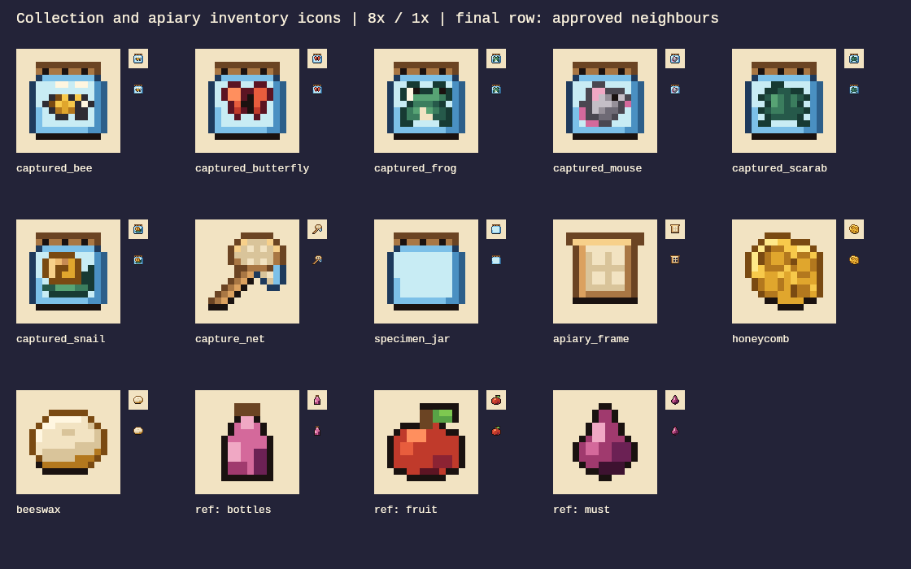
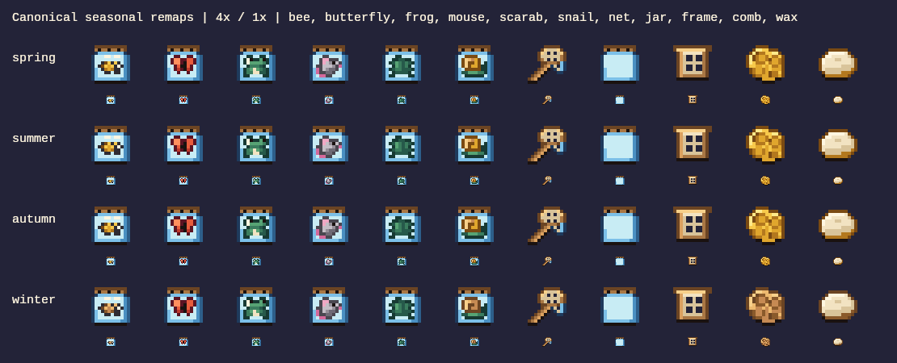

# Collection and apiary inventory art

This delivers the eleven inventory icons assigned from owner-approved doc 63
([plan PR #82](https://github.com/Dastari/orchard-cellar/pull/82), §§7.1–7.2 and §8).
The full plan was approved on 2026-09-23. These are original text-grid assets in
`packages/assets/ui`, using only the 55-color Late Summer Orchard palette.



The large images use nearest-neighbor 8× scaling. The two small copies beside each
image are 1× on parchment and dark backgrounds. Labels belong to this review sheet,
not the sprites. The last three entries are approved bottle, fruit and must icons.
The PNG is a review artifact rendered from committed grids, not an asset source or
licensed sheet.

## Integration mapping

| Planned item | Asset name | Readability cue |
| --- | --- | --- |
| `item:captured_bee` | `icon_animal_captured_bee` | Gold striped body, paired pale wings, live eye |
| `item:captured_butterfly` | `icon_animal_captured_butterfly` | Spread warm red wings and narrow body |
| `item:captured_frog` | `icon_animal_captured_frog` | Raised eyes, green crouched body and hind feet |
| `item:captured_mouse` | `icon_animal_captured_mouse` | Round pink ear, pointed face, eye and curled tail |
| `item:captured_scarab` | `icon_animal_captured_scarab` | Teal wing cases with central seam and lateral legs |
| `item:captured_snail` | `icon_animal_captured_snail` | Gold spiral shell, green extended foot and raised head |
| `item:capture_net` | `icon_alchemy_capture_net` | Wooden hoop and handle, open mesh and hanging bag |
| `item:specimen_jar` | `icon_alchemy_specimen_jar` | Empty glass jar with ventilated lid |
| `item:apiary_frame` | `icon_alchemy_apiary_frame` | Broad top bar, timber sides, open fiber grid |
| `item:honeycomb` | `icon_animal_honeycomb` | Irregular gold comb with clustered hexagonal cells |
| `item:beeswax` | `icon_animal_beeswax` | Pale cream wax lump, broad highlight and folded surface |

All icons are 16×16, anchor `[8, 15]`, with nontransparent art inside the central
12×12 area. They have one static base frame, explicit UI placement and no collision.
The six occupied jars share the empty jar's ventilated lid and glass rim, without a
liquid meniscus. The animals are alive; no carcass, meat, severed part or ingredient
preparation is depicted. Each species is a general inventory icon; variant-specific
journal art remains a later integration concern.

## Visual review

1. **Silhouette pass:** rendered all eleven through `npm run assets:render <name>`.
   Checked the jar, diagonal net, frame, comb and wax outlines at 1×; occupied jars
   intentionally share the same outer silhouette, so species identification depends
   on their internal animal silhouettes and colors.
2. **Color and outline pass:** added top-left highlights, darker lower-right facets,
   hue-relative outlines and dark bottom contact edges. Compared the set with approved
   `icon_resource_bottles`, `icon_resource_fruit` and `icon_resource_must`. The standard
   render tool also showed its three automatically selected approved UI neighbors.
3. **Revision pass:** the first net read as a spoon, so added an open mesh and hanging
   bag; stepped the butterfly wing tips and added a clear mouse eye. Re-rendered and
   inspected the changed assets. Tightened the comb to the central 12×12 bounds.
4. **Final review:** inspected all eleven rendered outputs and the contact sheet at
   8× and 1×, on light and dark backgrounds. Metadata `approved: true` records this
   authoring review; the PR remains open for owner review.

Independent coordinator review on 2026-09-23 also passed the native-size species,
separate-item and palette comparison, with no blocking visual issues.

The existing orphan-pixel validator uses only orthogonal neighbors. Ten icons use
its existing `lintAllow: ["sparkle"]` convention for intentional one-pixel eyes,
ventilation holes, narrow animal details and diagonally connected outline/ramp
pixels. These are structural details, not scattered texture. The apiary frame
passes without this exception. No palette or validator rule was changed.

Reproduce any individual neighbor review with:

```sh
npm ci --ignore-scripts
npm run assets:render icon_animal_captured_bee
npm run assets:validate
npm run assets:build
```

The individual review PNG appears at `build/review/<asset-name>.png`. Generated
atlases remain ignored and are not sources.

## Seasonal review



The existing native seasonal remaps apply without any new seasonal grids. Gold
becomes warm tan in winter, retaining bee stripes, snail shell and honeycomb cues.
The frog uses the existing cool-green ramp so it remains green in all seasons,
instead of inheriting the autumn foliage recolor. All four exports were visually
inspected and checked pixel-for-pixel against the canonical remap: 11 assets ×
4 seasons × 256 pixels = 11,264 exact RGBA comparisons.

## Checklist

- [x] Only the closed 55-color palette; binary transparency; no source palette override.
- [x] Canonical 16×16 canvas and `[8, 15]` anchor; central 12×12 art bounds.
- [x] Distinct object silhouettes at 1×; species cues reviewed inside the shared jars.
- [x] Top-left lighting; broad clusters, no pillow shading or decorative dithering.
- [x] Item outlines and dark lower contact edges.
- [x] Compared with three approved same-category neighbors.
- [x] Static inventory art; animation timing is not applicable.

## Validation

Passed: isolated `npm ci --ignore-scripts`, workspace typecheck, lint, content
validation (919 definitions), asset validation (1,331 assets), atlas/UI assets build,
17 targeted pipeline/registry/UI-metadata/frame-kind tests, exact four-season atlas
pixel comparison, all-eleven naming/palette/size/anchor/art-bound checks, and
`git diff --check`. The original full `npm test` coverage run reported 145 failures
in existing plain-icon/native-village source checks because this isolated worktree
lacked the ignored licensed `references/` directory. A narrow reproduction confirmed
`ENOENT`; after linking the authorized local reference library, both affected suites
passed all 147 tests. No source asset or test logic was changed. The original full
run remains active at handoff; full-suite and exhaustive-phase success are not
claimed. See the PR for subsequent completion status.

## Delivery and handoff

Assets candidate version **0.19.3** is coordinated after P0 imported icons 0.19.1
and core art 0.19.2. Preserve higher compatible versions and additive release notes
when integrating parallel branches. This branch started at upstream main
`5578b49c96d8131f83bb7d642c7e09d840471b3c`.

The item mapping above is for the later content phase; this change does not add or
activate item definitions, recipes, custody logic, journal UI, station art or world
objects. The apiary inventory icon and station/world sprites belong to another art
lane. There are no renamed IDs or player-data changes.

Release order: include these grids in the next owner-authorized client asset bundle
before publishing content that references them. This art PR needs no world-module or
content publication. No merge, deployment or world publish was performed.
