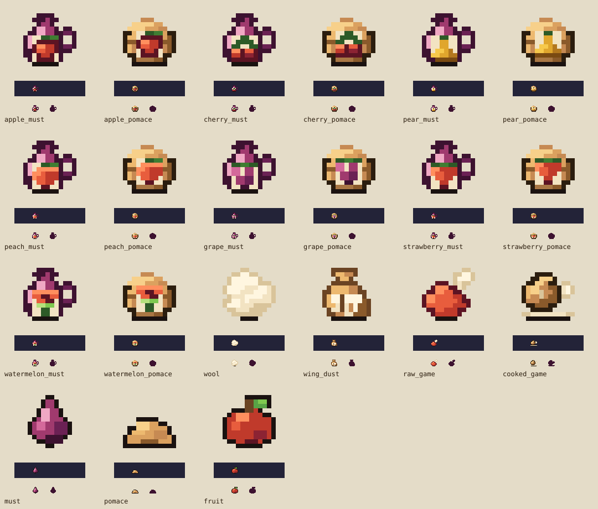

# Food/alchemy core art handoff

This art-only lane fulfills 18 requests in owner-approved [doc 63 §§3/8](https://github.com/Dastari/orchard-cellar/blob/docs/food-alchemy-plan/docs/63-food-alchemy-content-plan.md), part of [plan PR #82](https://github.com/Dastari/orchard-cellar/pull/82). It starts from `origin/main` `5578b49c`, independently of the 203 licensed imports in [PR #90](https://github.com/Dastari/orchard-cellar/pull/90).



The SVG is a review drawing of the committed bespoke grids, not a runtime asset. The source of truth is `packages/assets/ui/*.sprite.json`; all runtime PNGs/atlases and individual review PNGs remain generated, ignored files. No licensed pixels, external source images, source palettes or lint exceptions are introduced.

## Delivered keys

| Family | Asset keys | Identification cues |
|---|---|---|
| Must | `icon_alchemy_<fruit>_must` | Open handled jug, wine ramp, paper fruit mark |
| Pomace | `icon_alchemy_<fruit>_pomace` | Woven basket, rolled rim, pulp mound, paper fruit mark |
| Wool | `icon_animal_wool` | Cream fleece tuft with irregular folded clumps |
| Wing dust | `icon_animal_wing_dust` | Tied pouch with a paired-wing motif |
| Raw game | `icon_animal_raw_game` | Red haunch with an upward bone end; no gore |
| Roast game | `icon_food_cooked_game` | Brown roast with side bone on a shallow plate |

`<fruit>` is exactly `apple`, `cherry`, `pear`, `peach`, `grape`, `strawberry`, or `watermelon`. The fruit marks have distinct geometry: round apple, paired cherries with stems, narrow-necked pear, split peach, grape clusters, tapered strawberry with leafy cap, and a watermelon wedge with rind. Their names/tooltips remain necessary accessibility cues; these are not recolor-only variants.

All 18 sources use size `[16,16]`, anchor `[8,15]`, binary transparency, a single static `base` frame, and only the closed 55-color Orchard palette. They have no collision geometry or gameplay definitions. Existing generic must/pomace and all other IDs are unchanged.

## Review record — 2026-09-23

Author: AzureOx (Astra art lane). Independent reviewer: OrangeCastle (coordinator).

1. Rendered all 18 filled silhouettes with `assets:render` and inspected at 1×/8×. Jug handles, basket bodies, tuft, pouch, raw bone angle and cooked platter separate the core families.
2. First color review found that the basket tag hid too much weave and the roast resembled bread. Exposed the rim/lower weave, added the roast's side bone, and kept the raw haunch's upward bone.
3. Final motif review removed the strawberry's oversized seed stripes, separated grape clusters, and eliminated isolated shading pixels. Re-rendered every source. No validation suppression was added.
4. Reviewed final grids at 8× and native size on light/dark backgrounds, beside approved `icon_resource_must`, `icon_resource_pomace`, and `icon_resource_fruit`. OrangeCastle independently inspected the contact sheet and found no blocking silhouette or motif defect. Only then marked the 18 assets `approved: true`.

The standard individual previews are generated by `npm run assets:render <key>` at `build/review/<key>.png`. The committed SVG preserves all final visual evidence without committing raster output. A final source audit filled two unintended transparent interior pixels in the wing-dust pouch and joined its lower wing highlight; the corrected pouch was rendered and re-reviewed. The palette and outer silhouette are unchanged.

Style-bible checklist:

- [x] Closed bespoke palette; no `sourcePalette` or new palette entries.
- [x] Correct 16×16 size and (8,15) anchor.
- [x] Core item silhouettes readable at 1×; fruit identification adds distinct motif shapes.
- [x] Top-left light, clustered highlights/shadows, no pillow shading or dither.
- [x] Hue-relative outlines and warm near-black contact edges.
- [x] Compared with three existing approved Orchard icons.
- [x] Static icons; no animation timing requirement.

## Verification and publication

Run in an isolated checkout with its own dependencies:

```sh
npm ci --ignore-scripts
npm run assets:validate
npm run assets:render icon_alchemy_apple_must
npm run assets:build
npm run typecheck
npm run lint
npm run content:validate
npm test
```

Check results are recorded in the PR. Assets version is **0.19.2**, coordinated after PR #90's 0.19.1; preserve higher compatible package versions when integrating parallel art lanes.

Publication order: release the client asset bundle before future content references these keys. This PR requires no world-module or content publication. No merge, deployment or world publication was performed. No existing inventories, placed stations or running jobs change.

Remaining work belongs to separate lanes: collection/apiary inventory icons, station/world state art and other held source-mapping corrections. `raw_game` is resolved here despite appearing in the P0 mapping-correction ledger; do not create a second replacement. The coordinator can reconcile that ledger after reviewing this PR. Recipe reachability, animal drops and gameplay activation remain later phases of doc 63.
