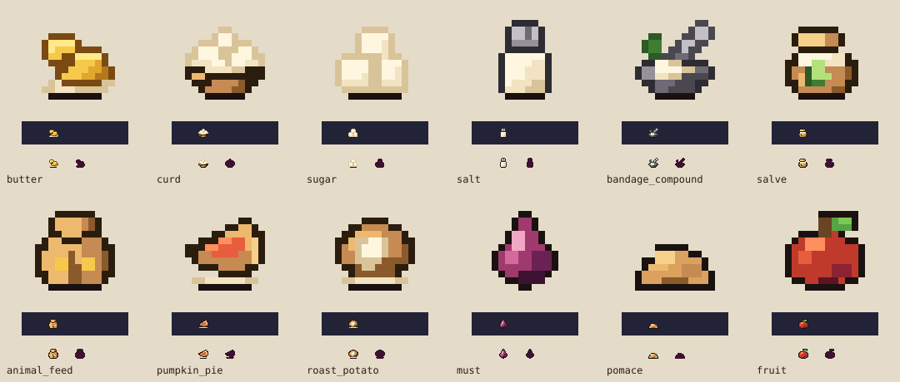

# Food/alchemy semantic icon corrections

These nine bespoke icons resolve held source-mapping defects from approved [doc 63](https://github.com/Dastari/orchard-cellar/blob/docs/food-alchemy-plan/docs/63-food-alchemy-content-plan.md) / [plan PR #82](https://github.com/Dastari/orchard-cellar/pull/82), recorded in [P0's art request ledger](https://github.com/Dastari/orchard-cellar/blob/feat/food-alchemy-icons/docs/food-alchemy-p0/art-requests.md). This independent lane starts from `origin/main` `df509125`. It does not modify the plan catalogue or import manifest; the coordinator reconciles those after review.



The SVG is review evidence rendered from the new source grids. Runtime PNGs, atlases and individual review PNGs are generated/ignored. None of the rejected vendor crops or licensed source pixels is copied into these replacements.

## Exact delivered keys

| Planned item | Stable asset key | Corrected identification cue |
|---|---|---|
| Butter | `icon_food_butter` | Golden butter slabs on unfolded paper; no charcoal silhouette |
| Curd | `icon_food_curd` | Soft, rounded cream curds in a shallow bowl; no mineral powder |
| Sugar | `icon_food_sugar` | Stack of straight-sided pale sugar cubes |
| Salt | `icon_alchemy_salt` | Pale salt shaker with a metal dispensing cap |
| Bandage compound | `icon_alchemy_bandage_compound` | Herb-and-fiber mixture in a mortar with pestle |
| Salve | `icon_alchemy_salve` | Squat salve jar with pale ointment and green leaf motif |
| Animal feed | `icon_animal_animal_feed` | Burlap feed sack with a grain motif |
| Pumpkin pie | `icon_food_pumpkin_pie` | Orange custard pie slice with pastry edge, on a plate |
| Roast potato | `icon_food_roast_potato` | Brown baked potato with a pale split center, on a plate |

The repeated `animal` in the feed key is intentional: it matches the exact approved P0 mapping. Do not rename it during integration. Names/tooltips remain necessary to distinguish specific materials and recipe meanings accessibly.

All nine assets use `[16,16]` dimensions, `[8,15]` anchors, a single static `base` frame, binary transparency and the closed 55-color Orchard palette. No `sourcePalette`, source crop, `lintAllow`, gameplay definition or collision metadata is added. Existing generic must/pomace and all saved player/station data remain unchanged.

## Review record — 2026-09-23

Author: AzureOx (Astra art lane). Independent reviewer: OrangeCastle.

1. Drew and rendered each filled silhouette through `assets:render`; inspected the 1× and 8× views before shading.
2. Reviewed the first color pass. The full pie and potato had overly similar round footprints, so redrew the pie as a triangular slice; separated the curd clumps with soft creases. Joined isolated shading/outline pixels without lint exemptions.
3. Re-rendered every asset and inspected the final sheet at native size on light/dark backgrounds and at 8×. Compared with approved `icon_resource_must`, `icon_resource_pomace`, and `icon_resource_fruit`.
4. OrangeCastle independently reviewed the final sheet and approved all nine corrections: food and medicine silhouettes/materials read distinctly, and no placeholder semantics remained. Marked metadata approved after validation.

Style-bible checklist:

- [x] Only closed bespoke palette colors; no source palette or lint exceptions.
- [x] Canonical 16×16 size and (8,15) anchor.
- [x] Native-size core silhouettes readable; specific materials additionally use shape/color cues and item names.
- [x] Top-left lighting and clustered shadows; no pillow shading or dither.
- [x] Hue-relative outlines and warm near-black contact edges.
- [x] Reviewed beside three approved Orchard icons.
- [x] Static frames; animation timing is not applicable.

## Verification and handoff

```sh
npm ci --ignore-scripts
npm run assets:validate
npm run assets:render icon_food_pumpkin_pie
npm run assets:build
npm run typecheck
npm run lint
npm run content:validate
npx vitest run packages/tools/src/assets/pipeline.test.ts packages/tools/src/assets/asset-registry.test.ts packages/tools/src/assets/source-palette.test.ts packages/tools/src/assets/frame-kind.test.ts
```

Results and full-suite limitations are stated in the PR. The earlier core-art checkout's exhaustive run passed 101 tests; its two coverage attempts were interrupted with exit 143 before a final result. The coordinator requested no additional competing full runs for this bounded art lane. Those earlier results are not represented as this branch's full-suite pass.

Assets version **0.19.5** is coordinated after the core, collection and station art lanes. Preserve the highest compatible version when integrating. The original bad source mappings must remain rejected; PR #90's coordinator owns manifest/tests reconciliation for reviewed bespoke replacements under these keys.

Publication order: owner-authorized client asset bundle release first; later gameplay content references afterward. No world-module or content publication is required by this art-only change. No merge, deployment or world publish was performed. Milk/egg source corrections and station/world art belong to other lanes; raw game was handled in [core art PR #91](https://github.com/Dastari/orchard-cellar/pull/91).
