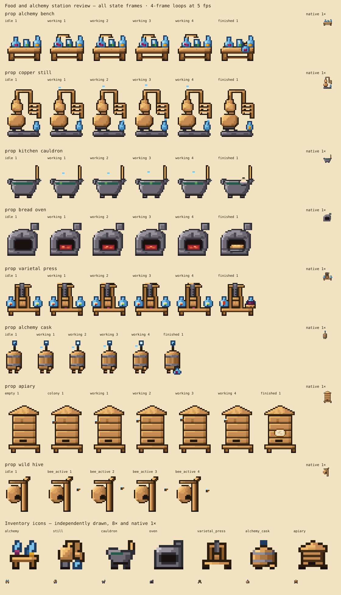

# Food and alchemy station artwork

Asset-only implementation of the owner-approved [doc 63, §§7.2 and 8](https://github.com/Dastari/orchard-cellar/blob/docs/food-alchemy-plan/docs/63-food-alchemy-content-plan.md), based on `origin/main` at `5578b49c`. Assets package **0.19.4** is coordinated with the other food/alchemy art lanes. No item, object, frame, process, ownership or runtime definitions are changed here.

[Open the full visual review sheet](review.svg) — every state and all seven icons, viewable directly on GitHub. This SVG embeds only the new bespoke grids.



## Asset contract

All sprites are bespoke native text grids in the closed 55-colour Orchard palette, with binary transparency. No source PNG, generated PNG, new palette colour, imported-source claim or orphan-pixel exemption is included. Inventory icons are drawn independently inside a 12×12 area of a 16×16 canvas, anchored at `(8,15)`.

| World asset | Size | Anchor | Collision, sprite-relative tile units | Inventory icon |
|---|---|---|---|---|
| `prop_alchemy_bench` | 32×32 | 16,31 | 0,1,2,1 | `icon_alchemy_alchemy` |
| `prop_copper_still` | 32×48 | 16,47 | 0,2,2,1 | `icon_alchemy_still` |
| `prop_kitchen_cauldron` | 32×32 | 16,31 | 0.5,1,1,1 | `icon_alchemy_cauldron` |
| `prop_bread_oven` | 32×32 | 16,31 | 0,1,2,1 | `icon_alchemy_oven` |
| `prop_varietal_press` | 32×32 | 16,31 | 0.5,1,1,1 | `icon_alchemy_varietal_press` |
| `prop_alchemy_cask` | 16×32 | 8,31 | 0,1,1,1 | `icon_alchemy_alchemy_cask` |
| `prop_apiary` | 32×48 | 16,47 | 0.5,2,1,1 | `icon_alchemy_apiary` |
| `prop_wild_hive` | 32×32 | 16,31 | No collision authored; habitat integration owns this policy | None |

Inventory suffixes follow the catalogue's exact item IDs. No pre-existing asset is renamed. The half-tile x offset centres each specified one-tile foot collider within a two-tile canvas. Doc 63 gives the wild hive's 32×32 canvas but leaves its numeric anchor unspecified: coordinator OrangeCastle confirmed the category-standard `(16,31)` on 2026-09-23. It is a grounded habitat branch with an attached nest, without attack or reward effects.

The six processing stations expose `idle` (one frame), `working` (four frames at 5 fps, looping), and `finished` (one frame). The apiary exposes `empty`, `colony`, `working` (four frames at 5 fps), and `finished`. The wild hive exposes `idle` and `bee_active` (four frames at 5 fps). Every state uses the same asset-level anchor and footprint. A runtime integrating these must select the appropriate named group and use its static state or first working frame for reduced motion.

Finished-state cues are a forward stoppered flask, full receiver, covered bowl, bread tray, filled jug plus pomace basket, sample jug, and capped comb, respectively. The press's labels use fruit pictograms rather than text. Bees are visual accents only; this PR creates no actors or production rewards.

## Reproduce the review

From this worktree, with workspace dependencies installed:

```sh
node docs/food-alchemy-station-art/render-review.mjs
# Verify the committed, portable SVG reproduces exactly:
cmp output/food-alchemy-station-art/review.svg docs/food-alchemy-station-art/review.svg
npm run assets:render prop_alchemy_bench
npm run assets:validate
npm run assets:build
```

The script writes `output/food-alchemy-station-art/contact.png` and eight `prop_*.png` sheets. Each world sheet contains the 8× idle/empty sprite, a native 1× inset, a dark-background comparison, complete labelled state filmstrips at 4×, and the approved `prop_basket_press`, `prop_oak_barrel`, `prop_cf_furnace` neighbours. The contact sheet includes all seven inventory icons at 8× and 1×. `npm run assets:render <name>` also produces each asset's standard checkerboard review with three approved category neighbours under `build/review/`.

The dark background checks silhouette contrast; it is not a production night-lighting or interaction playtest. PNGs are local review outputs, never committed assets. The portable `review.svg` is committed for direct visual review and contains only the new bespoke artwork; it contains no licensed neighbour pixels. The committed JSON grids and renderer reproduce the final evidence.

## Art review record — 2026-09-23

1. **Silhouette pass:** rendered all fifteen assets using the normal renderer and an aggregate contact sheet. The eight station/habitat types read separately at native size. The bench glassware floated above its surface and the still head was detached from its boiler.
2. **Colour and shape pass:** connected the bench vessels, still neck and cask airlock. Top-left wood/copper highlights, cool iron shadows, low-detail material clusters and distinct miniature icons established the shared family. Added small fruit pictograms to the press's jug rack.
3. **State pass:** rendered all working/finished groups. Reviewed the bowl, bread tray, sample jug, capped comb and finished pomace basket. Corrected the still's supports and retained condensation between coil and receiver.
4. **Cluster pass:** the strict orphan validator rejected isolated colour pixels. Connected those clusters without changing opaque silhouettes; re-rendered all assets and inspected every complete world filmstrip plus all icons. The palette and validator were unchanged. Bench icon liquid clusters were restored after cleanup to preserve the purple/gold vessels.

Author review passes the silhouette, material, top-left-lighting, outline and animation checks. The artwork is purposefully simple at native resolution; it is not a claim of owner approval or an in-game accessibility/lighting test. Coordinator review and final verification results are recorded in [verification.md](verification.md).

## Integration and publication order

Release the client atlas assets before content definitions reference these IDs. This artwork PR needs no world-module publication. Later doc 63 runtime/content PRs must implement station state selection, placement policy, custody, production, authoring forms and shared-kit frames, and must satisfy their own tests. Existing inventory, placed objects and jobs are untouched. No merge, deployment or world publication occurred here.
