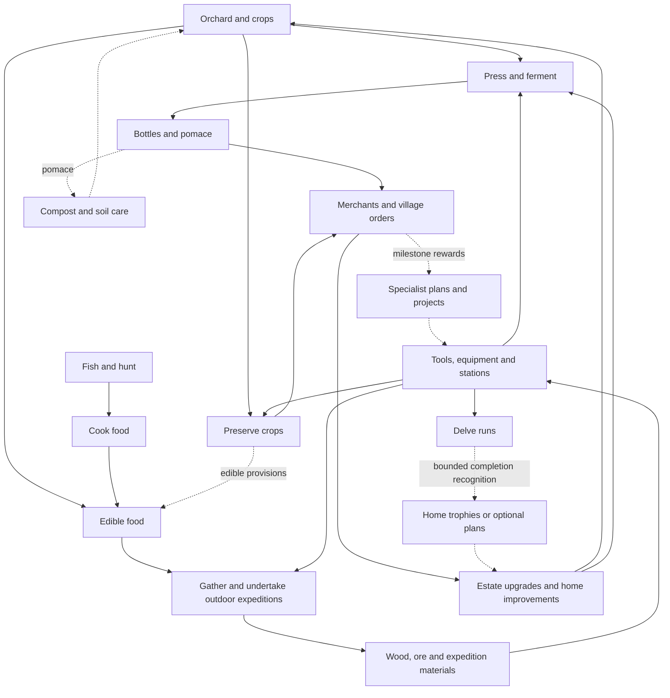

# Gameplay loops and their connections

Audit date: 2026-09-21. Source baseline: upstream `main` at
`1d2462cdeb70a96bdbc0e259bf3491d2d8a38a9d`.

This is a design audit and proposal, not an implementation commitment. It compares
authored content, authority code, simulation, client integration evidence, and the
design/roadmap documents. No production state was changed or fresh live playthrough
performed. “Implemented” below means present in the current source, not newly
verified on the deployed game. Historical deployment evidence is identified separately.

## Main finding

The game already has substantial connections. Gathering supplies production stations;
food sustains work; farming supplies bottles and orders; money buys estate upgrades;
expeditions supply equipment materials. What is missing is a consistent reason to
move from one activity to another and then bring something useful home.

The strongest unifying session loop is:

**Prepare the estate → start production → leave on a purposeful outing → return with
resources or discoveries → collect and deliver goods → improve the estate → repeat.**

Use a network of optional branches around that loop. Requiring every player to fish,
hunt, fight, and decorate in a single linear chain would frustrate specialization
and the peaceful farming path.

## 1. Existing loop inventory

Related mechanics are grouped by player purpose; this is not a count of every verb.
Evidence keys resolve to source links in section 7.

| Loop | Current chain and reward | Existing connections and limits | Evidence |
| --- | --- | --- | --- |
| Crops | Acquire seeds → till/plant → water or receive rain → grow → harvest → sell/replant | Food, preserving, grape pressing, Farming XP, seed-return skills, estate upgrades | A, B |
| Orchard trees | Chop mature fruit tree → collect wood, fruit and possible seed → plant/regrow → repeat | Food or press inputs; Orchard Seed Saver increases seed recovery. Fruit picking, orchard Care and the older ten-species/grafting design are not this live loop | A, C |
| Preservation | Grow crops → load matching batch → seal barrel → wait → collect preserved goods | Better sale value and pantry orders. Preserved items are tagged food but currently lack edible `food.restoreCenti` metadata | B, D |
| Cellar production | Fruit → press → Must + Pomace → fermentation cask → bottles → sell → reinvest | Workbench, timber, iron and copper supply stations; estate Vintage raises aging time and sale value. Pomace currently has a sale sink but no production consumer | C, D, E |
| Hunger and cooking | Spend Vigour working/sprinting/fighting → hunger pressure → harvest, hunt or fish → cook/eat → resume | Already connects resource work and combat to food. Hunger slows work; it does not drain offline or kill the player | F |
| Hunting | Find eligible food wildlife → fight → collect raw meat → cook → eat/sell → revisit respawn | Combat XP and Farming cooking XP. Hunting food animals is a documented exception to the earlier blanket sanctuary restriction | F |
| Fishing | Acquire rod → find pool → cast/wait → catch → cook/eat/sell → find replenished pool | Tutorial quest, fishing skills, rod wear/repair, food. Catches grant Explorer XP, while fishing specialization is under Farming | G, O |
| Forestry and gathering | Chop/gather → wood, sticks, fiber and other materials → craft or fuel processors → revisit regrowth | Supplies tools, stations, lights, furniture and smelting; woodcutting skill branch | A, H |
| Mining and metalwork | Discover node → strike → collect fragments/chunks → consolidate → smelt → craft/repair → reach better deposits | Farming mining skills, pick tiers, fuel, stations, cellar excavation and volcanic materials. Repair maintains a recurring material sink | H |
| Cellar excavation | Strike eligible walls → open usable cellar space and collect materials → install more storage/production | Already makes mining useful to the estate. Expansion needs a clearer production goal and visible payoff | I |
| Crafting and equipment | Gather/buy inputs → obtain a plan when required → use appropriate station → equip/place output → improve work/combat | Cross-system backbone. Core recipe book hints are not all hard knowledge gates; equipment plans use explicit recipe knowledge | H, J |
| Commerce and village orders | Produce requested goods → deliver/sell → receive money → buy seeds, plans, furnishings or upgrades | Seven repeatable orders already cover raw crops, preserves and bottles. Their repeated rewards are money, with limited distinct long-term village outcomes | E, K |
| Home building and furnishing | Earn money/materials → acquire/craft furniture → place, move, sit, construct and expand rooms | Permanent expression, construction material sinks and furnishing introduction quest. Routine home utility is less connected to outings | L |
| Outdoor expeditions | Prepare equipment → enter danger region → fight/gather → claim reserved rewards → craft better gear → attempt tougher encounters | Cinderwake materials, Guardian Seals and legendary recipe exchange are real links. Travel/service journeys still have acceptance caveats in the release ledger | J, M |
| Delves | Enter private run → clear waves → choose boons/doors → spend run embers → defeat guardians or exit → reset | Equipped gear/skills matter, but no persistent XP, drops or run rewards return. World vitals are restored; persistent consumables are prohibited. Delve rewards are separate from outdoor Expedition Rewards | N |
| Character progression and quests | Perform eligible actions → XP/statistics/objectives → points/rewards → active skill effects → improve activity | Three live tracks: Combat, Explorer and Farming, with mining/fishing/woodcutting branches under Farming. Some displayed/design nodes remain unavailable | O |
| Travel, mounts and discovery | Explore → find pools, deposits, destinations and NPCs → travel there → bring goods home | Horses, boats, ferries and map/discovery capabilities support other loops. Travel is mostly connective infrastructure, not a complete reward loop on its own | G, M, O |
| Cooperation and trade | Help/build with permissions, share mining work through parties, or trade goods → support another player's production | Direct escrow trade and party authority exist. Party presentation and actual group journeys need separate verification; Delve Phase 1 admits only its owner | H, N, P |

Production is already suitable for the proposed session rhythm: base press cycles
take five minutes, fermentation and preserving thirty minutes, and progress settles
from authority time. Players need not stand beside a machine. These are base process
durations, not measured total session times; capacity, skills, ranks and gathering
change throughput.

There is also an existing useful consumable bridge: apple + pear crafts Orchard
Tea, whose use applies an authored effect. Extend this pattern when designing
provisions; food preparation and temporary effects are not wholly missing systems.

## 2. Planned, partial and legacy loops

“Planned” is not a single status. Some systems have authority and content but incomplete
acceptance; others are unavailable authored skills; others belong to the retired solo
economy and need an explicit redesign before joining the multiplayer game.

| Status | Loop or mechanic | Useful eventual connection |
| --- | --- | --- |
| Simulated foundation; interaction missing | Bees/hives accumulate honey; harvest, apiary management and Beekeeping/Hive Keeper are unfinished | Orchard → pollination/honey → food, candles or specialty products → estate/village |
| Unavailable authored branches | Grafting; Master Angler/Forester; Animal Friend/Herd Keeper; additional combat/explorer nodes | Specialization can create differentiated goods and discoveries. An unavailable skill does not mean its underlying mechanic is absent: blocking already exists independently of Shield Discipline |
| Partial wildlife progression | Basic mount-related skills exist; full pets, livestock breeding and husbandry are not a closed product loop. Barn/coop/silo placeables are not evidence of animal production | Crops/byproducts → feed/care → animal products or hauling → farming/production |
| Existing code, incomplete journey acceptance | Hearth ferries, service interiors, cave/lobby access, equipment/housing/expedition onboarding | Finish the accessible out-and-back route before adding new destination systems |
| Older homestead expansion target | Larger land/residence tiers, distinct from the implemented two interior room expansions | Longer-term estate capacity and specialization; reconcile with current housing before implementation |
| Deferred fishing scope | More species, records, bait/tackle, ocean/boat fishing and party claims | Different locations can supply distinct foods, collections and orders. These are possible extensions, not committed next tasks; a bite-timing minigame is explicitly rejected |
| Partial cooperative foundation | Party work sharing, permissions and trading; future Delve party admission | Player specialization and shared projects with individual contribution/reward recognition |
| Older social design | Guestbook, gifts, tasting table and hosted celebrations beyond existing chat/trade/permissions | Bottles and furnished homes → hospitality, collections and shared goals |
| Roadmap concepts | Seasonal festivals, daily events, visiting/working NPCs and estate hands | Produce seasonal goods → public occasion/project → recipes, decor, recognition and next-season goals |
| Legacy orchard/production design | Care, ten-species synergies, pomace-funded presses, compost, automated hauling, press/cask tiers | Selectively adapt these to current inventory/processors, rather than importing the old global resource banks |
| Legacy long-term progression | Vintage ceremony → Terroir/Knowledge → Succession/Heirlooms → Lineage/Cultivars; tasting/label history | A future estate legacy can recognize connected play. Current Estate Vintage ranks are sale/aging upgrades, not prestige resets |

Specific plan sources: [wildlife](29-wildlife.md),
[character progression](36-character-progression.md),
[orchard](04-orchard-design.md), [cellar](05-cellar-design.md),
[live progression amendment](06-progression-economy.md#15-live-character-progression),
[roadmap](14-roadmap.md), [world direction](40-sanctuary-overworld-and-zoned-world.md),
[Hearth plan](60-hearth-harbour-and-embers-content-patch-plan.md).

## 3. Where the connections are weak

1. **Pomace stops at a merchant.** Five press processes produce it; no current recipe
   or processor consumes it. Compost would directly close production back into growing.
2. **Preserving does not yet provision an outing.** Current preserves sell and satisfy
   orders but are not edible under the runtime food contract. “Preserves → rations” is
   a proposed behavior change, not an existing link.
3. **Delves intentionally have no return leg to persistent progression.** This is an
   explicit isolation contract, not an overlooked reward bug. A bounded completion
   reward would need a new design and atomic, once-only settlement outside run state.
4. **Money makes outputs interchangeable.** Most peaceful repeatable work leads to a
   wallet, so a dominant income source can bypass the purpose of other professions.
   Village orders exist already; merely adding another coin-paying board will not
   solve this.
5. **Price scales compress housing goals.** A base bottle sells for 5,000 bronze; the
   two individual residence expansions cost 3,200 and 4,200. The first-bottle quest
   grants 50,000 bronze. Purchased apples cost 12 each and can enter the timed press
   chain. These are verified prices, not a measured gold-per-hour exploit: station
   construction, input access, capacity and processing time still matter. Evaluate
   the whole route before adjusting any prices.
6. **Generic products lose their origin.** Apple/pear/peach/cherry/grape pressing
   converges on the same Must and Bottle. The estate rank, rather than a distinct
   vintage item, supplies the sale premium. Species-specific orders can give variety
   purpose without immediately adding quality/provenance inventory complexity.
7. **Unlocks and waiting time need an explained purpose.** The first-bottle quest and
   introductory Hearth contracts are useful beginnings. Players still need to see
   which upgrade they are working toward, what it consumes, and a useful outing while
   production runs.
8. **Fishing does not directly train its own specialist tree.** Both ordinary catches
   and pool depletion grant Explorer XP; Angler's Rhythm, Seasoned Angler and Fishing
   Mapping are Farming nodes. Cooking the catch can earn Farming XP, so there is an
   indirect route, but the activity-to-specialization link is obscure. Decide whether
   to align fishing XP or deliberately explain and balance a dual-track design.
9. **Orchard cultivation currently shares forestry's destructive harvest.** Planted
   fruit trees use chopping and regrowth, not a separate fruit-picking interaction.
   A repeatable fruiting/picking cycle would make tending a permanent orchard distinct
   from collecting timber, and give compost/grafting a more natural future target.

## 4. Proposed dependency network

This diagram is a target design, not a claim that all edges already work. Solid
arrows show current source connections; dashed arrows are proposed additions.

The chain should have **local prerequisites and shared payoffs**:

- Basic metalwork supplies barrels/casks; it must not require a reward from the
  production station it unlocks.
- Farmed food, fishing, hunting and merchant food remain alternative supply routes.
- Ordinary orchard/cellar/home progression remains achievable without combat.
- Outdoor rare materials and combat rewards can support specialist equipment and
  optional estate styles without becoming universal farming taxes.
- Trade lets a farmer purchase crafted tools and a miner obtain meals. Self-sufficient
  solo routes remain possible; cooperation improves choice and convenience.
- Farming's watering and production remain functional at baseline. New compost or
  provisions provide clear benefits without creating a new maintenance penalty.

## 5. Recommended integration order

| Priority | Deliverable | Depends on | Player-visible proof |
| --- | --- | --- | --- |
| 0 | Verify current routes and economy from a fresh character; surface “next useful upgrade” and its inputs using existing quests/recipes; resolve fishing XP/skill-track intent | Current content and accessible stations/NPCs | Player can explain the next estate goal and choose a useful outing while a batch runs; actual ferry/service/return paths work; specialist advancement is understandable |
| 1 | Pomace → compost → a bounded growing benefit | Priority 0; choose current crops first or explicitly design orchard Care | Press byproduct is consumed, benefits a later harvest, and replenishes through more pressing; no need for a new machine tier system |
| 2 | Preserves and mixed meals → useful outing provisions | Priority 0 plus food/effect design | Crops and fish/meat have distinct practical uses; preserving is useful beyond selling, without invalidating basic food |
| 3 | Extend the existing seven village orders into specialist milestones and visible projects | Priority 0 economy; priorities 1–2 if those goods participate | A meaningful variety of deliveries unlocks a plan, decorative project or service; repeatedly selling the most profitable item cannot complete everything |
| 4 | Tie existing cellar space, tools and production capacity to explicit estate goals; design renewable fruit picking as a separate orchard interaction | Economy review plus existing mining/crafting/excavation; fruit/tree lifecycle design for picking | A player identifies a bottleneck, gathers/crafts for it, adds usable capacity and sees the improvement; existing Vintage ranks retain their role; fruit picking and timber felling have distinct purposes |
| 5 | Add optional Delve completion recognition and outdoor discovery rewards that return home | Explicit amendment to Delve isolation; reward transaction and duplicate/reconnect tests | A trophy, journal record or bounded plan survives victory exactly once; run embers/boons remain isolated; no required combat gate for farmers |
| 6 | Honey/husbandry → specialist goods; seasonal projects/festivals → estate history | Core production/supply/demand loop has passed playtests | New systems enter with both an input and a useful output, instead of adding another isolated activity |

Priorities 1 and 2 can be implemented independently after 0. Priority 5 is optional
and can be designed independently, but the current isolation contract must be
preserved until replaced deliberately. Generational prestige belongs after the
estate economy has a proven repeatable rhythm; shared ownership/reset semantics need
their own design.

Suggested first playable slice: **fruit → press → bottle sale + pomace compost →
better harvest**, with a quest explaining the return to growing and suggesting a
gathering trip during fermentation. It uses an existing orphaned output and makes
the game's central chain circular before expanding the feature roster.

## 6. Acceptance and risks for later implementation

These are proposed acceptance criteria, not results collected in this audit.

- Play through one estate → outing → return → reinvest cycle without developer grants.
  Record active work, travel and wait separately; do not infer income rates from prices.
- Demonstrate a peaceful solo route and a trading/cooperative route to the same basic
  estate milestone. No compulsory Delve, boss, fishing or hunting requirement.
- Verify starter inputs are obtainable before any gate that needs them; zero circular
  mandatory unlock dependencies or permanent hunger/tool/seed soft locks.
- Compare growing inputs with buying and processing them, including fuel, repair,
  station cost, throughput and ordinary sale opportunity cost. Assess housing,
  equipment, quest payouts and Vintage ranks on the same currency scale.
- Give each new product a named consumer and each activity a visible next benefit.
  Track whether playtesters can identify that benefit without assistance.
- Test retry/reconnect and full inventories for material conversion, project delivery
  and any permanent Delve reward. Keep server authority and existing custody rules.
- Preserve the current distinction between physical inventory goods and permanent
  unlocks. Do not introduce provenance-dependent bottle prices unless provenance is
  actually stored; current prices use the seller's estate rank.
- Before coding a selected slice, update its binding design/acceptance document and
  balance fixtures. This audit does not approve exact costs, new reset rules or a
  production deployment.

## 7. Evidence and documentation drift

| Key | Primary sources |
| --- | --- |
| A | [Growth](../packages/sim/src/growth.ts), [farming effects](../packages/sim/src/farming-skills.ts), [crop content](../packages/assets/content/crops.json), [world authority](../packages/world/src/index.ts) |
| B | [Preserving](../packages/sim/src/barreling.ts), [estate upgrades](../packages/sim/src/homestead-upgrades.ts), [harvest/cellar audit](harvest-cellar-audit.md) |
| C | [Fruit seed specification](fruit-seeds-spec.md), [tree regrowth](../packages/sim/src/tree-regrowth.ts), [processor content](../packages/assets/content/processes.json) |
| D | [Item definitions](../packages/assets/content/items.json), [runtime food contract](../packages/sim/src/content/runtime.ts), [processor settlement](../packages/sim/src/behaviour/handlers/processors.ts) |
| E | [First-bottle design](46-live-first-bottle-loop.md), [village order quote/planner](../packages/sim/src/village-orders.ts), [estate tier arithmetic](../packages/sim/src/homestead-upgrades.ts) |
| F | [Hunger/hunting/cooking amendment](45-repeatable-loop-hunger-hunting-cooking.md), [food](../packages/sim/src/food.ts), [hunger authority tests](../packages/world/src/hunger-authority.test.ts) |
| G | [Fishing design](54-fishing-system.md), [world authority](../packages/world/src/index.ts), [quest content](../packages/assets/content/quests.json) |
| H | [Mining](48-repeatable-mining-loop.md), [crafting](28-crafting.md), [recipes](../packages/assets/content/recipes.json), [processes](../packages/assets/content/processes.json) |
| I | [Excavation](../packages/sim/src/cellar-excavation.ts), [excavation authority tests](../packages/world/src/cellar-excavation-authority.test.ts) |
| J | [Equipment content tests](../packages/sim/src/content/hearth-equipment.test.ts), [seal exchange](../packages/sim/src/hearth-seal-exchange.ts), [equipment skills](../packages/sim/src/equipment-skills.ts) |
| K | [NPC orders](../packages/assets/content/npcs.json), [quest definitions](../packages/assets/content/quests.json), [existing economy audit generator](../packages/tools/src/report-village-order-economy.ts) |
| L | [Residence expansion quotes](../packages/sim/src/hearth-residence-expansion.ts), [construction inventory](../packages/sim/src/hearth-architecture-inventory.ts), [furnishing contracts](../packages/sim/src/hearth-furnishing-contract.ts) |
| M | [Hearth implementation ledger](60-implementation-status.md), [encounters](../packages/sim/src/hearth-encounters.ts), [travel](../packages/sim/src/hearth-travel.ts) |
| N | [Delve isolation design](49-hidden-cellar-descent.md), [run simulation](../packages/sim/src/roguelike.ts), [world `finishRogueRun` and `startRogueRun`](../packages/world/src/index.ts) |
| O | [Authored skills](../packages/assets/content/skill-trees.json), [availability filtering](../packages/sim/src/skill-trees.ts), [live progression amendment](06-progression-economy.md#15-live-character-progression) |
| P | [Direct trading](42-player-trading.md), [homestead permissions](35-homesteads-and-farming.md), [party mining contract](48-repeatable-mining-loop.md#parties-and-contribution-ownership) |

Important status corrections when using older plans:

- Doc 54 still says fishing is unimplemented; the current authority has casting,
  catches, pool replenishment and tutorial content. Its banner is stale.
- Doc 46 describes Marlow/book prerequisites for the bottle quest. Current authored
  `marlow_first_bottle` is given by Farmer Bob after the strawberry quest. Keep the
  actual ten-quest catalogue as the inventory source for this audit.
- Doc 60's top table predates its later publication entries. The final entries record
  code/schema/content publication on September 10 and island terrain/policy/resources
  activation on September 11, while distinguishing unfinished ferry/service/lobby
  acceptance. Neither “all planned” nor “fully verified live” describes that state.
- Docs 03–06 contain retired solo-economy systems alongside later live amendments.
  The old milestone completion and pure simulation support do not establish a live
  multiplayer prestige, automation or orchard Care loop.

## Review and handoff

Two independent read-only audits covered implemented mechanics and planned systems.
An adversarial review corrected the orchard inventory to distinguish chopping from
fruit picking. Local validation passed whitespace checks, all 57 relative file links,
Markdown fence/table checks, and direct assertions against authored quest/order
counts, relevant prices, preserved-food metadata and pomace production/consumption.
No code tests or builds were run for this documentation-only change; the repository's
normal PR CI remains the automated code gate. No live playtest result is claimed.
The resulting proposals remain advisory. The next implementation task should select
one complete slice from section 5, reconcile its binding design, then prove the
listed player journey. No gameplay feature or roadmap milestone is marked complete
by this documentation change.
