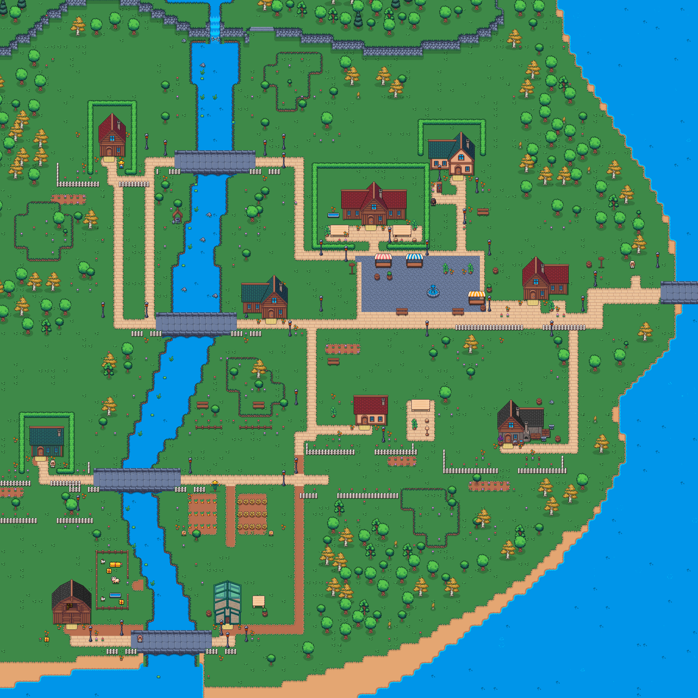
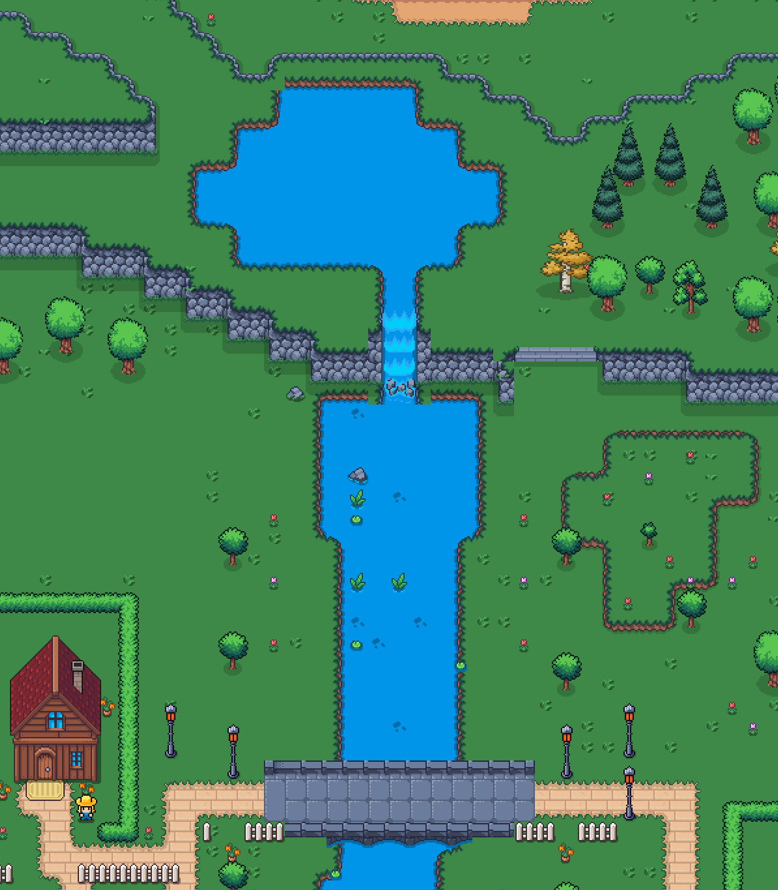
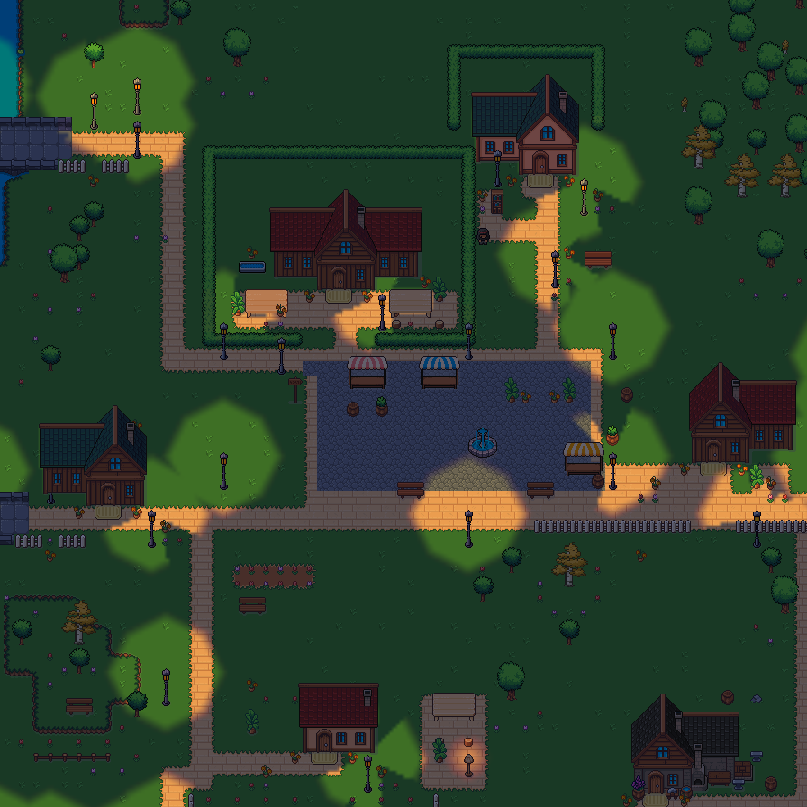

# Astra review — headwaters and finishing details

Independent reviewer: `headwaters_astra_review` (Astra). Accepted after R2 correction.

Native-sheet inspection identified the missing bridge underside at source y60–79 and the incorrect lamp `on` crop (a different dim design instead of the bright matching column). The existing full waterfall artwork includes the crest, cliff sides, descent and splash.

R1 review accepted the bridge arches, visibly stronger warm lamps, clear flower/fence separation and fences stopping before the eastern shallow hill. It rejected a dry cliff-lip gap between the lake outlet and visible waterfall crest. Anchoring the waterfall on the upper plane restored the complete crest; a two-cell stepped lake mask removed isolated shoreline spikes.

R2 accepted: the lake flows continuously over the cliff into the river; crest and splash connect; shoreline spikes are gone; bridge arches remain aligned beneath the south rail. No remaining visual correction was requested for this scope.

These are actual-engine offline renders, not deployed-game verification. Functional and native-source tests accompany them.

