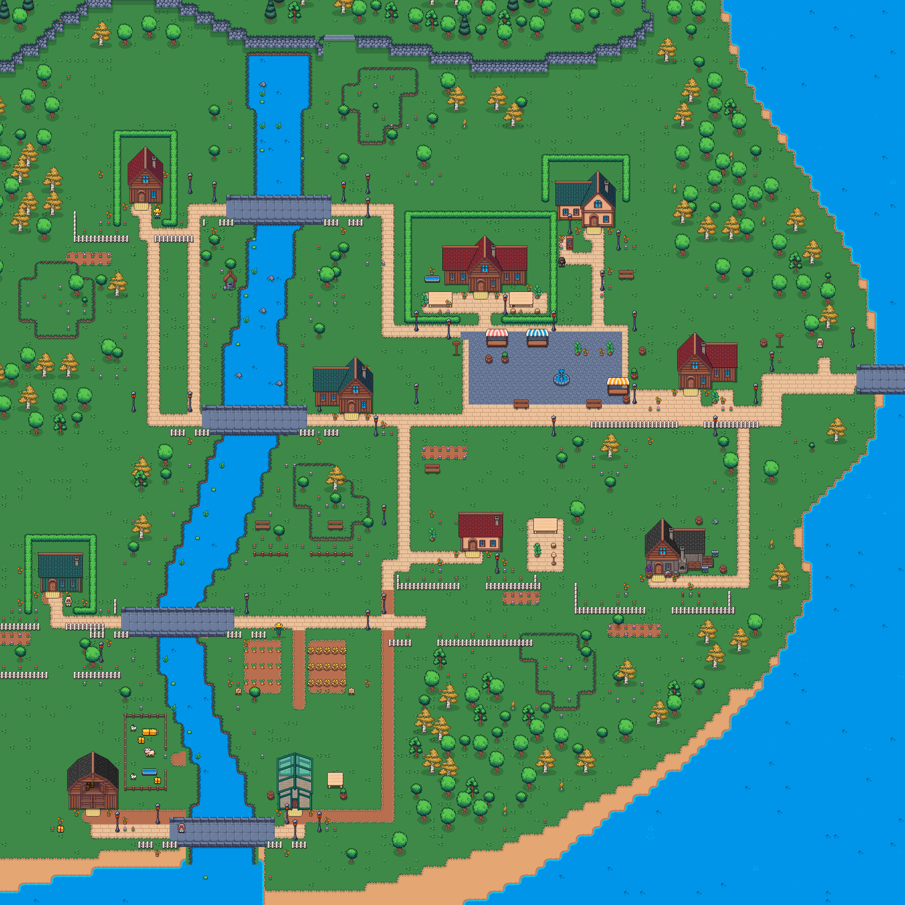
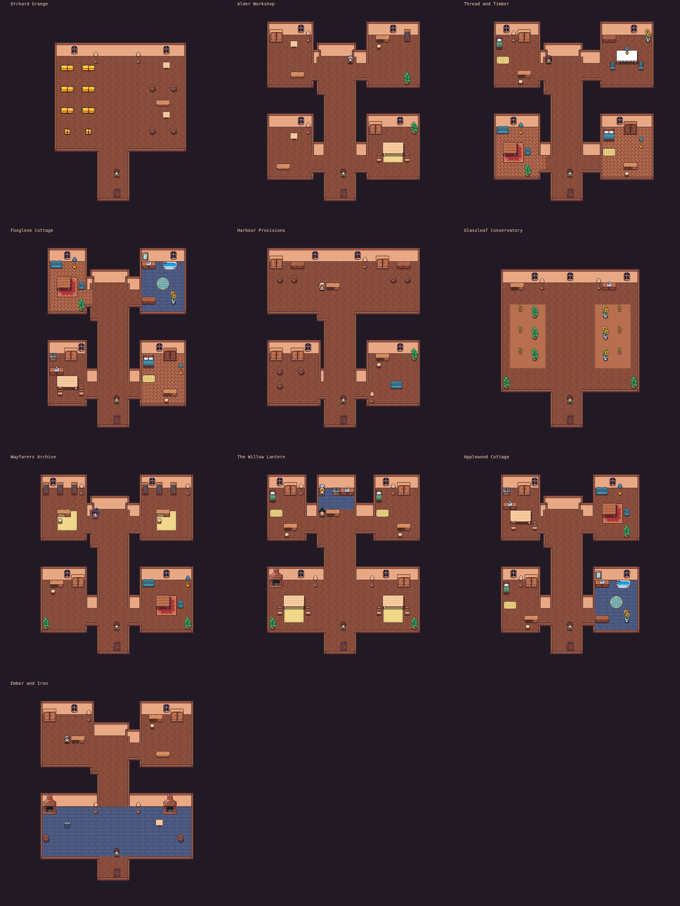
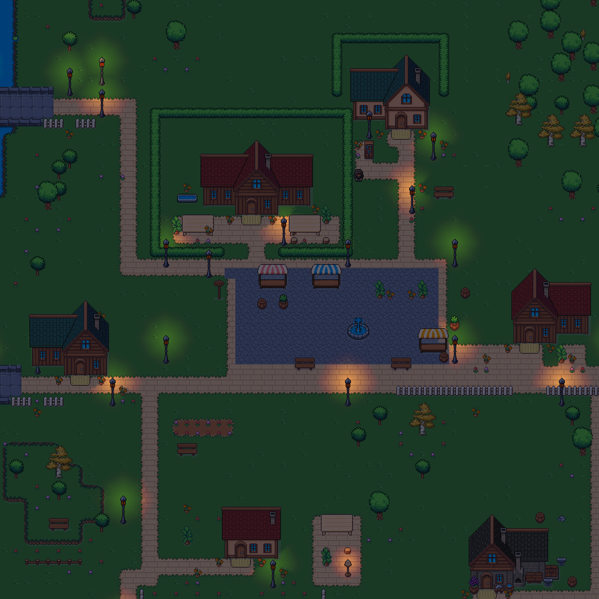

# Independent Astra review — connected town pass

Reviewer: `town_rules_astra_review` (Astra). Final decision: **accepted; no remaining visual blockers**.

Compared the supplied fence/bank/interior defect screenshots and town references against `output/town-rules/final-town.png`, `final-interiors.png`, and `final-night.png`, rendered with the actual engine and native asset atlas.

The review first rejected obstructed windows, open guest-room sides, remote chairs, oversized sparse work spaces and repeated rug groups. These were corrected and the interiors accepted at R3. The final exterior review then found a fence corner omitted where it overlapped river water; moving the eastern pen rail onto dry ground restored the complete enclosure.

Final findings:
- Four connected livestock-pen corners, with only the intended east gateway.
- Clean visible wooden, picket and hedge joins.
- Varied small banks with continuous convex/concave returns and no unsupported one-cell juts.
- Interior tops meeting side edges and consistent doorway returns.
- Ten purposeful room programmes with appropriate floors, clear windows and furniture relationships.
- No visible random Willowharbour chests or placeholder objects.
- Night lamp artwork matching emitted light.

This is offline rendered-appearance acceptance, not live deployment or persistence acceptance. Functional state, topology and route checks accompany the implementation. The canonical shared preview remains https://orchard.dastari.net/; this PR has not been deployed there.

## Reviewed images

